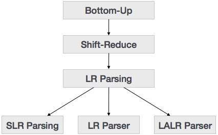

自下而上的解析从树的叶节点开始并向上工作直到它到达根节点。在这里，我们从一个句子开始，然后以相反的方式应用生产规则，以便到达开始符号。下面给出的图像描述了可用的自下而上的解析器。



# Shift-Reduce Parsing
Shift-reduce解析使用两个独特的步骤进行自下而上的解析。这些步骤称为shift-step和reduce-step。

移位步骤：移位步骤是指输入指针前进到下一个输入符号，称为移位符号。此符号被压入堆栈。移位的符号被视为解析树的单个节点。

减少步骤：当解析器找到完整的语法规则（RHS）并将其替换为（LHS）时，它被称为reduce-step。当堆栈顶部包含句柄时会发生这种情况。为了减少，在堆栈上执行POP功能，弹出句柄并用LHS非终端符号替换它。

# LR解析器
LR解析器是一个非递归，移位减少，自下而上的解析器。它使用了一大类无上下文语法，使其成为最有效的语法分析技术。LR解析器也称为LR（k）解析器，其中L代表输入流的从左到右扫描; R代表反向最右边推导的构造，k代表做出决定的先行符号的数量。

有三种广泛使用的算法可用于构造LR解析器：

SLR（1） - 简单的LR解析器：

适用于最小的语法课程

几个州，因此非常小的表

简单快速的施工

LR（1） - LR解析器：

适用于全套LR（1）语法

生成大表和大量状态

施工缓慢

LALR（1） - Look-Ahead LR Parser：

适用于中等大小的语法

状态数与SLR（1）相同


# LR解析算法
这里我们描述一个LR解析器的骨架算法：

```
token = next_token()

repeat forever
   s = top of stack
   
   if action[s, token] = “shift si” then
      PUSH token
      PUSH si 
      token = next_token()
      
   else if action[s, token] = “reduce A::= β“ then 
      POP 2 * |β| symbols
      s = top of stack
      PUSH A
      PUSH goto[s,A]
      
   else if action[s, token] = “accept” then
      return
      
   else
      error()

```
# LL与LR
LL | 	LR
---|--------
是最左边的推导。|	最右边的推导是相反的。
从堆栈上的根非终结符开始。	|以堆栈上的根非终结点结束。
堆栈为空时结束。|	从空堆栈开始。
使用堆栈来指定仍然可以预期的内容。	|使用堆栈来指定已经看到的内容。
自上而下构建解析树。|	自下而上构建解析树。
从堆栈中连续弹出非终结符，并按下相应的右侧。|	试图识别堆栈上的右侧，弹出它，并推动相应的非终结符号。
扩展非终端。|	减少非终端。
当终端弹出一个终端时读取终端。|	在将终端推入堆栈时读取终端。
预解析遍历解析树。	|解析树的后序遍历。

