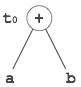
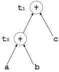
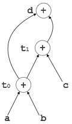

代码生成可以被视为编译的最后阶段。通过后代码生成，可以对代码应用优化过程，但这可以看作是代码生成阶段本身的一部分。编译器生成的代码是某种低级编程语言的目标代码，例如汇编语言。我们已经看到，用更高级语言编写的源代码将转换为更低级别的语言，从而产生更低级别的对象代码，该代码应具有以下最小属性：

它应该带有源代码的确切含​​义。
它在CPU使用和内存管理方面应该是高效的。
我们现在将看到如何将中间代码转换为目标对象代码（在这种情况下为汇编代码）。

# 有向无环图
有向无环图（DAG）是一种描述基本块结构的工具，有助于查看基本块之间流动的值，并提供优化。DAG提供基本块的简单转换。DAG可以在这里理解：

叶节点表示标识符，名称或常量。

内部节点代表运营商。

内部节点还表示表达式的结果或要存储或分配值的标识符/名称。

例：
```
t0 = a + b
t1 = t0 + c
d = t0 + t1
```


[t 0 = a + b]



[t 1 = t 0 + c]


[d = t 0 + t 1 ]


# 窥孔优化
此优化技术在源代码上本地工作，以将其转换为优化代码。在本地，我们指的是手头的一小部分代码块。这些方法可以应用于中间代码以及目标代码。分析了一堆语句，并检查以下可能的优化：

# 冗余指令消除
在源代码级别，用户可以完成以下操作：
```
int add_ten(int x)
   {
   int y, z;
   y = 10;
   z = x + y;
   return z;
   }	
   ```
   ```
int add_ten(int x)
   {
   int y;
   y = 10;
   y = x + y;
   return y;
   }	
   ```
   ```
int add_ten(int x)
   {
   int y = 10;
   return x + y;
   }
   ```
   ```
   	
int add_ten(int x)
   {
   return x + 10;
   }
```

在编译级别，编译器搜索本质上冗余的指令。指令的多次加载和存储可以具有相同的含义，即使它们中的一些被移除。例如：

MOV x，R0
MOV R0，R1
我们可以删除第一条指令并重新编写句子：

```
MOV x, R1

```

# 无法访问的代码
无法访问的代码是程序代码的一部分，由于编程结构而从未被访问过。程序员可能会意外地编写一段永远无法访问的代码。

例：
```
void add_ten(int x)
{
   return x + 10;
   printf(“value of x is %d”, x);
}
```
在此代码段中，printf语句将永远不会执行，因为程序控件在它可以执行之前返回，因此可以删除printf。

# 控制优化流程
代码中存在程序控件来回跳转而不执行任何重要任务的实例。可以删除这些跳转。考虑以下代码块：
```
...		
MOV R1, R2
GOTO L1
...
L1 :   GOTO L2
L2 :   INC R1
```
在此代码中，标签L1可以在将控制传递给L2时被删除。因此，控制可以直接到达L2，而不是跳到L1然后跳到L2，如下所示：

```
...		
MOV R1, R2
GOTO L2
...
L2 :   INC R1

```

# 代数表达式简化
在某些情况下，代数表达式可以变得简单。例如，表达式A = A + 0，可以通过更换一个本身和表达A = A + 1可以简单地通过一个INC被替换。

# 力量减少
有些操作会消耗更多的时间和空间。通过将其替换为消耗更少时间和空间的其他操作，可以减少它们的“强度”，但产生相同的结果。

例如，x * 2可以用x << 1代替，它只涉及一个左移。虽然a * a和a 2的输出相同，但实现2的效率要高得多。

# 访问机器说明
目标机器可以部署更复杂的指令，这些指令可以非常有效地执行特定操作。如果目标代码可以直接容纳这些指令，那么不仅可以提高代码质量，还可以产生更有效的结果。

# 代码生成器
期望代码生成器理解目标机器的运行时环境及其指令集。代码生成器应该考虑以下因素来生成代码：

目标语言：代码生成器必须知道要转换代码的目标语言的本质。该语言可以促进一些特定于机器的指令，以帮助编译器以更方便的方式生成代码。目标机器可以具有CISC或RISC处理器架构。

IR类型：中间表示具有各种形式。它可以是抽象语法树（AST）结构，反向波兰表示法或3地址代码。

选择指令：代码生成器将Intermediate Representation作为输入，并将其转换（映射）到目标机器的指令集。一种表示可以有许多方式（指令）来转换它，因此代码生成器有责任明智地选择适当的指令。

寄存器分配：程序在执行期间需要维护许多值。目标机器的体系结构可能不允许将所有值保存在CPU内存或寄存器中。代码生成器决定在寄存器中保留哪些值。此外，它决定用于保存这些值的寄存器。

指令排序：最后，代码生成器决定执行指令的顺序。它为执行它们的指令创建计划。

# 叙
代码生成器必须在生成代码时跟踪寄存器（用于可用性）和地址（值的位置）。对于它们两者，使用以下两个描述符：

寄存器描述符：寄存器描述符用于通知代码生成器寄存器的可用性。寄存器描述符跟踪存储在每个寄存器中的值。只要在代码生成期间需要新的寄存器，就可以查询该描述符以获得寄存器可用性。

地址描述符：程序中使用的名称（标识符）的值可能在执行时存储在不同的位置。地址描述符用于跟踪存储标识符值的存储器位置。这些位置可以包括CPU寄存器，堆，堆栈，存储器或所提到的位置的组合。

代码生成器保持描述符的实时更新。对于加载语句，LD R1，x，代码生成器：

updates the Register Descriptor R1 that has value of x and
updates the Address Descriptor (x) to show that one instance of x is in R1.
# 代码生成
基本块包括一系列三地址指令。代码生成器将这些指令序列作为输入。

注意：如果在多个位置（寄存器，高速缓存或内存）找到名称的值，则寄存器的值将优先于缓存和主存储器。同样，缓存的值将优先于主存储器。主内存几乎没有任何偏好。

getReg：代码生成器使用getReg函数来确定可用寄存器的状态和名称值的位置。getReg的工作原理如下：

如果变量Y已经在寄存器R中，则它使用该寄存器。

否则，如果某个寄存器R可用，则它使用该寄存器。

否则，如果上述两个选项都不可用，它会选择一个需要最少数量的加载和存储指令的寄存器。

对于指令x = y OP z，代码生成器可以执行以下动作。让我们假设L是要保存y OP z输出的位置（最好是寄存器）：

调用函数getReg，来决定L的位置。

通过查询y的地址描述符确定y的当前位置（寄存器或存储器）。如果y当前不在寄存器L中，则生成以下指令以将y的值复制到L：

MOV y'，L

其中Y”表示的复制的值ÿ。

确定当前位置Ž使用相同的方法在步骤2中所用ÿ并生成以下指令：

OP z'，L

其中Z”表示的复制的值Ž。

现在L包含y OP z的值，该值旨在分配给x。因此，如果L是寄存器，则更新其描述符以指示它包含x的值。更新的描述符X，以表明它是存储在位置大号。

如果y和z没有进一步使用，则可以将它们返回给系统。

其他代码构造如循环和条件语句以通用汇编方式转换为汇编语言。

