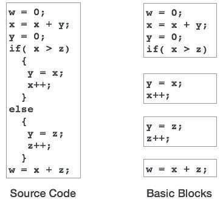
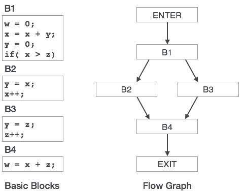
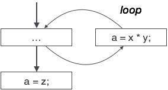
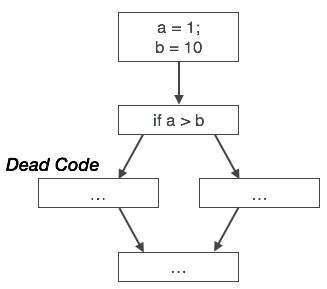
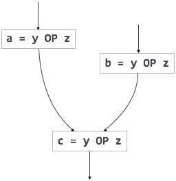
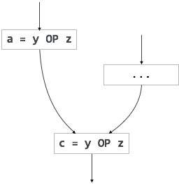

优化是一种程序转换技术，它通过使代码消耗更少的资源（即CPU，内存）并提供高速度来尝试改进代码。

在优化中，高级通用编程结构被非常有效的低级编程代码所取代。代码优化过程必须遵循以下三个规则：

输出代码不得以任何方式改变程序的含义。

优化应该提高程序的速度，如果可能的话，程序应该需要更少的资源。

优化本身应该很快，不应该延迟整个编译过程。

可以在编译过程的各个级别上进行优化代码的努力。

开始时，用户可以更改/重新排列代码或使用更好的算法来编写代码。

生成中间代码后，编译器可以通过地址计算和改进循环来修改中间代码。

在生成目标机器代码时，编译器可以使用内存层次结构和CPU寄存器。

优化可以大致分为两种类型：机器独立和机器相关。

# 与机器无关的优化
在此优化中，编译器接收中间代码并转换不涉及任何CPU寄存器和/或绝对存储器位置的代码的一部分。例如：

```
do
{
   item = 10;
   value = value + item; 
} while(value<100);

```

此代码涉及重复分配标识符项，如果我们这样做：
```
Item = 10;
do
{
   value = value + item; 
} while(value<100);
```

不仅应该节省CPU周期，还可以在任何处理器上使用。

# 机器相关的优化
在生成目标代码之后以及根据目标机器架构转换代码时，完成依赖于机器的优化。它涉及CPU寄存器，可能具有绝对内存引用而不是相对引用。依赖于机器的优化器致力于最大限度地利用内存层次结构。

# 基本块
源代码通常具有许多指令，这些指令总是按顺序执行并被视为代码的基本块。这些基本块之间没有任何跳转语句，即，当执行第一条指令时，同一基本块中的所有指令将按其出现顺序执行而不会丢失程序的流控制。

程序可以有各种构造作为基本块，如IF-THEN-ELSE，SWITCH-CASE条件语句和循环，如DO-WHILE，FOR和REPEAT-UNTIL等。

# 基本块识别
我们可以使用以下算法来查找程序中的基本块：

搜索基本块开始的所有基本块的头语句：

第一个程序声明。
作为任何分支目标的陈述（有条件/无条件）。
任何分支声明后面的语句。
标题语句及其后面的语句构成一个基本块。

基本块不包括任何其他基本块的任何头语句。

从代码生成和优化的角度来看，基本块是重要的概念。



基本块在识别变量中起着重要作用，这些变量在单个基本块中被多次使用。如果任何变量被多次使用，则除非块完成执行，否则不需要清空分配给该变量的寄存器存储器。

# 控制流程图
程序中的基本块可以通过控制流程图来表示。控制流程图描述了如何在块之间传递程序控制。它是一个有用的工具，通过帮助定位程序中任何不需要的循环来帮助优化。



# 循环优化
大多数程序在系统中作为循环运行。有必要优化循环以节省CPU周期和内存。可以通过以下技术优化循环：

不变代码：驻留在循环中并在每次迭代时计算相同值的代码片段称为循环不变代码。通过将此代码保存为仅计算一次，而不是每次迭代，可以将此代码移出循环。

归纳分析：如果变量的值在循环内被循环不变值改变，则该变量称为归纳变量。

强度降低：存在消耗更多CPU周期，时间和内存的表达式。这些表达式应该用更便宜的表达式替换，而不会影响表达式的输出。例如，乘法（x * 2）在CPU周期方面比（x << 1）昂贵并且产生相同的结果。

# 死码消除
死代码是一个或多个代码语句，它们是：

从未执行过或无法访问，
或者如果执行，则从不使用它们的输出。
因此，死代码在任何程序操作中都不起作用，因此可以简单地将其删除。

# 部分死代码
有些代码语句的计算值仅在某些情况下使用，即有时使用值，有时则不使用。这种代码称为部分死代码。


上面的控制流程图描绘了一个程序块，其中变量'a'用于分配表达式'x * y'的输出。让我们假设分配给'a'的值从不在循环内使用。在控制离开循环之后，'a'被赋予变量'z'的值，稍后将在程序中使用。我们在此得出结论，“a”的赋值代码从未在任何地方使用过，因此它有资格被删除。



同样，上面的图片描述了条件语句总是假的，暗示以真实情况编写的代码永远不会被执行，因此可以将其删除。

# 部分冗余
冗余表达式在并行路径中被多次计算，而操作数没有任何变化。部分冗余表达式在路径中被多次计算，而操作数没有任何变化。例如，


[冗余表达]




[部分冗余的表达]

循环不变代码是部分冗余的，可以通过使用代码运动技术来消除。

部分冗余代码的另一个例子可以是：

```
If (condition)
{
   a = y OP z;
}
else
{
   ...
}
c = y OP z;

```

我们假设操作数（y和z）的值不会从变量a的赋值变为变量c。这里，如果条件语句为真，则y OP z计算两次，否则计算一次。代码运动可用于消除此冗余，如下所示：

```
If (condition)
{
   ...
   tmp = y OP z;
   a = tmp;
   ...
}
else
{
   ...
   tmp = y OP z;
}
c = tmp;

```

在这里，条件是真还是假; y OP z应该只计算一次。

