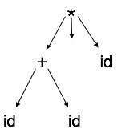
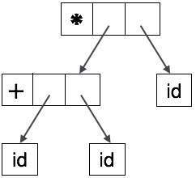

解析器应该能够检测并报告程序中的任何错误。预计当遇到错误时，解析器应该能够处理它并继续解析其余的输入。大多数情况下，期望从解析器检查错误，但是在编译过程的各个阶段可能会遇到错误。程序在各个阶段可能会出现以下类型的错误：

词法：某些标识符的名称输入不正确

句法：缺少分号或不平衡的括号

语义：不兼容的值赋值

逻辑：代码无法访问，无限循环

可以在解析器中实现四种常见的错误恢复策略来处理代码中的错误。

# 恐慌模式
当解析器在语句中的任何位置遇到错误时，它会通过不处理从错误输入到分隔符的输入（例如分号）来忽略语句的其余部分。这是错误恢复的最简单方法，也可以防止解析器开发无限循环。

# 声明模式
当解析器遇到错误时，它会尝试采取纠正措施，以便语句的其余输入允许解析器提前解析。例如，插入缺少的分号，用分号替换逗号等。解析器设计者必须小心，因为错误的纠正可能会导致无限循环。

# 错误产生
编译器设计者知道代码中可能出现的一些常见错误。此外，设计人员可以创建要使用的扩充语法，作为在遇到这些错误时生成错误构造的产品。

# 全球纠正
解析器将程序作为一个整体考虑在内，并试图弄清楚程序的目的是什么，并试图找出它最接近的匹配，这是没有错误的。当输入错误的输入（语句）X时，它会为某个最接近的无错误语句Y创建一个解析树。这可能允许解析器对源代码进行最小的更改，但由于其复杂性（时间和空间）这个策略尚未在实践中实施。

# 抽象语法树
解析树表示不容易被编译器解析，因为它们包含的实际细节比实际需要的更多。以下面的解析树为例：

如果仔细观察，我们发现大多数叶节点都是其父节点的单个子节点。在将信息提供给下一阶段之前，可以消除该信息。通过隐藏额外信息，我们可以获得如下所示的树：

抽象树可以表示为：

AST是编译器中的重要数据结构，具有最少的不必要信息。AST比解析树更紧凑，编译器可以很容易地使用它。

