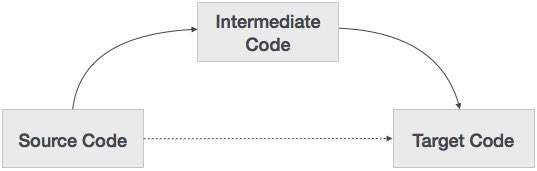

源代码可以直接转换为其目标机器代码，那么为什么我们需要将源代码转换为中间代码，然后将其转换为目标代码？让我们看看为什么需要中间代码的原因。



如果编译器将源语言转换为其目标机器语言而没有生成中间代码的选项，则对于每个新机器，都需要完整的本机编译器。

通过保持所有编译器的分析部分相同，中间代码消除了为每个独特机器创建新的完整编译器的需要。

编译器的第二部分，即合成，根据目标机器进行更改。

通过在中间代码上应用代码优化技术，可以更轻松地应用源代码修改来提高代码性能。

# 中级代表
中间代码可以以各种方式表示，并且它们具有其自身的益处。

高级IR - 高级中级代码表示非常接近源语言本身。可以从源代码轻松生成它们，我们可以轻松应用代码修改来增强性能。但对于目标机器优化，它不太受欢迎。

低电平IR - 这个接近目标机器，这使它适用于寄存器和存储器分配，指令集选择等。它适用于机器相关的优化。

中间代码可以是特定于语言的（例如，用于Java的字节代码）或者与语言无关的（三地址代码）。

# 三地址代码
中间代码生成器以带注释的语法树的形式从其前任阶段，语义分析器接收输入。然后可以将该语法树转换为线性表示，例如后缀表示法。中间代码往往是与机器无关的代码。因此，代码生成器假定具有无限数量的存储器（寄存器）来生成代码。

例如：

```
a = b + c * d;

```

中间代码生成器将尝试将此表达式划分为子表达式，然后生成相应的代码。

```
r1 = c * d;
r2 = b + r1;
a = r2
```

r用作目标程序中的寄存器。

三地址代码最多有三个地址位置来计算表达式。三地址代码可以用两种形式表示：四元组和三元组。

四倍
四重表示中的每条指令分为四个字段：operator，arg1，arg2和result。以上示例以四重格式表示如下：

欧普|	arg 1	|arg 2|	结果
-----|----------|-----|----
*|	C	|d	|R1
+|	b	|R1	|R2
+|	R2|	R1	|R3
=|	R3|		|1

# 三同
三元组表示中的每条指令都有三个字段：op，arg1和arg2。各个子表达式的结果由表达式的位置表示。三元组表示与DAG和语法树的相似性。它们在表示表达式时等同于DAG。

欧普|	arg 1|	arg 2
----|--------|------
*|	C|	d
+|	b|	（0）
+|	（1）|	（0）
=|	（2）|	
三元组在优化时面临代码不可移动的问题，因为结果是位置的，并且改变表达式的顺序或位置可能导致问题。

# 间接三元组
该表示是对三元组表示的增强。它使用指针而不是位置来存储结果。这使优化器能够自由地重新定位子表达式以生成优化的代码。

# 声明
必须先声明变量或过程才能使用它。声明涉及在内存中分配空间以及在符号表中输入类型和名称。可以编程和设计程序以保持目标机器结构，但是可能不总是能够准确地将源代码转换为其目标语言。

将整个程序作为程序和子程序的集合，可以声明程序的所有本地名称。内存分配以连续方式完成，名称按照它们在程序中声明的顺序分配给内存。我们使用偏移量变量并将其设置为零{offset = 0}，表示基址。

源编程语言和目标机器架构可能在名称存储方式上有所不同，因此使用相对寻址。虽然第一个名称是从内存位置0 {offset = 0}开始分配内存，但是后面声明的下一个名称应该在第一个名称旁边分配内存。

例：

我们以C编程语言为例，其中整数变量分配2个字节的内存，浮点变量分配4个字节的内存。
```
int a;
float b;

Allocation process:
{offset = 0}

   int a;
   id.type = int
   id.width = 2

offset = offset + id.width 
{offset = 2}

   float b;
   id.type = float
   id.width = 4
   
offset = offset + id.width 
{offset = 6}
```
要在符号表中输入此详细信息，可以使用过程输入。该方法可以具有以下结构：
```
enter(name, type, offset)
```
此过程应在符号表中为变量名创建一个条目，其类型设置为type，并在其数据区域中设置相对地址偏移量。