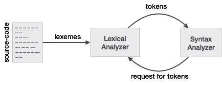

词法分析是编译器的第一阶段。它采用以句子形式编写的语言预处理器的修改后的源代码。词法分析器通过删除源代码中的任何空格或注释，将这些语法分解为一系列标记。

如果词法分析器发现令牌无效，则会生成错误。词法分析器与语法分析器紧密配合。它从源代码中读取字符流，检查合法令牌，并在需要时将数据传递给语法分析器。



# 令牌
Lexemes被称为令牌中的一系列字符（字母数字）。每个词位都有一些预定义的规则被识别为有效令牌。这些规则由语法规则通过模式定义。模式解释了什么可以是一个标记，这些模式是通过正则表达式定义的。

在编程语言中，关键字，常量，标识符，字符串，数字，运算符和标点符号可以被视为标记。

例如，在C语言中，变量声明行

```
int value = 100;
```

包含令牌：

```
int (keyword), value (identifier), = (operator), 100 (constant) and ; (symbol).

```

# 令牌规格
让我们理解语言理论如何执行以下术语：

## 字母
任何有限的符号集{0,1}都是一组二进制字母表，{0,1,2,3,4,5,6,7,8,9，A，B，C，D，E，F}是一组十六进制字母，{az，AZ}是一组英语字母表。

## 字符串
任何有限的字母序列都称为字符串。字符串的长度是字母出现的总数，例如，字符串tutorialspoint的长度为14，并由| tutorialspoint |表示。没有字母的字符串，即长度为零的字符串称为空字符串，用ε（ε）表示。

## 特殊符号
典型的高级语言包含以下符号： -
算术符号 | 	加法（+），减法（ - ），模数（％），乘法（*），除法（/）
---|-----
标点	|逗号（，），分号（;），点（。），箭头（ - >）
分配|	=
特别任务|	+ =，/ =，* =， - =
对照	|==，！=，<，<=，>，> =
预处理器|	＃
位置说明符|	＆
合乎逻辑	|＆，&&，|，|| ,!
转移运算符	|>>，>>>，<<，<<<

# 语言
语言被认为是一组有限字母表上的有限字符串集。计算机语言被认为是有限集，并且可以对它们执行数学设置操作。有限语言可以通过正则表达式来描述。

最长匹配规则
当词法分析器读取源代码时，它会逐字母地扫描代码; 当它遇到空格，操作符号或特殊符号时，它决定一个单词完成。

例如：
```
int intvalue;
```
在将两个词汇扫描到'int'时，词法分析器无法确定它是关键字int还是标识符int值的首字母。

最长匹配规则指出应该根据可用的所有令牌中的最长匹配来确定扫描的词素。

词法分析器还遵循规则优先级，其中语言的保留字（例如，关键字）优先于用户输入。也就是说，如果词法分析器找到与任何现有保留字匹配的词位，则应该生成错误。