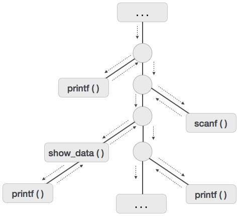

作为源代码的程序仅仅是文本（代码，语句等）的集合，并且为了使其生效，它需要在目标机器上执行动作。程序需要内存资源来执行指令。程序包含过程，标识符等的名称，这些名称需要在运行时与实际内存位置进行映射。

在运行时，我们指的是执行中的程序。运行时环境是目标机器的状态，其可以包括软件库，环境变量等，以向系统中运行的进程提供服务。

运行时支持系统是一个包，主要由可执行程序本身生成，并促进进程和运行时环境之间的进程通信。它在程序执行时负责内存分配和解除分配。

# 激活树
程序是一系列指令，它们组合成许多程序。过程中的指令是顺序执行的。过程有一个开始和结束分隔符，其中的所有内容都称为过程的主体。过程标识符和它内部的有限指令序列构成了过程的主体。

过程的执行称为其激活。激活记录包含调用过程所需的所有必要信息。激活记录可能包含以下单位（取决于使用的源语言）。

临时工 | 	存储表达式的临时值和中间值。
------|------------
本地数据|	存储被调用过程的本地数据。
机器状态|	在调用过程之前，存储机器状态，例如寄存器，程序计数器等。
控制链接|	存储调用者过程的激活记录的地址。
访问链接	|存储超出本地范围的数据信息。
实际参数|	存储实际参数，即用于将输入发送到被调用过程的参数。
回报价值|	存储返回值。

无论何时执行过程，其激活记录都存储在堆栈中，也称为控制堆栈。当过程调用另一个过程时，将暂停执行调用程序，直到被调用的过程完成执行。此时，被调用过程的激活记录存储在堆栈中。

我们假设程序控制以顺序方式流动，并且当调用过程时，其控制被转移到被调用过程。执行调用过程时，它会将控件返回给调用者。这种类型的控制流程可以更容易地以树的形式表示一系列激活，称为激活树。

为了理解这个概念，我们以一段代码为例：
```
. . .
printf(“Enter Your Name: “);
scanf(“%s”, username);
show_data(username);
printf(“Press any key to continue…”);
. . .
int show_data(char *user)
   {
   printf(“Your name is %s”, username);
   return 0;
   }
. . . 
```

下面是给出的代码的激活树。


现在我们知道过程以深度优先的方式执行，因此堆栈分配是过程激活的最佳存储形式。

# 存储分配
运行时环境管理以下实体的运行时内存要求：

代码：它被称为程序的文本部分，在运行时不会更改。其内存要求在编译时是已知的。

程序：它们的文本部分是静态的，但它们是以随机方式调用的。这就是为什么堆栈存储用于管理过程调用和激活。

变量：变量仅在运行时已知，除非它们是全局变量或常量变量。堆内存分配方案用于管理运行时变量的内存分配和解除分配。


# 静态分配
在这种分配方案中，编译数据被绑定到存储器中的固定位置，并且在程序执行时它不会改变。由于存储器要求和存储位置是预先已知的，因此不需要用于存储器分配和解除分配的运行时支持包。


# 堆栈分配
过程调用及其激活通过堆栈内存分配进行管理。它适用于后进先出（LIFO）方法，这种分配策略对递归过程调用非常有用。

# 堆分配
过程本地的变量仅在运行时分配和解除分配。堆分配用于动态地为变量分配内存，并在不再需要变量时将其返回。

除静态分配的内存区域外，堆栈和堆内存都可以动态地和意外地增长和缩小。因此，它们不能在系统中提供固定数量的存储器。


如上图所示，代码的文本部分被分配了固定数量的内存。堆栈和堆内存安排在分配给程序的总内存的极值中。两者都相互缩小和相互成长。

# 参数传递
程序之间的通信介质称为参数传递。调用过程中的变量值通过某种机制传递给被调用过程。在继续之前，首先要了解一些与程序中的值有关的基本术语。

## R值
表达式的值称为r值。如果单个变量中包含的值出现在赋值运算符的右侧，则它也会变为r值。r值始终可以分配给其他变量。

## L值
存储表达式的内存（地址）的位置称为该表达式的l值。它总是出现在赋值运算符的左侧。

例如：

```
day = 1;
week = day * 7;
month = 1;
year = month * 12;

```

从这个例子中，我们知道常数值，如1,7,12，以及日，周，月和年等变量都有r值。只有变量具有l值，因为它们也代表分配给它们的内存位置。

例如：

```
7 = x + y;
```
是一个l值错误，因为常量7不代表任何内存位置。

# 形式参数
获取调用者过程传递的信息的变量称为形式参数。这些变量在被调用函数的定义中声明。

# 实际参数
将值或地址传递给被调用过程的变量称为实际参数。这些变量在函数调用中指定为参数。

例：
```
fun_one()
{
   int actual_parameter = 10;
   call fun_two(int actual_parameter);
}
   fun_two(int formal_parameter)
{
   print formal_parameter;
}

```
形式参数保存实际参数的信息，具体取决于所使用的参数传递技术。它可以是值或地址。

# 通过价值
在pass by value机制中，调用过程传递实际参数的r值，编译器将其放入被调用过程的激活记录中。然后，形式参数保存调用过程传递的值。如果形式参数保持的值发生变化，则应该对实际参数没有影响。

# 通过参考传递
在通过引用机制传递时，实际参数的l值被复制到被调用过程的激活记录中。这样，被调用过程现在具有实际参数的地址（存储位置），形式参数指的是相同的存储位置。因此，如果形式参数指向的值发生更改，则应在实际参数上看到影响，因为它们也应指向相同的值。

# 通过复制还原
此参数传递机制的工作方式类似于“按引用传递”，但实际参数的更改是在被调用过程结束时进行的。在函数调用时，实际参数的值被复制到被调用过程的激活记录中。如果操作的形式参数对实际参数没有实时影响（当传递l值时），但是当被调用的过程结束时，形式参数的l值被复制到实际参数的l值。

例：

```
int y; 
calling_procedure() 
{
   y = 10;     
   copy_restore(y); //l-value of y is passed
   printf y; //prints 99 
}
copy_restore(int x) 
{     
   x = 99; // y still has value 10 (unaffected)
   y = 0; // y is now 0 
}

```

当此函数结束时，形式参数x的l值被复制到实际参数y。即使在过程结束之前更改了y的值，x的l值也会被复制到y的l值，使其行为类似于按引用调用。

# 通过名字
像Algol这样的语言提供了一种新的参数传递机制，就像C语言中的预处理器一样。在按名称传递机制中，被调用的过程的名称将由其实际主体替换。按名称传递以文本方式替换过程调用中的参数表达式，以获取过程体中的相应参数，以便它现在可以处理实际参数，就像传递引用一样。

