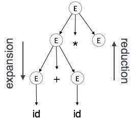
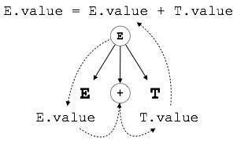
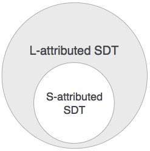

# 概述
我们已经学习了解析器如何在语法分析阶段构造解析树。在该阶段构造的普通解析树通常对编译器没用，因为它不包含如何评估树的任何信息。制作语言规则的无上下文语法的产生不适应如何解释它们。

例如
```
E → E + T
```
上面的CFG制作没有与之相关的语义规则，它无助于对制作有任何意义。

# 语义
语言的语义为其构造提供了意义，如标记和语法结构。语义有助于解释符号，它们的类型以及它们之间的关系。语义分析判断源程序中构造的语法结构是否派生任何含义。

```
CFG + semantic rules = Syntax Directed Definitions
```
例如：
```
int a = “value”;
```

不应该在词法和语法分析阶段发出错误，因为它在词法上和结构上都是正确的，但是由于赋值的类型不同，它应该产生语义错误。这些规则由语言的语法设定，并在语义分析中进行评估。应在语义分析中执行以下任务：

范围解析
类型检查
数组绑定检查

# 语义错误
我们已经提到了语义分析器应该识别的一些语义错误：

类型不匹配
未申报的变量
保留标识符滥用。
在范围内多次声明变量。
访问超出范围的变量。
实际和形式参数不匹配。

# 属性语法
属性语法是一种特殊形式的无上下文语法，其中一些附加信息（属性）被附加到其一个或多个非终端以便提供上下文敏感信息。每个属性都有明确定义的值域，例如整数，浮点数，字符，字符串和表达式。

属性语法是为无上下文语法提供语义的媒介，它可以帮助指定编程语言的语法和语义。属性语法（当被视为解析树时）可以在树的节点之间传递值或信息。

例：
```
E → E + T { E.value = E.value + T.value }

```

CFG的右侧部分包含指定语法应如何解释的语义规则。这里，非终端E和T的值加在一起，结果被复制到非终端E.

语义属性可以在解析时从其域分配给它们的值，并在赋值或条件时进行评估。根据属性获取其值的方式，它们可以大致分为两类：合成属性和继承属性。

# 合成属性
这些属性从其子节点的属性值中获取值。为了说明，假设以下产品：

```
S → ABC

```

如果S从其子节点（A，B，C）获取值，则称其为合成属性，因为ABC的值被合成为S.

与前面的示例（E→E + T）一样，父节点E从其子节点获取其值。合成属性永远不会从其父节点或任何兄弟节点获取值。

# 继承属性
与合成属性相比，继承属性可以从父级和/或兄弟级获取值。如下面的制作，

```
S → ABC

```

A可以从S，B和C获取值.B可以从S，A和C获取值。同样，C可以从S，A和B获取值。

扩展：根据语法规则将非终端扩展到终端



减少：根据语法规则将终端缩减为相应的非终端。语法树从上到下，从左到右进行解析。每当减少发生时，我们应用其相应的语义规则（动作）。

语义分析使用语法定向翻译来执行上述任务。

语义分析器从其前一阶段（语法分析）接收AST（抽象语法树）。

语义分析器使用AST附加属性信息，称为归属AST。

属性是两个元组值，<属性名称，属性值>

例如：
```
int value  = 5;
<type, “integer”>
<presentvalue, “5”>
```
对于每个产品，我们都附加一个语义规则。

# S归因于SDT
如果SDT仅使用合成属性，则将其称为S属性SDT。这些属性使用S-attributes SDT进行评估，这些SDT在生产之后（右侧）编写了语义操作。


如上所述，S-属性SDT中的属性在自下而上解析中被评估，因为父节点的值取决于子节点的值。

# L归因于SDT
这种形式的SDT使用合成和继承属性，限制不从右兄弟中获取值。

在L属性SDT中，非终端可以从其父节点，子节点和兄弟节点获取值。如下面的制作
```
S → ABC
```
S可以取A，B和C（合成）的值。A只能从S获取值。B可以从S和A获取值.C可以从S，A和B获取值。没有非终端可以从兄弟到右边获取值。

L属性SDT中的属性通过深度优先和从左到右的解析方式来评估。



我们可以得出结论，如果定义是S-归因的，那么它也是L-归因的，因为L-属性定义包含S-属性定义。

