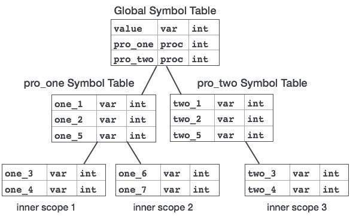

符号表是由编译器创建和维护的重要数据结构，用于存储有关各种实体（如变量名称，函数名称，对象，类，接口等）的出现的信息。符号表由分析和综合使用编译器的一部分。

根据手中的语言，符号表可以用于以下目的：

在一个地方以结构化形式存储所有实体的名称。

验证是否已声明变量。

要实现类型检查，通过验证源代码中的赋值和表达式在语义上是正确的。

确定名称的范围（范围解析）。

符号表只是一个表，可以是线性表或哈希表。它以下列格式为每个名称维护一个条目：
```
<symbol name,  type,  attribute>
```
例如，如果符号表必须存储有关以下变量声明的信息：
```
static int interest;
```
然后它应该存储条目，如：
```
<interest, int, static>
```
attribute子句包含与名称相关的条目。

# 履行
如果编译器要处理少量数据，那么符号表可以实现为无序列表，这很容易编码，但它只适用于小型表。符号表可以通过以下方式之一实现：

线性（已排序或未排序）列表
二叉搜索树
哈希表
其中，符号表主要实现为散列表，其中源代码符号本身被视为散列函数的键，返回值是关于符号的信息。

# 操作
符号表（线性或散列）应提供以下操作。

插入（）
分析阶段更频繁地使用此操作，即编译器的前半部分，其中标识了标记并且名称存储在表中。此操作用于在符号表中添加有关源代码中出现的唯一名称的信息。存储名称的格式或结构取决于手头的编译器。

源代码中符号的属性是与该符号相关联的信息。此信息包含符号的值，状态，范围和类型。insert（）函数将符号及其属性作为参数，并将信息存储在符号表中。

例如：
```
int a;
```
应该由编译器处理为：
```
insert(a, int);
```

# title
lookup（）操作用于搜索符号表中的名称以确定：

如果表中存在符号。
如果在使用之前声明它。
如果在范围中使用该名称。
如果符号已初始化。
如果符号多次声明。
lookup（）函数的格式根据编程语言而有所不同。基本格式应符合以下内容：

```
lookup(symbol)
```
如果符号表中不存在该符号，则此方法返回0（零）。如果符号表中存在符号，则返回存储在表中的属性。

# 范围管理
编译器维护两种类型的符号表：全局符号表，可以由为程序中的每个作用域创建的所有过程和作用域符号表访问。

要确定名称的范围，符号表按层次结构排列，如下例所示：

```
. . . 
int value=10;

void pro_one()
   {
   int one_1;
   int one_2;
   
      {              \
      int one_3;      |_  inner scope 1 
      int one_4;      | 
      }              /
      
   int one_5; 
   
      {              \   
      int one_6;      |_  inner scope 2
      int one_7;      |
      }              /
   }
   
void pro_two()
   {
   int two_1;
   int two_2;
   
      {              \
      int two_3;      |_  inner scope 3
      int two_4;      |
      }              /
      
   int two_5;
   }
. . . 

```

上述程序可以用符号表的层次结构表示：



全局符号表包含一个全局变量（int值）的名称和两个过程名称，这些名称应该对上面显示的所有子节点都可用。pro_one符号表中提及的名称（及其所有子表）不适用于pro_two符号及其子表。

此符号表数据结构层次结构存储在语义分析器中，只要需要在符号表中搜索名称，就会使用以下算法进行搜索：

首先，将在当前范围内搜索符号，即当前符号表。

如果找到名称，则搜索完成，否则将在父符号表中搜索，直到

找到名称或搜索全局符号表的名称。

