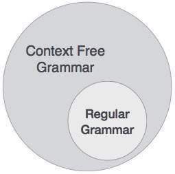
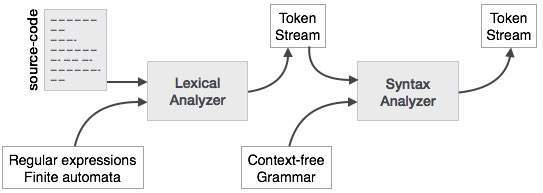
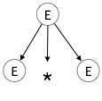
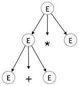
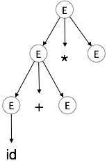
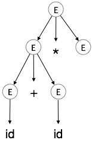
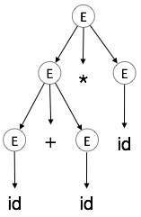
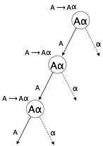

语法分析或解析是编译器的第二阶段。在本章中，我们将学习构造解析器时使用的基本概念。

我们已经看到词法分析器可以在正则表达式和模式规则的帮助下识别令牌。但是由于正则表达式的限制，词法分析器无法检查给定句子的语法。正则表达式无法检查平衡标记，例如括号。因此，此阶段使用无上下文语法（CFG），这是由下推自动机识别的。

另一方面，CFG是Regular Grammar的超集，如下所示：



这意味着每个常规语法也是无上下文的，但存在一些超出常规语法范围的问题。CFG是描述编程语言语法的有用工具。

# 无上下文语法
在本节中，我们将首先看到无上下文语法的定义，并介绍解析技术中使用的术语。

无上下文语法有四个组成部分：

一组非终端（V）。非终端是表示字符串集的语法变量。非终端定义了有助于定义语法生成的语言的字符串集。

一组令牌，称为终端符号（Σ）。终端是形成字符串的基本符号。

一组制作（P）。语法的产生指定了终端和非终端可以组合以形成字符串的方式。每个产品包括一个称为生产左侧的非终端，一个箭头，以及一系列令牌和/或在线终端，称为生产的右侧。

其中一个非终端被指定为起始符号（S）; 从生产开始的地方。

通过对于该非终端重复替换生产的右侧的非终端（最初是起始符号），从起始符号导出字符串。

例
我们采用回文语言的问题，这不能通过正则表达式来描述。也就是说，L = {w | w = w R }不是常规语言。但它可以通过CFG来描述，如下图所示：
```
G = ( V, Σ, P, S )

```

```
V = { Q, Z, N }
Σ = { 0, 1 }
P = { Q → Z | Q → N | Q → ℇ | Z → 0Q0 | N → 1Q1 }
S = { Q }

```

# 语法分析器

语法分析器或解析器以令牌流的形式从词法分析器获取输入。解析器根据生产规则分析源代码（令牌流）以检测代码中的任何错误。此阶段的输出是解析树。



这样，解析器完成两个任务，即解析代码，查找错误并生成解析树作为阶段的输出。

即使程序中存在某些错误，解析器也会解析整个代码。解析器使用错误恢复策略，我们将在本章后面学习。

# 求导
派生基本上是一系列生产规则，以获取输入字符串。在解析期间，我们对某些句子形式的输入做出两个决定：

确定要更换的非终端。
决定生产规则，非终端将被替换。
要决定使用生产规则替换哪个非终端，我们可以有两个选项。

最左派的
如果输入的句子形式被扫描并从左到右替换，则称为最左侧推导。由最左派推导得出的句子形式称为左句形式。

最正确的推导
如果我们使用生产规则扫描并替换输入，从右到左，它被称为最右边的派生。从最右边推导得出的句子形式称为右句形式。

制作规则：
```
E → E + E
E → E * E
E → id 
```
输入字符串：id + id * id

最左边的推导是：
```
E → E * E
E → E + E * E
E → id + E * E
E → id + id * E
E → id + id * id
```
请注意，始终首先处理最左侧的非终端。

最右边的推导是：
```
E → E + E
E → E + E * E
E → E + E * id
E → E + id * id
E → id + id * id
```

# 解析树
解析树是派生的图形描述。可以很方便地查看字符串是如何从起始符号派生的。派生的起始符号成为解析树的根。让我们通过上一个主题的一个例子看到这一点。

我们采用a + b * c的最左边推导

最左边的推导是：

```
E → E * E
E → E + E * E
E → id + E * E
E → id + id * E
E → id + id * id

```

## 步骤1：

E→E * E.	

## 第2步：

E→E + E * E.	 

## 第3步：

E→id + E * E.	

## 第4步：

E→id + id * E.	

## 第5步：

E→id + id * id	  

在解析树中：

所有叶节点都是终端。
所有内部节点都是非终端节点。
有序遍历提供原始输入字符串。
解析树描述了运算符的关联性和优先级。首先遍历最深的子树，因此该子树中的运算符优先于父节点中的运算符。

# 歧义
如果语法G对于至少一个字符串具有多于一个解析树（左或右派生），则该语法G被认为是不明确的。

```
E → E + E
E → E – E
E → id

```

对于字符串id + id-id，上面的语法生成两个解析树：


据说模糊语法产生的语言本质上是模棱两可的。语法中的歧义对编译器构造不利。没有方法可以自动检测和消除歧义，但可以通过重写整个语法而不模糊，或者通过设置和遵循关联性和优先级约束来删除歧义。

# 关联性
如果操作数在两侧都有运算符，则运算符取该运算数的一侧由这些运算符的相关性决定。如果操作是左关联的，则操作数将由左操作符获取，或者如果操作是右关联操作，则右操作符将获取操作数。

加法，乘法，减法和除法等运算是左关联的。如果表达式包含：

```
id op id op id
```
它将被评估为：

```
(id op id) op id
```
例如，（id + id）+ id

像Exponentiation这样的操作是正确的关联，即同一表达式中的评估顺序将是：
```
id op (id op id)
```
例如，id ^（id ^ id）

# 优先权
如果两个不同的运算符共享一个公共操作数，则运算符的优先级决定哪个将采用操作数。也就是说，2 + 3 * 4可以具有两个不同的解析树，一个对应于（2 + 3）* 4，另一个对应于2+（3 * 4）。通过在运算符之间设置优先级，可以轻松删除此问题。与前面的示例一样，数学上*（乘法）优先于+（加法），因此表达式2 + 3 * 4将始终解释为：

```
2 + (3 * 4)
```

这些方法降低了语言或语法中模糊性的可能性。
 
# 左递归
如果语法具有任何非终端'A'，其派生包含'A'本身作为最左边的符号，则该语法变为左递归。对于自上而下的解析器，左递归语法被认为是一个有问题的情况。自上而下的解析器从Start符号开始解析，Start符号本身是非终端的。因此，当解析器在其派生中遇到相同的非终端时，它很难判断何时停止解析左非终端并且它进入无限循环。


```
(1) A => Aα | β

(2) S => Aα | β 
    A => Sd 

```

（1）是立即左递归的示例，其中A是任何非终端符号，α表示非终端串。

（2）是间接左递归的一个例子。




自上而下的解析器将首先解析A，这反过来将产生由A本身组成的字符串，并且解析器可以永远进入循环。

# 去除左递归
删除左递归的一种方法是使用以下技术：

```
A => Aα | β
```
转换成以下作品
```
A => βA'
A'=> αA' | ε
```
这不会影响从语法派生的字符串，但它会删除立即的左递归。

第二种方法是使用以下算法，它应该消除所有直接和间接左递归。
```
START

Arrange non-terminals in some order like A1, A2, A3,…, An

   for each i from 1 to n
      {
      for each j from 1 to i-1
         {
         replace each production of form Ai ⟹Aj𝜸
         with Ai ⟹ δ1𝜸  | δ2𝜸 | δ3𝜸 |…| 𝜸 
         where Aj ⟹ δ1 | δ2|…| δn  are current Aj productions
         }
      }
   eliminate immediate left-recursion
   
END
```
例

```
S => Aα | β 
A => Sd
```
应用上述算法后，应该成为
```
S => Aα | β 
A => Aαd | βd
```
然后，使用第一种技术删除立即左递归。
```
A  => βdA'
A' => αdA' | ε
```
现在没有一个产品有直接或间接的左递归。

