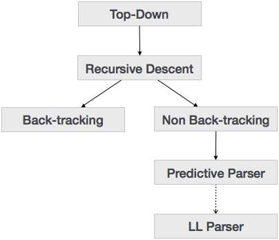
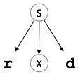
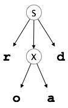
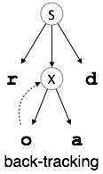
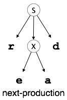
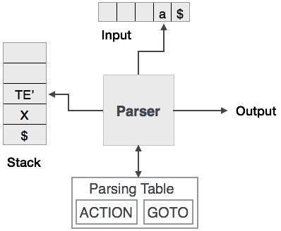
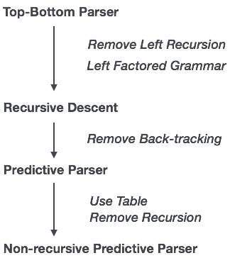
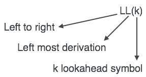

我们在上一章中已经了解到，自上而下的解析技术解析输入，并开始从根节点构建一个解析树，逐渐向下移动到叶节点。自顶向下解析的类型如下所示：



# 递归下降解析
递归下降是一种自上而下的解析技术，它从顶部构造解析树，并从左到右读取输入。它使用每个终端和非终端实体的程序。此解析技术递归地解析输入以生成解析树，该解析树可能需要也可能不需要反向跟踪。但与之相关的语法（如果没有留下因素）无法避免反向跟踪。一种不需要任何反向跟踪的递归下降解析形式称为预测解析。

这种解析技术被认为是递归的，因为它使用了本质上递归的无上下文语法。

# 回溯
自上而下的解析器从根节点（起始符号）开始，并将输入字符串与生产规则匹配以替换它们（如果匹配）。要理解这一点，请参考以下CFG示例：

```
S → rXd | rZd
X → oa | ea
Z → ai
```
对于输入字符串：read，自上而下的解析器，行为如下：

它将从生产规则的S开始，并将其收益率与输入的最左侧字母匹配，即“r”。S（S→rXd）的生产与之匹配。因此，自上而下的解析器前进到下一个输入字母（即'e'）。解析器尝试扩展非终端“X”并从左侧检查其生成（X→oa）。它与下一个输入符号不匹配。因此，自上而下的解析器回溯以获得X的下一个生成规则（X→ea）。

现在，解析器以有序的方式匹配所有输入字母。该字符串被接受。






# 预测性解析器
预测解析器是一种递归下降解析器，它能够预测哪个生产将用于替换输入字符串。预测解析器不会受到回溯的影响。

为了完成其任务，预测解析器使用指向下一个输入符号的前瞻指针。为了使解析器回溯自由，预测解析器对语法设置了一些约束，并且只接受称为LL（k）语法的一类语法。



预测性解析使用堆栈和解析表来解析输入并生成解析树。堆栈和输入都包含一个结束符号$来表示堆栈为空并且输入已被消耗。解析器引用解析表来对输入和堆栈元素组合做出任何决定。



在递归下降解析中，解析器可能有多个生产可供选择单个输入实例，而在预测解析器中，每个步骤最多只能选择一个生产。可能存在没有与输入字符串匹配的生产的情况，使得解析过程失败。

# LL解析器
LL Parser接受LL语法。LL语法是无上下文语法的子集，但是为了实现简单的实现，有一些限制来获得简化版本。LL语法可以通过两种算法实现，即递归下降或表驱动。

LL解析器表示为LL（k）。LL（k）中的第一个L从左到右解析输入，LL（k）中的第二个L代表最左侧的推导，k本身代表前瞻的数量。通常k = 1，因此LL（k）也可以写为LL（1）。



# LL解析算法
我们可能会坚持使用确定性LL（1）进行解析器解释，因为表的大小随k的值呈指数增长。其次，如果给定的语法不是LL（1），那么通常，对于任何给定的k，它不是LL（k）。

下面给出了LL（1）解析的算法：

```
Input: 
   string ω 
   parsing table M for grammar G

Output:
   If ω is in L(G) then left-most derivation of ω,
   error otherwise.

Initial State : $S on stack (with S being start symbol)
   ω$ in the input buffer

SET ip to point the first symbol of ω$.

repeat
   let X be the top stack symbol and a the symbol pointed by ip.

   if X∈ Vt or $
      if X = a
         POP X and advance ip.
      else
         error()
      endif
      
   else	/* X is non-terminal */
      if M[X,a] = X → Y1, Y2,... Yk    
         POP X
         PUSH Yk, Yk-1,... Y1 /* Y1 on top */
         Output the production X → Y1, Y2,... Yk 
      else
         error()
      endif
   endif
until X = $	/* empty stack */
```
如果A→α|，则语法G是LL（1）β是G的两种不同产物：

对于没有终端，α和β都得到以a开头的字符串。

最多α和β中的一个可以得到空字符串。

如果β→t，那么α不会在FOLLOW（A）中导出以终端开头的任何字符串。


