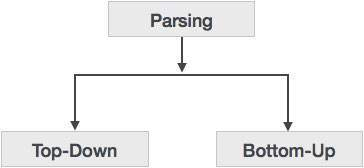

语法分析器遵循通过无上下文语法定义的生产规则。生成规则的实现方式（派生）将解析分为两种类型：自顶向下解析和自底向上解析。



# 自上而下的解析
当解析器从开始符号开始构造解析树然后尝试将起始符号转换为输入时，它被称为自上而下解析。

递归下降解析：这是自上而下解析的常见形式。它被称为递归，因为它使用递归过程来处理输入。递归下降解析会受到回溯的影响。

回溯：这意味着，如果生产的一个派生失败，语法分析器将使用相同生产的不同规则重新启动该过程。此技术可以多次处理输入字符串以确定正确的生产。

# 自下而上的解析
顾名思义，自下而上的解析以输入符号开始，并尝试构造解析树直到起始符号。

例：

输入字符串：a + b * c

制作规则：
```
S → E
E → E + T
E → E * T
E → T
T → id
```
让我们开始自下而上的解析
```
a + b * c
```
阅读输入并检查是否有任何产品与输入匹配：
```
a + b * c
T + b * c
E + b * c
E + T * c
E * c
E * T
E
S
```
