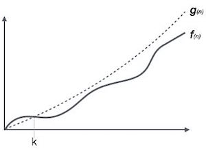
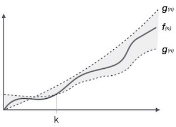

# 概述


算法的渐近分析是指定义其运行时性能的数学边界/框架。使用渐近分析，我们可以很好地得出算法的最佳情况，平均情况和最坏情况。


渐近分析是输入界限，即，如果算法没有输入，则结论是在恒定时间内工作。除了“输入”之外，所有其他因素都被认为是不变的。


渐近分析是指以数学计算单位计算任何操作的运行时间。例如，一个操作的运行时间计算为f（n），并且可以用于另一个操作，其计算为g（n 2）。这意味着第一操作运行时间将随着n的增加而线性增加，并且当n增加时第二操作的运行时间将指数地增加。类似地，如果n非常小，则两个操作的运行时间将几乎相同。


通常，算法所需的时间分为三种类型 -


最佳案例 - 程序执行所需的最短时间。


平均情况 - 程序执行所需的平均时间。


最坏情况 - 程序执行所需的最长时间。


# 渐进符号


以下是计算算法运行时间复杂度的常用渐近符号。


Ο符号


Ω表示法


θ表示法


# 大O表示法


符号Ο（n）是表示算法运行时间上限的正式方式。它测量最坏情况时间复杂度或算法可能需要完成的最长时间。





例如，对于函数f（n）


```
Ο(f(n)) = { g(n) : there exists c > 0 and n0 such that f(n) ≤ c.g(n) for all n > n0. }
```

# Ω表示法


符号Ω（n）是表示算法运行时间下限的正式方式。它衡量最佳案例时间复杂度或算法可能需要完成的最佳时间量。


例如，对于函数f（n）


```
Ω(f(n)) ≥ { g(n) : there exists c > 0 and n0 such that g(n) ≤ c.f(n) for all n > n0. }
```

# θ表示法


符号θ（n）是表示算法运行时间的下限和上限的形式方式。它表示如下 -





# 常见的渐近符号


以下列出了一些常见的渐近符号 -


 算术 | 符号 
 ----| -----
不变	|	Ο（1）
对数的	|	Ο（log n）
线性	|	Ο（n）的
n log n	|	Ο（n log n）
二次	|	Ο（n 2）
立方体	|	Ο（n 3）
多项式	|	n （1）
指数	|	2 Ο（n）的