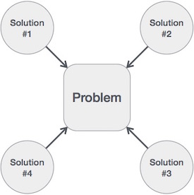

# 概述
算法是一个逐步的过程，它定义了一组指令，这些指令按特定顺序执行以获得所需的输出。算法通常独立于底层语言创建，即算法可以用多种编程语言实现。

从数据结构的角度来看，以下是一些重要的算法类别 -

搜索 - 搜索数据结构中的项目的算法。

排序 - 按特定顺序对项目进行排序的算法。

插入 - 在数据结构中插入项的算法。

更新 - 更新数据结构中现有项的算法。

删除 - 从数据结构中删除现有项目的算法。

# 特征
并非所有程序都可以称为算法。算法应具有以下特征 -

明确 - 算法应清晰明确。它的每个步骤（或阶段）及其输入/输出应该是清楚的，并且必须只有一个含义。

输入 - 算法应具有0个或更多明确定义的输入。

输出 - 算法应具有1个或多个明确定义的输出，并且应与所需的输出匹配。

有限性 - 算法必须在有限数量的步骤之后终止。

可行性 - 利用现有资源应该可行。

独立 - 算法应该具有逐步指导，这应该独立于任何编程代码。

# 如何写算法
编写算法没有明确的标准。相反，它取决于问题和资源。永远不会编写算法来支持特定的编程代码。

我们知道所有编程语言都共享基本代码结构，如循环（do，for，while），流控制（if-else）等。这些常用结构可用于编写算法。

我们一步一步地编写算法，但情况并非总是如此。算法编写是一个过程，在问题域定义明确后执行。也就是说，我们应该知道我们正在设计解决方案的问题域。

## 例
让我们尝试通过一个例子学习算法编写。
**设计一个算法来添加两个数字并显示结果。**
```
Step 1 − START
Step 2 − declare three integers a, b & c
Step 3 − define values of a & b
Step 4 − add values of a & b
Step 5 − store output of step 4 to c
Step 6 − print c
Step 7 − STOP
```
算法告诉程序员如何编写程序代码。或者，算法可以写成 -
```
Step 1 − START ADD
Step 2 − get values of a & b
Step 3 − c ← a + b
Step 4 − display c
Step 5 − STOP
```
在算法的设计和分析中，通常使用第二种方法来描述算法。它使分析人员可以轻松分析算法，忽略所有不需要的定义。他可以观察正在使用的操作以及流程如何流动。

编写步骤编号是可选的。

我们设计了一种算法来获得给定问题的解决方案。问题可以通过多种方式解决。

因此，可以针对给定问题导出许多解算法。下一步是分析那些提出的解决方案算法并实施最合适的解决方案。

# 算法分析
算法的效率可以在实现之前和实现之后的两个不同阶段进行分析。他们是以下 -

先验分析 - 这是对算法的理论分析。通过假设所有其他因素（例如，处理器速度）是恒定的并且对实现没有影响来测量算法的效率。

后验分析 - 这是对算法的实证分析。所选算法使用编程语言实现。然后在目标计算机上执行此操作。在此分析中，收集了所需的运行时间和空间等实际统计数据。

我们将学习先验算法分析。算法分析处理所涉及的各种操作的执行或运行时间。操作的运行时间可以定义为每个操作执行的计算机指令的数量。

# 算法复杂度
假设X是算法，n是输入数据的大小，算法X使用的时间和空间是决定X效率的两个主要因素。

时间因素 - 时间是通过计算关键操作的数量来测量的，例如排序算法中的比较。

空间因子 - 通过计算算法所需的最大内存空间来测量空间。

算法f（n）的复杂性给出算法所需的运行时间和/或存储空间，以n为输入数据的大小。

# 空间复杂度
算法的空间复杂度表示算法在其生命周期中所需的存储空间量。算法所需的空间等于以下两个组件的总和 -

固定部分，是存储某些数据和变量所需的空间，与问题的大小无关。例如，使用的简单变量和常量，程序大小等。

变量部分是变量所需的空间，其大小取决于问题的大小。例如，动态内存分配，递归堆栈空间等。

任何算法P的空间复杂度S（P）是S（P）= C + SP（I），其中C是固定部分，S（I）是算法的可变部分，它取决于实例特征I.是一个试图解释这个概念的简单例子 -
```
Algorithm: SUM(A, B)
Step 1 -  START
Step 2 -  C ← A + B + 10
Step 3 -  Stop
```
这里我们有三个变量A，B和C以及一个常数。因此，S（P）= 1 + 3.现在，空间取决于给定变量和常量类型的数据类型，并且它将相应地相乘。

# 时间复杂度
算法的时间复杂度表示算法运行完成所需的时间量。时间要求可以定义为数值函数T（n），其中T（n）可以作为步数来测量，条件是每个步骤消耗恒定的时间。

例如，添加两个n位整数需要n步。因此，总计算时间是T（n）= c * n，其中c是添加两个比特所花费的时间。在这里，我们观察到T（n）随着输入大小的增加而线性增长。

