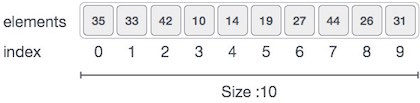

# 概述
Array是一个容器，可以容纳固定数量的项目，这些项目应该是相同的类型。大多数数据结构都使用数组来实现其算法。以下是理解Array概念的重要术语。

元素 - 存储在数组中的每个项称为元素。

索引 - 数组中元素的每个位置都有一个数字索引，用于标识元素。

# 数组表示
可以使用不同语言以各种方式声明数组。为了说明，我们采取C数组声明。


可以使用不同语言以各种方式声明数组。为了说明，我们采取C数组声明。



根据以上说明，以下是要考虑的重点。

索引从0开始。

数组长度为10，这意味着它可以存储10个元素。

可以通过索引访问每个元素。例如，我们可以将索引6处的元素提取为9。

# 基本操作
以下是数组支持的基本操作。

遍历 - 逐个打印所有数组元素。

插入 - 在给定索引处添加元素。

删除 - 删除给定索引处的元素。

搜索 - 使用给定索引或值搜索元素。

更新 - 更新给定索引处的元素。

在C中，当使用size初始化数组时，它会按以下顺序为其元素分配默认值。

数据类型 |	默认值
--------|------
bool	|false
char	|0
int	|0
float	|0.0
double	|0.0f
void	|
wchar_t	|0

# 插入操作
插入操作是将一个或多个数据元素插入到数组中。根据需求，可以在数组的开头，结尾或任何给定索引处添加新元素。

在这里，我们看到插入操作的实际实现，我们在数组的末尾添加数据 -

## 算法
令Array为MAX元素的线性无序数组。

## 例
```
#include <stdio.h>

main() {
   int LA[] = {1,3,5,7,8};
   int item = 10, k = 3, n = 5;
   int i = 0, j = n;
   
   printf("The original array elements are :\n");

   for(i = 0; i<n; i++) {
      printf("LA[%d] = %d \n", i, LA[i]);
   }

   n = n + 1;
	
   while( j >= k) {
      LA[j+1] = LA[j];
      j = j - 1;
   }

   LA[k] = item;

   printf("The array elements after insertion :\n");

   for(i = 0; i<n; i++) {
      printf("LA[%d] = %d \n", i, LA[i]);
   }
}
```

## 结果
```
The original array elements are :
LA[0] = 1 
LA[1] = 3 
LA[2] = 5 
LA[3] = 7 
LA[4] = 8 
The array elements after insertion :
LA[0] = 1 
LA[1] = 3 
LA[2] = 5 
LA[3] = 10 
LA[4] = 7 
LA[5] = 8 
```

# 删除操作
删除是指从数组中删除现有元素并重新组织数组的所有元素。

## 栗子
```
#include <stdio.h>

void main() {
   int LA[] = {1,3,5,7,8};
   int k = 3, n = 5;
   int i, j;
   
   printf("The original array elements are :\n");
	
   for(i = 0; i<n; i++) {
      printf("LA[%d] = %d \n", i, LA[i]);
   }
    
   j = k;
	
   while( j < n) {
      LA[j-1] = LA[j];
      j = j + 1;
   }
	
   n = n -1;
   
   printf("The array elements after deletion :\n");
	
   for(i = 0; i<n; i++) {
      printf("LA[%d] = %d \n", i, LA[i]);
   }
}

```

## 结果
```
The original array elements are :
LA[0] = 1 
LA[1] = 3 
LA[2] = 5 
LA[3] = 7 
LA[4] = 8 
The array elements after deletion :
LA[0] = 1 
LA[1] = 3 
LA[2] = 7 
LA[3] = 8 

```

# 搜索 
您可以根据数组元素的值或索引搜索数组元素。

## 栗子
```
#include <stdio.h>

void main() {
   int LA[] = {1,3,5,7,8};
   int item = 5, n = 5;
   int i = 0, j = 0;
   
   printf("The original array elements are :\n");
	
   for(i = 0; i<n; i++) {
      printf("LA[%d] = %d \n", i, LA[i]);
   }
    
   while( j < n){
      if( LA[j] == item ) {
         break;
      }
		
      j = j + 1;
   }
	
   printf("Found element %d at position %d\n", item, j+1);
}

```

## 结果
```
The original array elements are :
LA[0] = 1 
LA[1] = 3 
LA[2] = 5 
LA[3] = 7 
LA[4] = 8 
Found element 5 at position 3
```

# 更新操作
更新操作是指在给定索引处更新阵列中的现有元素。

## 栗子
```
#include <stdio.h>

void main() {
   int LA[] = {1,3,5,7,8};
   int k = 3, n = 5, item = 10;
   int i, j;
   
   printf("The original array elements are :\n");
	
   for(i = 0; i<n; i++) {
      printf("LA[%d] = %d \n", i, LA[i]);
   }
    
   LA[k-1] = item;

   printf("The array elements after updation :\n");
	
   for(i = 0; i<n; i++) {
      printf("LA[%d] = %d \n", i, LA[i]);
   }
}

```

## 结果
```
The original array elements are :
LA[0] = 1 
LA[1] = 3 
LA[2] = 5 
LA[3] = 7 
LA[4] = 8 
The array elements after updation :
LA[0] = 1 
LA[1] = 3 
LA[2] = 10 
LA[3] = 7 
LA[4] = 8 

```

