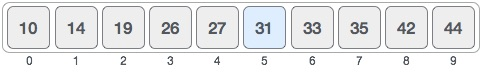
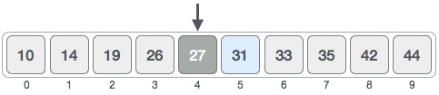
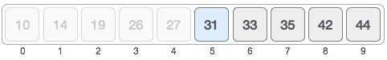
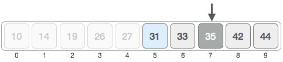
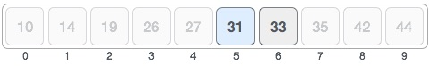
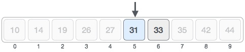
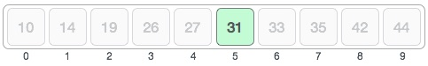

# 概述
二分搜索是一种快速搜索算法，运行时复杂度为Ο（log n）。这种搜索算法的工作原则是分而治之。为使此算法正常工作，数据收集应采用排序形式。

二分搜索通过比较集合的最中间项来查找特定项。如果匹配发生，则返回项目的索引。如果中间项大于项，则在中间项左侧的子阵列中搜索项。否则，在中间项右侧的子阵列中搜索项。该过程也在子阵列上继续，直到子阵列的大小减小到零。

# 二分搜索如何工作？
要使二进制搜索起作用，必须对目标数组进行排序。我们将通过一个图例来学习二元搜索的过程。以下是我们的排序数组，让我们假设我们需要使用二进制搜索来搜索值31的位置。



首先，我们将使用这个公式确定数组的一半 -

```
mid = low + (high - low) / 2

```

这里，0 +（9-0）/ 2 = 4（整数值为4.5）。所以，4是阵列的中间。



现在我们将位置4存储的值与搜索的值进行比较，即31.我们发现位置4的值是27，这不匹配。由于该值大于27并且我们有一个已排序的数组，因此我们也知道目标值必须位于数组的上半部分。



我们将低值改为+1，并再次找到新的中值。

```
low = mid + 1
mid = low + (high - low) / 2
```

我们新的中期现在是7。我们将位置7处存储的值与目标值31进行比较。



存储在位置7的值不匹配，而是比我们正在寻找的值更多。因此，该值必须位于此位置的下半部分。



因此，我们再次计算中期。这次是5。



我们将位置5存储的值与目标值进行比较。我们发现这是一场比赛。



我们得出结论，目标值31存储在位置5处。

二分搜索将可搜索项目减半，从而减少了对更少数字进行比较的次数。

# 伪代码
二进制搜索算法的伪代码应如下所示 -

```
Procedure binary_search
   A ← sorted array
   n ← size of array
   x ← value to be searched

   Set lowerBound = 1
   Set upperBound = n 

   while x not found
      if upperBound < lowerBound 
         EXIT: x does not exists.
   
      set midPoint = lowerBound + ( upperBound - lowerBound ) / 2
      
      if A[midPoint] < x
         set lowerBound = midPoint + 1
         
      if A[midPoint] > x
         set upperBound = midPoint - 1 

      if A[midPoint] = x 
         EXIT: x found at location midPoint
   end while
   
end procedure

```

# C语言代码如下
```
#include <stdio.h>

#define MAX 20

// array of items on which linear search will be conducted. 
int intArray[MAX] = {1,2,3,4,6,7,9,11,12,14,15,16,17,19,33,34,43,45,55,66};

void printline(int count) {
   int i;
	
   for(i = 0;i <count-1;i++) {
      printf("=");
   }
	
   printf("=\n");
}

int find(int data) {
   int lowerBound = 0;
   int upperBound = MAX -1;
   int midPoint = -1;
   int comparisons = 0;      
   int index = -1;
	
   while(lowerBound <= upperBound) {
      printf("Comparison %d\n" , (comparisons +1) );
      printf("lowerBound : %d, intArray[%d] = %d\n",lowerBound,lowerBound,
         intArray[lowerBound]);
      printf("upperBound : %d, intArray[%d] = %d\n",upperBound,upperBound,
         intArray[upperBound]);
      comparisons++;
		
      // compute the mid point
      // midPoint = (lowerBound + upperBound) / 2;
      midPoint = lowerBound + (upperBound - lowerBound) / 2;	
		
      // data found
      if(intArray[midPoint] == data) {
         index = midPoint;
         break;
      } else {
         // if data is larger 
         if(intArray[midPoint] < data) {
            // data is in upper half
            lowerBound = midPoint + 1;
         }
         // data is smaller 
         else {
            // data is in lower half 
            upperBound = midPoint -1;
         }
      }               
   }
   printf("Total comparisons made: %d" , comparisons);
   return index;
}

void display() {
   int i;
   printf("[");
	
   // navigate through all items 
   for(i = 0;i<MAX;i++) {
      printf("%d ",intArray[i]);
   }
	
   printf("]\n");
}

void main() {
   printf("Input Array: ");
   display();
   printline(50);
	
   //find location of 1
   int location = find(55);

   // if element was found 
   if(location != -1)
      printf("\nElement found at location: %d" ,(location+1));
   else
      printf("\nElement not found.");
}

```

输出
```
Input Array: [1 2 3 4 6 7 9 11 12 14 15 16 17 19 33 34 43 45 55 66 ]
==================================================
Comparison 1
lowerBound : 0, intArray[0] = 1
upperBound : 19, intArray[19] = 66
Comparison 2
lowerBound : 10, intArray[10] = 15
upperBound : 19, intArray[19] = 66
Comparison 3
lowerBound : 15, intArray[15] = 34
upperBound : 19, intArray[19] = 66
Comparison 4
lowerBound : 18, intArray[18] = 55
upperBound : 19, intArray[19] = 66
Total comparisons made: 4
Element found at location: 19

```