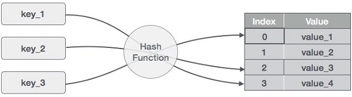

# 概述

哈希表是以关联方式存储数据的数据结构。在哈希表中，数据以数组格式存储，其中每个数据值都有自己唯一的索引值。如果我们知道所需数据的索引，则访问数据会变得非常快。

因此，它成为一种数据结构，其中插入和搜索操作非常快，而与数据的大小无关。散列表使用数组作为存储介质，并使用散列技术生成索引，其中要插入元素或将要定位元素。

# 哈希
散列是一种将一系列键值转换为数组索引范围的技术。我们将使用模运算符来获取一系列键值。考虑大小为20的哈希表的示例，并且要存储以下项目。项目采用（键，值）格式。



(1,20）

（2,70）

（42,80）

（4,25）

（12,44）

（14,32）

（17,11）

（13,78）

（37,98）

对应表格如下
序号 |	键	| 哈希	| 数组索引
----|------|------|--------
1|	1	|1％20 = 1|	1
2	|2	|2％20 = 2|	2
3	|42	|42％20 = 2|	2
4	|4	|4％20 = 4|	4
5	|12	|12％20 = 12|	12
6	|14	|14％20 = 14|	14
7	|17	|17％20 = 17|	17
8	|13	|13％20 = 13|	13
9	|37	|37％20 = 17|	17

# 线性探测
我们可以看到，可能会发生散列技术用于创建已使用的数组索引。在这种情况下，我们可以通过查看下一个单元格来搜索阵列中的下一个空位置，直到找到一个空单元格。这种技术称为线性探测。

序号 |	键	|哈希|	数组索引|	线性探测后,索引
-----|-----|----|---------|--------------
1|	1	|1％20 = 1	|1	|1
2	|2	|2％20 = 2	|2	|2
3	|42	|42％20 = 2	|2	|3
4	|4	|4％20 = 4	|4	|4
5	|12	|12％20 = 12	|12	|12
6	|14	|14％20 = 14	|14	|14
7	|17	|17％20 = 17	|17	|17
8	|13	|13％20 = 13	|13	|13
9	|37	|37％20 = 17	|17	|18

# 基本操作
以下是哈希表的基本主要操作。

搜索 - 搜索哈希表中的元素。

插入 - 在哈希表中插入元素。

delete - 从哈希表中删除元素。

# 数据项
定义具有一些数据和密钥的数据项，基于该数据项在哈希表中进行搜索。

```
struct DataItem {
   int data;
   int key;
};
```

# 哈希方法
定义散列方法以计算数据项的键的散列码。

```
int hashCode(int key){
   return key % SIZE;
}

```

# 搜索操作
每当要搜索元素时，计算传递的密钥的哈希码，并使用该哈希码作为数组中的索引来定位元素。如果在计算的哈希码中找不到元素，则使用线性探测来获取元素。

例

```
struct DataItem *search(int key) {
   //get the hash
   int hashIndex = hashCode(key);
	
   //move in array until an empty
   while(hashArray[hashIndex] != NULL) {
	
      if(hashArray[hashIndex]->key == key)
         return hashArray[hashIndex];
			
      //go to next cell
      ++hashIndex;
		
      //wrap around the table
      hashIndex %= SIZE;
   }

   return NULL;        
}

```

# 插入操作
每当要插入元素时，计算传递的密钥的哈希码，并使用该哈希码作为数组中的索引来定位索引。如果在计算的哈希码处找到元素，则对空位置使用线性探测。

例

```
void insert(int key,int data) {
   struct DataItem *item = (struct DataItem*) malloc(sizeof(struct DataItem));
   item->data = data;  
   item->key = key;     

   //get the hash 
   int hashIndex = hashCode(key);

   //move in array until an empty or deleted cell
   while(hashArray[hashIndex] != NULL && hashArray[hashIndex]->key != -1) {
      //go to next cell
      ++hashIndex;
		
      //wrap around the table
      hashIndex %= SIZE;
   }
	
   hashArray[hashIndex] = item;        
}

```

# 删除操作
每当要删除元素时，计算传递的密钥的哈希码，并使用该哈希码作为数组中的索引来定位索引。如果在计算的哈希码中找不到元素，则使用线性探测来获取元素。找到后，在那里存储一个虚拟项目，以保持哈希表的性能不变。

例
```
struct DataItem* delete(struct DataItem* item) {
   int key = item->key;

   //get the hash 
   int hashIndex = hashCode(key);

   //move in array until an empty 
   while(hashArray[hashIndex] !=NULL) {
	
      if(hashArray[hashIndex]->key == key) {
         struct DataItem* temp = hashArray[hashIndex]; 
			
         //assign a dummy item at deleted position
         hashArray[hashIndex] = dummyItem; 
         return temp;
      } 
		
      //go to next cell
      ++hashIndex;
		
      //wrap around the table
      hashIndex %= SIZE;
   }  
	
   return NULL;        
}

```

# C实现代码
```
#include <stdio.h>
#include <string.h>
#include <stdlib.h>
#include <stdbool.h>

#define SIZE 20

struct DataItem {
   int data;   
   int key;
};

struct DataItem* hashArray[SIZE]; 
struct DataItem* dummyItem;
struct DataItem* item;

int hashCode(int key) {
   return key % SIZE;
}

struct DataItem *search(int key) {
   //get the hash 
   int hashIndex = hashCode(key);  
	
   //move in array until an empty 
   while(hashArray[hashIndex] != NULL) {
	
      if(hashArray[hashIndex]->key == key)
         return hashArray[hashIndex]; 
			
      //go to next cell
      ++hashIndex;
		
      //wrap around the table
      hashIndex %= SIZE;
   }        
	
   return NULL;        
}

void insert(int key,int data) {

   struct DataItem *item = (struct DataItem*) malloc(sizeof(struct DataItem));
   item->data = data;  
   item->key = key;

   //get the hash 
   int hashIndex = hashCode(key);

   //move in array until an empty or deleted cell
   while(hashArray[hashIndex] != NULL && hashArray[hashIndex]->key != -1) {
      //go to next cell
      ++hashIndex;
		
      //wrap around the table
      hashIndex %= SIZE;
   }
	
   hashArray[hashIndex] = item;
}

struct DataItem* delete(struct DataItem* item) {
   int key = item->key;

   //get the hash 
   int hashIndex = hashCode(key);

   //move in array until an empty
   while(hashArray[hashIndex] != NULL) {
	
      if(hashArray[hashIndex]->key == key) {
         struct DataItem* temp = hashArray[hashIndex]; 
			
         //assign a dummy item at deleted position
         hashArray[hashIndex] = dummyItem; 
         return temp;
      }
		
      //go to next cell
      ++hashIndex;
		
      //wrap around the table
      hashIndex %= SIZE;
   }      
	
   return NULL;        
}

void display() {
   int i = 0;
	
   for(i = 0; i<SIZE; i++) {
	
      if(hashArray[i] != NULL)
         printf(" (%d,%d)",hashArray[i]->key,hashArray[i]->data);
      else
         printf(" ~~ ");
   }
	
   printf("\n");
}

int main() {
   dummyItem = (struct DataItem*) malloc(sizeof(struct DataItem));
   dummyItem->data = -1;  
   dummyItem->key = -1; 

   insert(1, 20);
   insert(2, 70);
   insert(42, 80);
   insert(4, 25);
   insert(12, 44);
   insert(14, 32);
   insert(17, 11);
   insert(13, 78);
   insert(37, 97);

   display();
   item = search(37);

   if(item != NULL) {
      printf("Element found: %d\n", item->data);
   } else {
      printf("Element not found\n");
   }

   delete(item);
   item = search(37);

   if(item != NULL) {
      printf("Element found: %d\n", item->data);
   } else {
      printf("Element not found\n");
   }
}

```

输出
```
 ~~  (1,20)  (2,70)  (42,80)  (4,25)  ~~  ~~  ~~  ~~  ~~  ~~  ~~ (12,44)  (13,78)  (14,32)  ~~  ~~  (17,11)  (37,97)  ~~ 
Element found: 97
Element not found
```