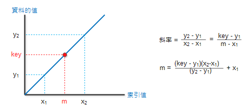

# 概述
插值搜索是二分搜索的改进变体。该搜索算法适用于所需值的探测位置。为使此算法正常工作，数据收集应采用排序形式并均匀分布。

二分搜索与线性搜索相比具有时间复杂性的巨大优势。线性搜索具有Ο（n）的最坏情况复杂度，而二分搜索具有Ο（log n）。

存在可以预先知道目标数据的位置的情况。例如，如果是电话簿，我们想要搜索Morphius的电话号码。在这里，线性搜索甚至二分搜索看起来都很慢，因为我们可以直接跳转到存储名称从“M”开始的存储空间。

# 定位二分搜索
在二分搜索中，如果未找到所需数据，则列表的其余部分分为两部分，即较低和较高。搜索是在其中任何一个中进行的。


即使对数据进行排序，二进制搜索也不会利用来探测所需数据的位置。

# 插值搜索中的位置探测
插值搜索通过计算探测位置来找到特定项目。最初，探针位置是集合中间项目的位置。


如果匹配发生，则返回该项的索引。要将列表拆分为两部分，我们使用以下方法 -

```
mid = Lo + ((Hi - Lo) / (A[Hi] - A[Lo])) * (X - A[Lo])

where −
   A    = list
   Lo   = Lowest index of the list
   Hi   = Highest index of the list
   A[n] = Value stored at index n in the list
```

如果中间项大于项，则再次在中间项右侧的子阵列中计算探测位置。否则，在中间项左侧的子阵列中搜索该项。该过程也在子阵列上继续，直到子阵列的大小减小到零。

与有利情况下的BST的Ο（log n）相比，插值搜索算法的运行时复杂度为0 （log（log n））。

# 算法
由于它是现有BST算法的即兴创作，我们提到了使用位置探测搜索“目标”数据值索引的步骤 -

```
Step 1 − Start searching data from middle of the list.
Step 2 − If it is a match, return the index of the item, and exit.
Step 3 − If it is not a match, probe position.
Step 4 − Divide the list using probing formula and find the new midle.
Step 5 − If data is greater than middle, search in higher sub-list.
Step 6 − If data is smaller than middle, search in lower sub-list.
Step 7 − Repeat until match.
```

# 伪代码
```
A → Array list
N → Size of A
X → Target Value

Procedure Interpolation_Search()

   Set Lo  →  0
   Set Mid → -1
   Set Hi  →  N-1

   While X does not match
   
      if Lo equals to Hi OR A[Lo] equals to A[Hi]
         EXIT: Failure, Target not found
      end if
      
      Set Mid = Lo + ((Hi - Lo) / (A[Hi] - A[Lo])) * (X - A[Lo]) 

      if A[Mid] = X
         EXIT: Success, Target found at Mid
      else 
         if A[Mid] < X
            Set Lo to Mid+1
         else if A[Mid] > X
            Set Hi to Mid-1
         end if
      end if
   End While

End Procedure

```

# C代码如下
```
#include<stdio.h>

#define MAX 10

// array of items on which linear search will be conducted. 
int list[MAX] = { 10, 14, 19, 26, 27, 31, 33, 35, 42, 44 };

int find(int data) {
   int lo = 0;
   int hi = MAX - 1;
   int mid = -1;
   int comparisons = 1;      
   int index = -1;

   while(lo <= hi) {
      printf("\nComparison %d  \n" , comparisons ) ;
      printf("lo : %d, list[%d] = %d\n", lo, lo, list[lo]);
      printf("hi : %d, list[%d] = %d\n", hi, hi, list[hi]);
      
      comparisons++;

      // probe the mid point 
      mid = lo + (((double)(hi - lo) / (list[hi] - list[lo])) * (data - list[lo]));
      printf("mid = %d\n",mid);

      // data found 
      if(list[mid] == data) {
         index = mid;
         break;
      } else {
         if(list[mid] < data) {
            // if data is larger, data is in upper half 
            lo = mid + 1;
         } else {
            // if data is smaller, data is in lower half 
            hi = mid - 1;
         }
      }               
   }
   
   printf("\nTotal comparisons made: %d", --comparisons);
   return index;
}

int main() {
   //find location of 33
   int location = find(33);

   // if element was found 
   if(location != -1)
      printf("\nElement found at location: %d" ,(location+1));
   else
      printf("Element not found.");
   
   return 0;
}

```

输出
```
Comparison 1
lo : 0, list[0] = 10
hi : 9, list[9] = 44
mid = 6

Total comparisons made: 1
Element found at location: 7
```

# 对于计算公式的解释
插补搜寻法假设资料呈直线分布，利用斜率公式来猜测键值的位置(m) ⇒用key及斜率来计算m



对于已排序好的资料，利用已排序及直线斜率的特性来加快搜寻速度
作法与二分搜寻法类似，差别在
二分搜寻法：猜测键值在中间位置(middle)
插补搜寻法：用直线斜率猜测键值位置
一般而言，资料量愈大，数值分布会愈平均，愈呈线性⇒资料量大时，插补搜寻法的效率会比二分搜寻法好

即，总结如下


特性：
资料需事先排序

支援随机存取(Random Access)机制


