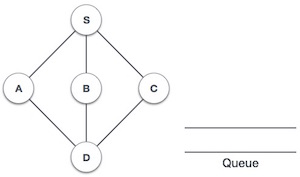
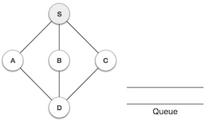
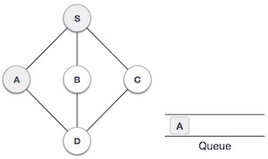
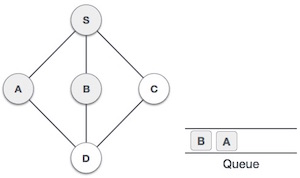
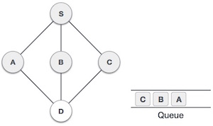
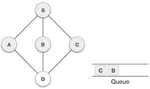
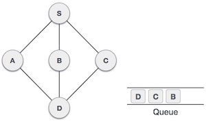

# 概述
广度优先搜索（BFS）算法以宽幅运动遍历图形并使用队列记住在任何迭代中发生死角时获取下一个顶点以开始搜索。


如在上面给出的示例中，BFS算法首先从A到B到E到F，然后到C和G，最后到D.它采用以下规则。

规则1 - 访问相邻的未访问顶点。将其标记为已访问。显示它。将其插入队列中。

规则2 - 如果未找到相邻顶点，则从队列中删除第一个顶点。

规则3 - 重复规则1和规则2，直到队列为空。

序号 | 图示 | 描述
-----|-----|----- 
1 |  | 初始化队列
2 |  | 我们从访问S（起始节点）开始，并将其标记为已访问。
3 |  | 然后我们从S看到一个未访问的相邻节点。在这个例子中，我们有三个节点，但按字母顺序我们选择A，将其标记为已访问并将其排入队列。
4 |  | 接下来，从未访问的邻接节点小号是乙。我们将其标记为已访问并将其排入队列。
5 |  | 接下来，从未访问邻接节点小号是Ç。我们将其标记为已访问并将其排入队列。
6 |  | 现在，S没有未访问的相邻节点。所以，我们出队，并找到一个。
7 |  | 从A我们有D作为未访问的相邻节点。我们将其标记为已访问并将其排入队列。

在这个阶段，我们没有未标记（未访问）的节点。但是根据算法我们继续出列以获得所有未访问的节点。当队列清空时，程序结束。

# c实现


```
#include <stdio.h>
#include <stdlib.h>
#include <stdbool.h>

#define MAX 5

struct Vertex {
   char label;
   bool visited;
};

//队列变量

int queue[MAX];
int rear = -1;
int front = 0;
int queueItemCount = 0;

//图变量

//顶点数组
struct Vertex* lstVertices[MAX];

//邻接矩阵
int adjMatrix[MAX][MAX];

//顶点数
int vertexCount = 0;

//队列功能
// 插入
void insert(int data) {
   queue[++rear] = data;
   queueItemCount++;
}

// 删除图
int removeData() {
   queueItemCount--;
   return queue[front++]; 
}

// 判断图是否为空
bool isQueueEmpty() {
   return queueItemCount == 0;
}

//图函数

//顶点添加到顶点列表
void addVertex(char label) {
    // 申请内存空间
   struct Vertex* vertex = (struct Vertex*) malloc(sizeof(struct Vertex));
   // 储存当前内容
   vertex->label = label;  
   // 下一个节点
   vertex->visited = false;   
   // 节点列表保存  
   lstVertices[vertexCount++] = vertex;
}

//添加边到边数组
void addEdge(int start,int end) {
    // 设置边1
   adjMatrix[start][end] = 1;
   adjMatrix[end][start] = 1;
}

//显示顶点
void displayVertex(int vertexIndex) {
   printf("%c ",lstVertices[vertexIndex]->label);
}       

//获取相邻的未访问的节点
int getAdjUnvisitedVertex(int vertexIndex) {
   int i;
	
   for(i = 0; i<vertexCount; i++) {
       // 寻找从当前节点到所有节点的边数
      if(adjMatrix[vertexIndex][i] == 1 && lstVertices[i]->visited == false)
         return i;
   }
	
   return -1;
}

// 广度优先搜索
void breadthFirstSearch() {
   int i;

   //第一个节点标记为已访问
   lstVertices[0]->visited = true;

   //显示顶点
   displayVertex(0);   

   //队列中插入顶点索引
   insert(0);
   int unvisitedVertex;

   // 当队列为非空的时候不断寻找
   while(!isQueueEmpty()) {
      //获取位于前面的顶点的未访问顶点
      int tempVertex = removeData();   

      //找不到相邻节点
      while((unvisitedVertex = getAdjUnvisitedVertex(tempVertex)) != -1) {    
         lstVertices[unvisitedVertex]->visited = true;
         displayVertex(unvisitedVertex);
         insert(unvisitedVertex);               
      }
		
   }   

   //当遇到为空的时候搜索结束
   for(i = 0;i<vertexCount;i++) {
      lstVertices[i]->visited = false;
   }    
}

int main() {
   int i, j;

   for(i = 0; i<MAX; i++) // set adjacency {
      for(j = 0; j<MAX; j++) // matrix to 0
         adjMatrix[i][j] = 0;
   }

   addVertex('S');   // 0
   addVertex('A');   // 1
   addVertex('B');   // 2
   addVertex('C');   // 3
   addVertex('D');   // 4
 
   addEdge(0, 1);    // S - A
   addEdge(0, 2);    // S - B
   addEdge(0, 3);    // S - C
   addEdge(1, 4);    // A - D
   addEdge(2, 4);    // B - D
   addEdge(3, 4);    // C - D
	
   printf("\nBreadth First Search: ");
   
   breadthFirstSearch();

   return 0;
}

```

输出
```
Breadth First Search: S A B C D

```