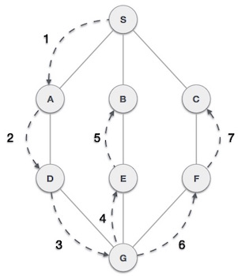
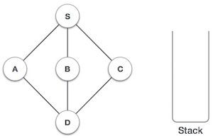
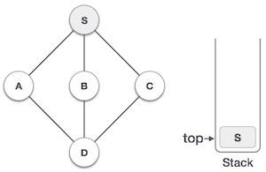
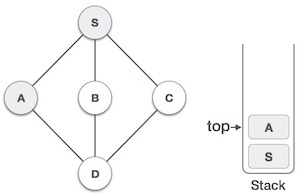
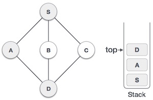
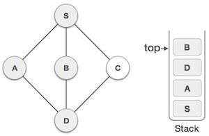
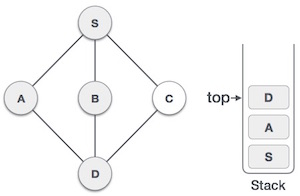

# 概述
深度优先遍历（DFS）算法以向深运动的方式遍历图形，并使用堆栈记住在任何迭代中发生死角时获取下一个顶点以开始搜索。



如在上面给出的示例中，DFS算法首先从S到A到D到G到E到B，然后到F，最后到C.它采用以下规则。

规则1 - 访问相邻的未访问顶点。将其标记为已访问。显示它。将其推入堆栈。

规则2 - 如果未找到相邻顶点，则从堆栈中弹出一个顶点。（它将弹出堆栈中的所有顶点，这些顶点没有相邻的顶点。）

规则3 - 重复规则1和规则2，直到堆栈为空。

序号 | 图示 | 描述
-----|-----|----- 
1 |  | 初始化堆栈
2|  | 将S标记为已访问并将其放入堆栈。从S探索任何未访问的相邻节点。我们有三个节点，我们可以选择其中任何一个。对于此示例，我们将按字母顺序获取节点。
3 |  | 将A标记为已访问并将其放入堆栈。从A探索任何未访问的相邻节点.S和D都与A相邻，但我们只关注未访问的节点。
4 |  | 访问D并将其标记为已访问并放入堆栈。在这里，我们有B和C节点，它们与D相邻并且两者都是未访问的。但是，我们将再次按字母顺序选择。
5 |  | 我们选择B，将其标记为已访问并放入堆栈。这里B没有任何未访问的相邻节点。所以，我们从堆栈弹出B。
6 |  | 我们检查堆栈顶部是否返回上一个节点并检查它是否有任何未访问的节点。在这里，我们发现D位于堆栈的顶部。
7 |  | 只有未访问的邻接节点是从d是Ç现在。所以我们访问C，将其标记为已访问并将其放入堆栈。


由于C没有任何未访问的相邻节点，因此我们不断弹出堆栈，直到找到具有未访问的相邻节点的节点。在这种情况下，没有，我们会一直弹出，直到堆栈为空。

# C实现

```
#include <stdio.h>
#include <stdlib.h>
#include <stdbool.h>

#define MAX 5

struct Vertex {
   char label;
   bool visited;
};

//stack variables

int stack[MAX]; 
int top = -1; 

//graph variables

//array of vertices
struct Vertex* lstVertices[MAX];

//adjacency matrix
int adjMatrix[MAX][MAX];

//vertex count
int vertexCount = 0;

//stack functions

void push(int item) { 
   stack[++top] = item; 
} 

int pop() { 
   return stack[top--]; 
} 

int peek() {
   return stack[top];
}

bool isStackEmpty() {
   return top == -1;
}

//graph functions

//add vertex to the vertex list
void addVertex(char label) {
   struct Vertex* vertex = (struct Vertex*) malloc(sizeof(struct Vertex));
   vertex->label = label;  
   vertex->visited = false;     
   lstVertices[vertexCount++] = vertex;
}

//add edge to edge array
void addEdge(int start,int end) {
   adjMatrix[start][end] = 1;
   adjMatrix[end][start] = 1;
}

//display the vertex
void displayVertex(int vertexIndex) {
   printf("%c ",lstVertices[vertexIndex]->label);
}       

//get the adjacent unvisited vertex
int getAdjUnvisitedVertex(int vertexIndex) {
   int i;

   for(i = 0; i < vertexCount; i++) {
      if(adjMatrix[vertexIndex][i] == 1 && lstVertices[i]->visited == false) {
         return i;
      }
   }

   return -1;
}

void depthFirstSearch() {
   int i;

   //mark first node as visited
   lstVertices[0]->visited = true;

   //display the vertex
   displayVertex(0);   

   //push vertex index in stack
   push(0);

   while(!isStackEmpty()) {
      //get the unvisited vertex of vertex which is at top of the stack
      int unvisitedVertex = getAdjUnvisitedVertex(peek());

      //no adjacent vertex found
      if(unvisitedVertex == -1) {
         pop();
      } else {
         lstVertices[unvisitedVertex]->visited = true;
         displayVertex(unvisitedVertex);
         push(unvisitedVertex);
      }
   }

   //stack is empty, search is complete, reset the visited flag        
   for(i = 0;i < vertexCount;i++) {
      lstVertices[i]->visited = false;
   }        
}

int main() {
   int i, j;

   for(i = 0; i < MAX; i++)    // set adjacency {
      for(j = 0; j < MAX; j++) // matrix to 0
         adjMatrix[i][j] = 0;
   }

   addVertex('S');   // 0
   addVertex('A');   // 1
   addVertex('B');   // 2
   addVertex('C');   // 3
   addVertex('D');   // 4

   addEdge(0, 1);    // S - A
   addEdge(0, 2);    // S - B
   addEdge(0, 3);    // S - C
   addEdge(1, 4);    // A - D
   addEdge(2, 4);    // B - D
   addEdge(3, 4);    // C - D

   printf("Depth First Search: ")
   depthFirstSearch(); 

   return 0;   
}
```

输出
```
Depth First Search: S A D B C
```