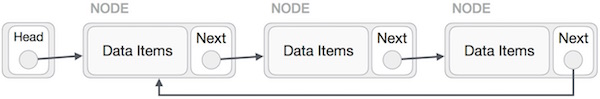
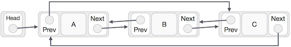

# 循环列表

圆形链接列表是链接列表的变体，其中第一个元素指向最后一个元素，最后一个元素指向第一个元素。单链表和双链表都可以制成循环链表。

# 单链表作为循环链表
在单链表中，最后一个节点的下一个指针指向第一个节点。



# 双链表作为循环链表
在双向链表中，最后一个节点的下一个指针指向第一个节点，第一个节点的前一个指针指向最后一个节点，在两个方向上形成圆形。



根据以上说明，以下是要考虑的重点。

最后一个链接指向列表的第一个链接，无论是单链还是双链表。

在双链表的情况下，第一个链接的前一个指向列表的最后一个。

# 基本操作
以下是循环列表支持的重要操作。

insert - 在列表的开头插入一个元素。

delete - 从列表的开头删除元素。

display - 显示列表。


# 插入操作
下面的代码演示了基于单个链表的循环链表中的插入操作。

```
//insert link at the first location
void insertFirst(int key, int data) {
   //create a link
   struct node *link = (struct node*) malloc(sizeof(struct node));
   link->key = key;
   link->data= data;
	
   if (isEmpty()) {
      head = link;
      head->next = head;
   } else {
      //point it to old first node
      link->next = head;
		
      //point first to new first node
      head = link;
   }   
}

```

# 删除操作
下面的代码演示了基于单个链表的循环链表中的删除操作。

```
//delete first item
struct node * deleteFirst() {
   //save reference to first link
   struct node *tempLink = head;
	
   if(head->next == head) {  
      head = NULL;
      return tempLink;
   }     

   //mark next to first link as first 
   head = head->next;
	
   //return the deleted link
   return tempLink;
}

```

# 显示列表操作
```
//display the list
void printList() {
   struct node *ptr = head;
   printf("\n[ ");
	
   //start from the beginning
   if(head != NULL) {
      while(ptr->next != ptr) {     
         printf("(%d,%d) ",ptr->key,ptr->data);
         ptr = ptr->next;
      }
   }
	
   printf(" ]");
}

```

# 全部代码
全部代码如下
```
#include <stdio.h>
#include <string.h>
#include <stdlib.h>
#include <stdbool.h>

struct node {
   int data;
   int key;
	
   struct node *next;
};

struct node *head = NULL;
struct node *current = NULL;

bool isEmpty() {
   return head == NULL;
}

int length() {
   int length = 0;

   //if list is empty
   if(head == NULL) {
      return 0;
   }

   current = head->next;

   while(current != head) {
      length++;
      current = current->next;   
   }
	
   return length;
}

//insert link at the first location
void insertFirst(int key, int data) {

   //create a link
   struct node *link = (struct node*) malloc(sizeof(struct node));
   link->key = key;
   link->data = data;
	
   if (isEmpty()) {
      head = link;
      head->next = head;
   } else {
      //point it to old first node
      link->next = head;
		
      //point first to new first node
      head = link;
   }    
}

//delete first item
struct node * deleteFirst() {

   //save reference to first link
   struct node *tempLink = head;
	
   if(head->next == head) {  
      head = NULL;
      return tempLink;
   }     

   //mark next to first link as first 
   head = head->next;
	
   //return the deleted link
   return tempLink;
}

//display the list
void printList() {

   struct node *ptr = head;
   printf("\n[ ");
	
   //start from the beginning
   if(head != NULL) {
	
      while(ptr->next != ptr) {     
         printf("(%d,%d) ",ptr->key,ptr->data);
         ptr = ptr->next;
      }
   }
	
   printf(" ]");
}

void main() {
   insertFirst(1,10);
   insertFirst(2,20);
   insertFirst(3,30);
   insertFirst(4,1);
   insertFirst(5,40);
   insertFirst(6,56); 

   printf("Original List: "); 
	
   //print list
   printList();

   while(!isEmpty()) {            
      struct node *temp = deleteFirst();
      printf("\nDeleted value:");  
      printf("(%d,%d) ",temp->key,temp->data);
   }   
	
   printf("\nList after deleting all items: ");
   printList();   
}

```

运行结果

```
Original List: 
[ (6,56) (5,40) (4,1) (3,30) (2,20) ]
Deleted value:(6,56) 
Deleted value:(5,40) 
Deleted value:(4,1) 
Deleted value:(3,30) 
Deleted value:(2,20) 
Deleted value:(1,10) 
List after deleting all items: 
[ ]
```