# 概述
链表是一系列数据结构，通过链接连接在一起。

链接列表是包含项目的一系列链接。每个链接包含与另一个链接的连接。链表是数组后第二常用的数据结构。以下是理解Linked List概念的重要术语。

链接 - 链接列表的每个链接都可以存储称为元素的数据。

Next - 链接列表的每个链接都包含指向下一个名为Next的链接的链接。

LinkedList - 链接列表包含指向名为First的第一个链接的连接链接。

# 链表表示
链表可以显示为节点链，其中每个节点指向下一个节点。
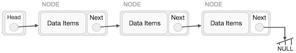

根据以上说明，以下是要考虑的重点。

Linked List包含一个名为first的链接元素。

每个链路都带有一个数据字段和一个名为next的链接字段。

每个链接使用其下一个链接与其下一个链接链接。

最后一个链接带有一个null链接以标记列表的结尾。

# 链表的类型
以下是各种类型的链表。

简单链接列表 - 项目导航仅向前。

双向链接列表 - 可以向前和向后导航项目。

循环链接列表 - 最后一项包含第一个元素的链接作为下一个，第一个元素具有前一个元素的链接。

# 基本操作
以下是列表支持的基本操作。

命令 | 操作
-----|----
插入 | 在列表的开头添加元素
删除 | 删除列表开头的元素
显示 | 显示完整列表
搜索 | 使用给定密钥搜索元素
删除 | 使用给定键删除元素

# 插入操作
在链接列表中添加新节点是一个以上的步骤活动。我们将在这里用图表来学习。首先，使用相同的结构创建一个节点，并找到它必须插入的位置。

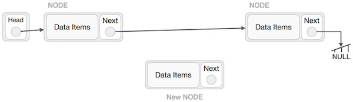

想象一下，我们在A（LeftNode）和C（RightNode）之间插入节点B（NewNode）。然后将B.next指向C -

```
NewNode.next −> RightNode;
```
看起来应该是这样的 -

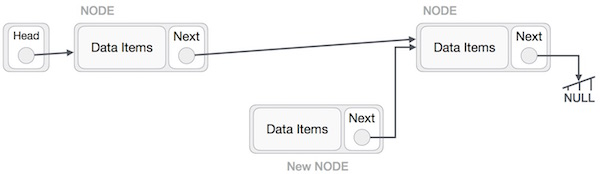
现在，左侧的下一个节点应指向新节点。

```
LeftNode.next −> NewNode;
```


这将把新节点放在两者的中间。新列表应如下所示 -

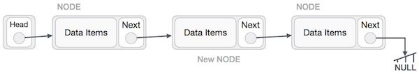
如果在列表的开头插入节点，则应采取类似的步骤。在末尾插入时，列表的倒数第二个节点应指向新节点，新节点将指向NULL。

# 删除操作
删除也是一个不止一步的过程。我们将学习图画表达。首先，使用搜索算法找到要删除的目标节点。

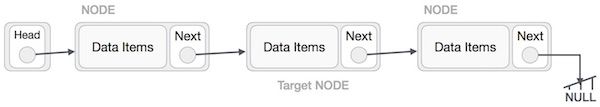

现在，目标节点的左（前）节点应指向目标节点的下一个节点 -

```
LeftNode.next −> TargetNode.next;
```


这将删除指向目标节点的链接。现在，使用以下代码，我们将删除目标节点指向的内容。

```
TargetNode.next −> NULL;
```

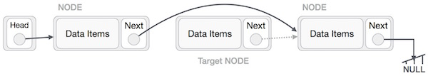

我们需要使用已删除的节点。我们可以将其保留在内存中，否则我们可以简单地释放内存并完全擦除目标节点。

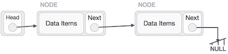


# 反向操作
这项操作是彻底的。我们需要让头节点指向最后一个节点并反转整个链表。

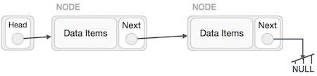

首先，我们遍历列表的末尾。它应该指向NULL。现在，我们将指出它以前的节点 -

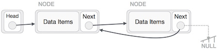

我们必须确保最后一个节点不是丢失的节点。所以我们将有一些临时节点，它看起来像指向最后一个节点的头节点。现在，我们将使所有左侧节点逐一指向其先前的节点。


除了头节点指向的节点（第一个节点）之外，所有节点都应指向它们的前任，使它们成为新的后继节点。第一个节点将指向NULL。

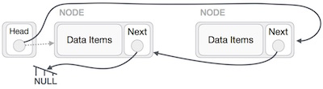

我们将使用temp节点使头节点指向新的第一个节点。

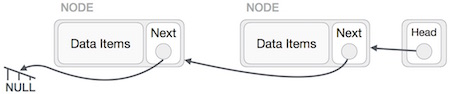

链接列表现在已颠倒过来。

# 代码实现
```
#include <stdio.h>
#include <string.h>
#include <stdlib.h>
#include <stdbool.h>

struct node {
   int data;
   int key;
   struct node *next;
};

struct node *head = NULL;
struct node *current = NULL;

//display the list
void printList() {
   struct node *ptr = head;
   printf("\n[ ");
	
   //start from the beginning
   while(ptr != NULL) {
      printf("(%d,%d) ",ptr->key,ptr->data);
      ptr = ptr->next;
   }
	
   printf(" ]");
}

//insert link at the first location
void insertFirst(int key, int data) {
   //create a link
   struct node *link = (struct node*) malloc(sizeof(struct node));
	
   link->key = key;
   link->data = data;
	
   //point it to old first node
   link->next = head;
	
   //point first to new first node
   head = link;
}

//delete first item
struct node* deleteFirst() {

   //save reference to first link
   struct node *tempLink = head;
	
   //mark next to first link as first 
   head = head->next;
	
   //return the deleted link
   return tempLink;
}

//is list empty
bool isEmpty() {
   return head == NULL;
}

int length() {
   int length = 0;
   struct node *current;
	
   for(current = head; current != NULL; current = current->next) {
      length++;
   }
	
   return length;
}

//find a link with given key
struct node* find(int key) {

   //start from the first link
   struct node* current = head;

   //if list is empty
   if(head == NULL) {
      return NULL;
   }

   //navigate through list
   while(current->key != key) {
	
      //if it is last node
      if(current->next == NULL) {
         return NULL;
      } else {
         //go to next link
         current = current->next;
      }
   }      
	
   //if data found, return the current Link
   return current;
}

//delete a link with given key
struct node* delete(int key) {

   //start from the first link
   struct node* current = head;
   struct node* previous = NULL;
	
   //if list is empty
   if(head == NULL) {
      return NULL;
   }

   //navigate through list
   while(current->key != key) {

      //if it is last node
      if(current->next == NULL) {
         return NULL;
      } else {
         //store reference to current link
         previous = current;
         //move to next link
         current = current->next;
      }
   }

   //found a match, update the link
   if(current == head) {
      //change first to point to next link
      head = head->next;
   } else {
      //bypass the current link
      previous->next = current->next;
   }    
	
   return current;
}

void sort() {

   int i, j, k, tempKey, tempData;
   struct node *current;
   struct node *next;
	
   int size = length();
   k = size ;
	
   for ( i = 0 ; i < size - 1 ; i++, k-- ) {
      current = head;
      next = head->next;
		
      for ( j = 1 ; j < k ; j++ ) {   

         if ( current->data > next->data ) {
            tempData = current->data;
            current->data = next->data;
            next->data = tempData;

            tempKey = current->key;
            current->key = next->key;
            next->key = tempKey;
         }
			
         current = current->next;
         next = next->next;
      }
   }   
}

void reverse(struct node** head_ref) {
   struct node* prev   = NULL;
   struct node* current = *head_ref;
   struct node* next;
	
   while (current != NULL) {
      next  = current->next;
      current->next = prev;   
      prev = current;
      current = next;
   }
	
   *head_ref = prev;
}

void main() {
   insertFirst(1,10);
   insertFirst(2,20);
   insertFirst(3,30);
   insertFirst(4,1);
   insertFirst(5,40);
   insertFirst(6,56); 

   printf("Original List: "); 
	
   //print list
   printList();

   while(!isEmpty()) {            
      struct node *temp = deleteFirst();
      printf("\nDeleted value:");
      printf("(%d,%d) ",temp->key,temp->data);
   }  
	
   printf("\nList after deleting all items: ");
   printList();
   insertFirst(1,10);
   insertFirst(2,20);
   insertFirst(3,30);
   insertFirst(4,1);
   insertFirst(5,40);
   insertFirst(6,56);
   
   printf("\nRestored List: ");
   printList();
   printf("\n");  

   struct node *foundLink = find(4);
	
   if(foundLink != NULL) {
      printf("Element found: ");
      printf("(%d,%d) ",foundLink->key,foundLink->data);
      printf("\n");  
   } else {
      printf("Element not found.");
   }

   delete(4);
   printf("List after deleting an item: ");
   printList();
   printf("\n");
   foundLink = find(4);
	
   if(foundLink != NULL) {
      printf("Element found: ");
      printf("(%d,%d) ",foundLink->key,foundLink->data);
      printf("\n");
   } else {
      printf("Element not found.");
   }
	
   printf("\n");
   sort();
	
   printf("List after sorting the data: ");
   printList();
	
   reverse(&head);
   printf("\nList after reversing the data: ");
   printList();
}
```

结果如下
```
Original List: 
[ (6,56) (5,40) (4,1) (3,30) (2,20) (1,10) ]
Deleted value:(6,56) 
Deleted value:(5,40) 
Deleted value:(4,1) 
Deleted value:(3,30) 
Deleted value:(2,20) 
Deleted value:(1,10) 
List after deleting all items: 
[ ]
Restored List: 
[ (6,56) (5,40) (4,1) (3,30) (2,20) (1,10) ]
Element found: (4,1) 
List after deleting an item: 
[ (6,56) (5,40) (3,30) (2,20) (1,10) ]
Element not found.
List after sorting the data: 
[ (1,10) (2,20) (3,30) (5,40) (6,56) ]
List after reversing the data: 
[ (6,56) (5,40) (3,30) (2,20) (1,10) ]

```