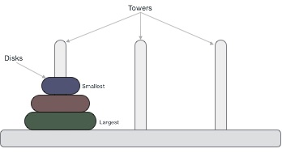
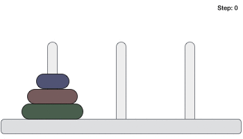
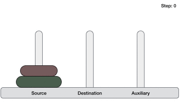

# 概述
河内塔，是一个数学难题，由三个塔（钉）和多个环组成 - 如图所示 -



这些环具有不同的尺寸并以升序堆叠，即较小的环位于较大的环上。这个拼图还有其他变化，其中磁盘数量增加，但塔数仍然相同。

# 规则
任务是将所有磁盘移动到另一个塔，而不违反排列顺序。河内塔的一些规则是 -

在任何给定时间，塔之间只能移动一个磁盘。
只能删除“顶部”磁盘。
没有大磁盘可以放在小磁盘上。
以下是用三个磁盘解决河内塔拼图的动画表示。



具有n个磁盘的河内塔拼图可以在最少2 ^ n -1步骤中解决。此演示文稿显示具有3个磁盘的拼图已经采取了2 ^ 3 - 1 = 7步。

# 算法
要为Tower of Hanoi编写算法，首先我们需要学习如何用较少量的磁盘来解决这个问题，比如说→1或2.我们用三个塔标记名称，源，目的地和辅助（仅用于帮助移动磁盘） ）。如果我们只有一个磁盘，那么它可以很容易地从源移动到目标挂钩。

如果我们有2个磁盘 -

首先，我们将较小的（顶部）磁盘移动到辅助挂钩。
然后，我们将较大的（底部）磁盘移动到目标挂钩。
最后，我们将较小的磁盘从aux移动到目标peg。



所以现在，我们可以设计一个具有两个以上磁盘的Tower of Hanoi算法。我们将磁盘堆分成两部分。最大的磁盘（第 n 个磁盘）在一个部分中，所有其他（n-1个）磁盘在第二个部分中。

我们的最终目标是将磁盘n从源移动到目标，然后将所有其他（n1）磁盘放到它上面。我们可以想象以递归方式对所有给定的磁盘组应用相同的方法。

要遵循的步骤是 -

```
Step 1 − Move n-1 disks from source to aux
Step 2 − Move nth disk from source to dest
Step 3 − Move n-1 disks from aux to dest
```

算法如下

```
START
Procedure Hanoi(disk, source, dest, aux)

   IF disk == 1, THEN
      move disk from source to dest             
   ELSE
      Hanoi(disk - 1, source, aux, dest)     // Step 1
      move disk from source to dest          // Step 2
      Hanoi(disk - 1, aux, dest, source)     // Step 3
   END IF
   
END Procedure
STOP

```

# C语言实现
```
#include <stdio.h>
#include <stdbool.h>

#define MAX 10

int list[MAX] = {1,8,4,6,0,3,5,2,7,9};

void display(){
   int i;
   printf("[");
	
   // navigate through all items 
   for(i = 0; i < MAX; i++) {
      printf("%d ",list[i]);
   }
	
   printf("]\n");
}

void bubbleSort() {
   int temp;
   int i,j;
   bool swapped = false;       
   
   // loop through all numbers 
   for(i = 0; i < MAX-1; i++) { 
      swapped = false;
		
      // loop through numbers falling ahead 
      for(j = 0; j < MAX-1-i; j++) {
         printf("Items compared: [ %d, %d ] ", list[j],list[j+1]);

         // check if next number is lesser than current no
         //   swap the numbers. 
         //  (Bubble up the highest number) 
			
         if(list[j] > list[j+1]) {
            temp = list[j];
            list[j] = list[j+1];
            list[j+1] = temp;

            swapped = true;
            printf(" => swapped [%d, %d]\n",list[j],list[j+1]);
         } else {
            printf(" => not swapped\n");
         }
      }

      // if no number was swapped that means 
      //   array is sorted now, break the loop. 
      if(!swapped) {
         break;
      }
      
      printf("Iteration %d#: ",(i+1)); 
      display();                     
   }    
}

int main() {
   printf("Input Array: ");
   display();
   printf("\n");
   bubbleSort();
   printf("\nOutput Array: ");
   display();
}

```

输出

```
Input Array: [1 8 4 6 0 3 5 2 7 9 ]

     Items compared: [ 1, 8 ]  => not swapped
     Items compared: [ 8, 4 ]  => swapped [4, 8]
     Items compared: [ 8, 6 ]  => swapped [6, 8]
     Items compared: [ 8, 0 ]  => swapped [0, 8]
     Items compared: [ 8, 3 ]  => swapped [3, 8]
     Items compared: [ 8, 5 ]  => swapped [5, 8]
     Items compared: [ 8, 2 ]  => swapped [2, 8]
     Items compared: [ 8, 7 ]  => swapped [7, 8]
     Items compared: [ 8, 9 ]  => not swapped
Iteration 1#: [1 4 6 0 3 5 2 7 8 9 ]
     Items compared: [ 1, 4 ]  => not swapped
     Items compared: [ 4, 6 ]  => not swapped
     Items compared: [ 6, 0 ]  => swapped [0, 6]
     Items compared: [ 6, 3 ]  => swapped [3, 6]
     Items compared: [ 6, 5 ]  => swapped [5, 6]
     Items compared: [ 6, 2 ]  => swapped [2, 6]
     Items compared: [ 6, 7 ]  => not swapped
     Items compared: [ 7, 8 ]  => not swapped
Iteration 2#: [1 4 0 3 5 2 6 7 8 9 ]
     Items compared: [ 1, 4 ]  => not swapped
     Items compared: [ 4, 0 ]  => swapped [0, 4]
     Items compared: [ 4, 3 ]  => swapped [3, 4]
     Items compared: [ 4, 5 ]  => not swapped
     Items compared: [ 5, 2 ]  => swapped [2, 5]
     Items compared: [ 5, 6 ]  => not swapped
     Items compared: [ 6, 7 ]  => not swapped
Iteration 3#: [1 0 3 4 2 5 6 7 8 9 ]
     Items compared: [ 1, 0 ]  => swapped [0, 1]
     Items compared: [ 1, 3 ]  => not swapped
     Items compared: [ 3, 4 ]  => not swapped
     Items compared: [ 4, 2 ]  => swapped [2, 4]
     Items compared: [ 4, 5 ]  => not swapped
     Items compared: [ 5, 6 ]  => not swapped
Iteration 4#: [0 1 3 2 4 5 6 7 8 9 ]
     Items compared: [ 0, 1 ]  => not swapped
     Items compared: [ 1, 3 ]  => not swapped
     Items compared: [ 3, 2 ]  => swapped [2, 3]
     Items compared: [ 3, 4 ]  => not swapped
     Items compared: [ 4, 5 ]  => not swapped
Iteration 5#: [0 1 2 3 4 5 6 7 8 9 ]
     Items compared: [ 0, 1 ]  => not swapped
     Items compared: [ 1, 2 ]  => not swapped
     Items compared: [ 2, 3 ]  => not swapped
     Items compared: [ 3, 4 ]  => not swapped

Output Array: [0 1 2 3 4 5 6 7 8 9 ]

```