# 概述
这是一种就地比较排序算法。这里，维护一个始终排序的子列表。例如，维护数组的下半部分以进行排序。要在此已排序的子列表中“插入”的元素必须找到其适当的位置，然后必须将其插入其中。因此名称，插入排序。

按顺序搜索数组，移动未分类的项并将其插入已排序的子列表（在同一数组中）。该算法不适用于大数据集，因为其平均和最差情况复杂度为0（n 2），其中n是项目数。

# 插入排序如何工作？
我们以一个未排序的数组为例。


插入排序比较前两个元素。

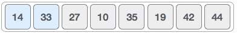

它发现14和33都已按升序排列。目前，14位于已排序的子列表中。

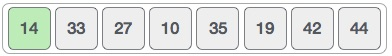

插入排序向前移动并将33与27进行比较。

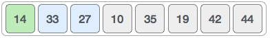

并发现33不在正确的位置。

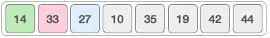

它将33与27交换。它还检查已排序子列表的所有元素。在这里，我们看到排序的子列表只有一个元素14，而27大于14.因此，排序的子列表在交换后仍然排序。

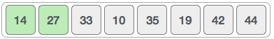

到目前为止，我们在已排序的子列表中有14和27。接下来，它将33与10进行比较。

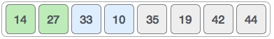

这些值不是按排序顺序排列的。

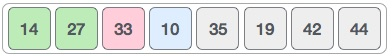

所以我们互换它们。

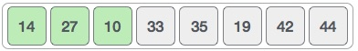

但是，交换使27和10未分类。

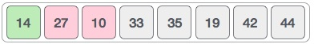

因此，我们也交换它们。

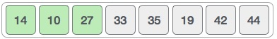

我们再次以未排序的顺序找到14和10。

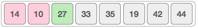

我们再次交换它们。到第三次迭代结束时，我们有一个包含4个项目的已排序子列表。

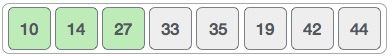

此过程将继续，直到排序的子列表中包含所有未排序的值。现在我们将看到插入排序的一些编程方面。

# 算法
现在我们对这种排序技术的工作原理有了更大的了解，因此我们可以推导出简单的步骤来实现插入排序。

```
Step 1 − If it is the first element, it is already sorted. return 1;
Step 2 − Pick next element
Step 3 − Compare with all elements in the sorted sub-list
Step 4 − Shift all the elements in the sorted sub-list that is greater than the 
         value to be sorted
Step 5 − Insert the value
Step 6 − Repeat until list is sorted

```

# 伪代码
```
procedure insertionSort( A : array of items )
   int holePosition
   int valueToInsert
	
   for i = 1 to length(A) inclusive do:
	
      /* select value to be inserted */
      valueToInsert = A[i]
      holePosition = i
      
      /*locate hole position for the element to be inserted */
		
      while holePosition > 0 and A[holePosition-1] > valueToInsert do:
         A[holePosition] = A[holePosition-1]
         holePosition = holePosition -1
      end while
		
      /* insert the number at hole position */
      A[holePosition] = valueToInsert
      
   end for
	
end procedure

```

# C代码
```
#include <stdio.h>
#include <stdbool.h>

#define MAX 7

int intArray[MAX] = {4,6,3,2,1,9,7};

void printline(int count) {
   int i;
	
   for(i = 0;i < count-1;i++) {
      printf("=");
   }
	
   printf("=\n");
}

void display() {
   int i;
   printf("[");
	
   // navigate through all items 
   for(i = 0;i < MAX;i++) {
      printf("%d ",intArray[i]);
   }
	
   printf("]\n");
}

void insertionSort() {

   int valueToInsert;
   int holePosition;
   int i;
  
   // loop through all numbers 
   for(i = 1; i < MAX; i++) { 
	
      // select a value to be inserted. 
      valueToInsert = intArray[i];
		
      // select the hole position where number is to be inserted 
      holePosition = i;
		
      // check if previous no. is larger than value to be inserted 
      while (holePosition > 0 && intArray[holePosition-1] > valueToInsert) {
         intArray[holePosition] = intArray[holePosition-1];
         holePosition--;
         printf(" item moved : %d\n" , intArray[holePosition]);
      }

      if(holePosition != i) {
         printf(" item inserted : %d, at position : %d\n" , valueToInsert,holePosition);
         // insert the number at hole position 
         intArray[holePosition] = valueToInsert;
      }

      printf("Iteration %d#:",i);
      display();
		
   }  
}

void main() {
   printf("Input Array: ");
   display();
   printline(50);
   insertionSort();
   printf("Output Array: ");
   display();
   printline(50);
}

```

# 输出
```
Input Array: [4 6 3 2 1 9 7 ]
==================================================
Iteration 1#:[4 6 3 2 1 9 7 ]
 item moved : 6
 item moved : 4
 item inserted : 3, at position : 0
Iteration 2#:[3 4 6 2 1 9 7 ]
 item moved : 6
 item moved : 4
 item moved : 3
 item inserted : 2, at position : 0
Iteration 3#:[2 3 4 6 1 9 7 ]
 item moved : 6
 item moved : 4
 item moved : 3
 item moved : 2
 item inserted : 1, at position : 0
Iteration 4#:[1 2 3 4 6 9 7 ]
Iteration 5#:[1 2 3 4 6 9 7 ]
 item moved : 9
 item inserted : 7, at position : 5
Iteration 6#:[1 2 3 4 6 7 9 ]
Output Array: [1 2 3 4 6 7 9 ]
==================================================

```

# 总结
一个for和一个while循环，for用于遍历已经排序好的数组，while用于遍历未排序的数组。进行交换。

