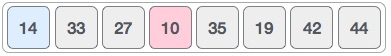
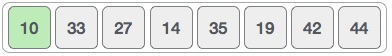
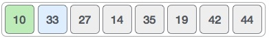
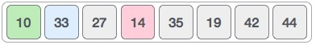
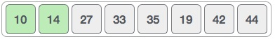
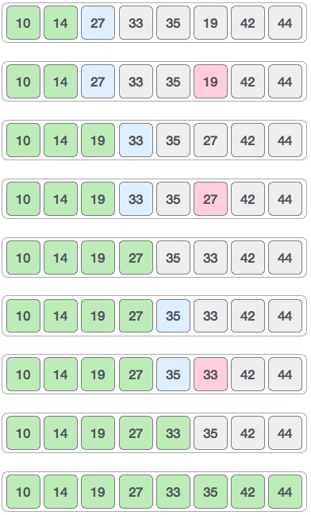

# 概述
选择排序是一种简单的排序算法。这种排序算法是一种就地比较算法，其中列表分为两部分，左端的排序部分和右端的未排序部分。最初，排序的部分为空，未排序的部分是整个列表。

最小元素从未排序数组中选择，并与最左边的元素交换，该元素成为排序数组的一部分。此过程继续将未排序的数组边界向右移动一个元素。

该算法不适用于大数据集，因为其平均和最差情况复杂度为0（n 2），其中n是项目数。

# 选择排序如何工作？
以下面描述的数组为例。


对于排序列表中的第一个位置，将按顺序扫描整个列表。目前存储14的第一个位置，我们搜索整个列表并发现10是最低值。



因此我们用10代替14.在一次迭代10之后，恰好是列表中的最小值，出现在排序列表的第一个位置。



对于存在33的第二个位置，我们开始以线性方式扫描列表的其余部分。



我们发现14是列表中第二低的值，它应该出现在第二位。我们交换这些值。



在两次迭代之后，两个最小值以排序的方式位于开头。



相同的过程应用于数组中的其余项。

以下是整个分拣过程的图示 -



现在，让我们学习一些选择排序的编程方面。

# 算法
```
Step 1 − Set MIN to location 0
Step 2 − Search the minimum element in the list
Step 3 − Swap with value at location MIN
Step 4 − Increment MIN to point to next element
Step 5 − Repeat until list is sorted
```
# 伪代码
```
procedure selection sort 
   list  : array of items
   n     : size of list

   for i = 1 to n - 1
   /* set current element as minimum*/
      min = i    
  
      /* check the element to be minimum */

      for j = i+1 to n 
         if list[j] < list[min] then
            min = j;
         end if
      end for

      /* swap the minimum element with the current element*/
      if indexMin != i  then
         swap list[min] and list[i]
      end if
   end for
	
end procedure

```
# C代码
```
#include <stdio.h>
#include <stdbool.h>

#define MAX 7

int intArray[MAX] = {4,6,3,2,1,9,7};

void printline(int count) {
   int i;
	
   for(i = 0;i < count-1;i++) {
      printf("=");
   }
	
   printf("=\n");
}

void display() {
   int i;
   printf("[");
	
   // navigate through all items 
   for(i = 0;i < MAX;i++) {
      printf("%d ", intArray[i]);
   }
	
   printf("]\n");
}

void selectionSort() {
   int indexMin,i,j;
	
   // loop through all numbers 
   for(i = 0; i < MAX-1; i++) { 
	
      // set current element as minimum 
      indexMin = i;
		
      // check the element to be minimum 
      for(j = i+1;j < MAX;j++) {
         if(intArray[j] < intArray[indexMin]) {
            indexMin = j;
         }
      }

      if(indexMin != i) {
         printf("Items swapped: [ %d, %d ]\n" , intArray[i], intArray[indexMin]); 
			
         // swap the numbers 
         int temp = intArray[indexMin];
         intArray[indexMin] = intArray[i];
         intArray[i] = temp;
      }          

      printf("Iteration %d#:",(i+1));
      display();
   }
}  

void main() {
   printf("Input Array: ");
   display();
   printline(50);
   selectionSort();
   printf("Output Array: ");
   display();
   printline(50);
}

```

输出
```
Input Array: [4 6 3 2 1 9 7 ]
==================================================
Items swapped: [ 4, 1 ]
Iteration 1#:[1 6 3 2 4 9 7 ]
Items swapped: [ 6, 2 ]
Iteration 2#:[1 2 3 6 4 9 7 ]
Iteration 3#:[1 2 3 6 4 9 7 ]
Items swapped: [ 6, 4 ]
Iteration 4#:[1 2 3 4 6 9 7 ]
Iteration 5#:[1 2 3 4 6 9 7 ]
Items swapped: [ 9, 7 ]
Iteration 6#:[1 2 3 4 6 7 9 ]
Output Array: [1 2 3 4 6 7 9 ]
==================================================

```

# 总结
选择排序是两个for嵌套，外部循环用来进行第几轮，内部循环用于寻找剩下的最小项。