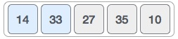
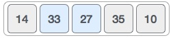
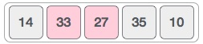
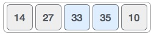
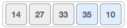
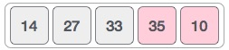
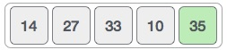
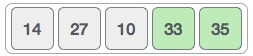
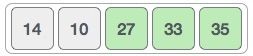
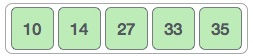

# 概述
冒泡排序是一种简单的排序算法。该排序算法是基于比较的算法，其中比较每对相邻元素，并且如果元素不按顺序则交换元素。该算法不适用于大数据集，因为其平均和最差情况复杂度为0（n 2），其中n是项目数。

# 冒泡排序如何工作？
我们以一个未排序的数组为例。冒泡排序需要Ο（n 2）时间，所以我们保持简短和精确。

我们以一个未排序的数组为例。冒泡排序需要Ο（n 2）时间，所以我们保持简短和精确。


冒泡排序从前两个元素开始，比较它们以检查哪一个更大。



在这种情况下，值33大于14，因此它已经在已排序的位置。接下来，我们将33与27进行比较。



我们发现27小于33并且必须交换这两个值。



新阵列应如下所示 -


接下来我们比较33和35.我们发现两者都处于已排序的位置。



然后我们转到接下来的两个值，35和10。



我们当时知道10小了35.因此它们没有排序。



我们交换这些值。我们发现我们已经到达了数组的末尾。一次迭代后，数组应如下所示 -



确切地说，我们现在展示了每次迭代后数组的外观。在第二次迭代之后，它应该看起来像这样 -



请注意，在每次迭代后，最后至少有一个值移动。



当没有需要交换时，bubble sorts会知道数组是完全排序的。



现在我们应该研究一下泡沫排序的一些实际方面。

# 算法
我们假设list是n个元素的数组。我们进一步假设交换函数交换给定数组元素的值。

```
begin BubbleSort(list)

   for all elements of list
      if list[i] > list[i+1]
         swap(list[i], list[i+1])
      end if
   end for
   
   return list
   
end BubbleSort
```

# 伪代码
我们在算法中观察到冒号排序比较每对数组元素，除非整个数组按升序完全排序。这可能会导致一些复杂性问题，例如，如果所有元素都已经提升，那么数组不需要更多交换。

为了解决问题，我们使用一个交换的标志变量，它将帮助我们查看是否发生了任何交换。如果没有发生交换，即数组不再需要进行排序处理，它将退出循环。

BubbleSort算法的伪代码可以写成如下 -

```
procedure bubbleSort( list : array of items )

   loop = list.count;
   
   for i = 0 to loop-1 do:
      swapped = false
		
      for j = 0 to loop-1 do:
      
         /* compare the adjacent elements */   
         if list[j] > list[j+1] then
            /* swap them */
            swap( list[j], list[j+1] )		 
            swapped = true
         end if
         
      end for
      
      /*if no number was swapped that means 
      array is sorted now, break the loop.*/
      
      if(not swapped) then
         break
      end if
      
   end for
   
end procedure return list

```

# 最后
我们在原始算法及其即兴伪代码中未解决的另一个问题是，在每次迭代之后，最高值在数组末尾处稳定下来。因此，下一次迭代不需要包括已经排序的元素。为此，在我们的实现中，我们限制内部循环以避免已经排序的值。

# C代码
```
#include <stdio.h>
#include <stdbool.h>

#define MAX 10

int list[MAX] = {1,8,4,6,0,3,5,2,7,9};

void display() {
   int i;
   printf("[");
	
   // navigate through all items 
   for(i = 0; i < MAX; i++) {
      printf("%d ",list[i]);
   }
	
   printf("]\n");
}

void bubbleSort() {
   int temp;
   int i,j;
	
   bool swapped = false;
   
   // loop through all numbers 
   for(i = 0; i < MAX-1; i++) { 
      swapped = false;
		
      // loop through numbers falling ahead 
      for(j = 0; j < MAX-1-i; j++) {
         printf("     Items compared: [ %d, %d ] ", list[j],list[j+1]);

         // check if next number is lesser than current no
         //   swap the numbers. 
         //  (Bubble up the highest number)
			
         if(list[j] > list[j+1]) {
            temp = list[j];
            list[j] = list[j+1];
            list[j+1] = temp;

            swapped = true;
            printf(" => swapped [%d, %d]\n",list[j],list[j+1]);
         } else {
            printf(" => not swapped\n");
         }
			
      }

      // if no number was swapped that means 
      //   array is sorted now, break the loop. 
      if(!swapped) {
         break;
      }
      
      printf("Iteration %d#: ",(i+1)); 
      display();
   }
	
}

void main() {
   printf("Input Array: ");
   display();
   printf("\n");
	
   bubbleSort();
   printf("\nOutput Array: ");
   display();
}

```

# 输出
```
Input Array: [1 8 4 6 0 3 5 2 7 9 ]
     Items compared: [ 1, 8 ]  => not swapped
     Items compared: [ 8, 4 ]  => swapped [4, 8]
     Items compared: [ 8, 6 ]  => swapped [6, 8]
     Items compared: [ 8, 0 ]  => swapped [0, 8]
     Items compared: [ 8, 3 ]  => swapped [3, 8]
     Items compared: [ 8, 5 ]  => swapped [5, 8]
     Items compared: [ 8, 2 ]  => swapped [2, 8]
     Items compared: [ 8, 7 ]  => swapped [7, 8]
     Items compared: [ 8, 9 ]  => not swapped
Iteration 1#: [1 4 6 0 3 5 2 7 8 9 ]
     Items compared: [ 1, 4 ]  => not swapped
     Items compared: [ 4, 6 ]  => not swapped
     Items compared: [ 6, 0 ]  => swapped [0, 6]
     Items compared: [ 6, 3 ]  => swapped [3, 6]
     Items compared: [ 6, 5 ]  => swapped [5, 6]
     Items compared: [ 6, 2 ]  => swapped [2, 6]
     Items compared: [ 6, 7 ]  => not swapped
     Items compared: [ 7, 8 ]  => not swapped
Iteration 2#: [1 4 0 3 5 2 6 7 8 9 ]
     Items compared: [ 1, 4 ]  => not swapped
     Items compared: [ 4, 0 ]  => swapped [0, 4]
     Items compared: [ 4, 3 ]  => swapped [3, 4]
     Items compared: [ 4, 5 ]  => not swapped
     Items compared: [ 5, 2 ]  => swapped [2, 5]
     Items compared: [ 5, 6 ]  => not swapped
     Items compared: [ 6, 7 ]  => not swapped
Iteration 3#: [1 0 3 4 2 5 6 7 8 9 ]
     Items compared: [ 1, 0 ]  => swapped [0, 1]
     Items compared: [ 1, 3 ]  => not swapped
     Items compared: [ 3, 4 ]  => not swapped
     Items compared: [ 4, 2 ]  => swapped [2, 4]
     Items compared: [ 4, 5 ]  => not swapped
     Items compared: [ 5, 6 ]  => not swapped
Iteration 4#: [0 1 3 2 4 5 6 7 8 9 ]
     Items compared: [ 0, 1 ]  => not swapped
     Items compared: [ 1, 3 ]  => not swapped
     Items compared: [ 3, 2 ]  => swapped [2, 3]
     Items compared: [ 3, 4 ]  => not swapped
     Items compared: [ 4, 5 ]  => not swapped
Iteration 5#: [0 1 2 3 4 5 6 7 8 9 ]
     Items compared: [ 0, 1 ]  => not swapped
     Items compared: [ 1, 2 ]  => not swapped
     Items compared: [ 2, 3 ]  => not swapped
     Items compared: [ 3, 4 ]  => not swapped

Output Array: [0 1 2 3 4 5 6 7 8 9 ]

```

# 总结
两个for嵌套，相邻两两交换