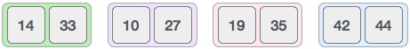
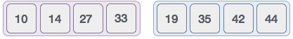

# 概述
合并排序是一种基于分而治之技术的排序技术。在最坏情况下的时间复杂度为0（n log n）时，它是最最要算法之一。

合并排序首先将数组分成相等的一半，然后以排序的方式组合它们。

# 合并排序如何工作？
要理解合并排序，我们采用未排序的数组，如下所示 -


我们知道，除非达到原子值，否则合并排序首先将整个数组迭代地分成相等的一半。我们在这里看到，8个项目的数组被分成两个大小为4的数组。


这不会改变原始项目的外观顺序。现在我们将这两个数组分成两半。


我们进一步划分这些数组，我们实现原子价值，不能再划分。


现在，我们以完全相同的方式将它们组合在一起。请注意这些列表的颜色代码。

我们首先比较每个列表的元素，然后以排序的方式将它们组合到另一个列表中。我们看到14和33处于排序位置。比较27和10，并且在2个值的目标列表中我们首先放置10个，然后是27.我们改变19和35的顺序，而顺序放置42和44。



在组合阶段的下一次迭代中，我们比较两个数据值的列表，并将它们合并到找到的数据值列表中，所有这些值都按排序顺序排列。



在最终合并之后，列表应该如下所示 -


现在我们应该学习合并排序的一些编程方面。

# 算法
合并排序继续将列表分成相等的一半，直到它不再被分割。根据定义，如果列表中只有一个元素，则对其进行排序。然后，合并排序组合了较小的排序列表，同时保持新列表的排序。

```
Step 1 − if it is only one element in the list it is already sorted, return.
Step 2 − divide the list recursively into two halves until it can no more be divided.
Step 3 − merge the smaller lists into new list in sorted order.
```

# 伪代码

我们现在将看到合并排序函数的伪代码。我们的算法指出了两个主要功能 - 分而合。

合并排序适用于递归，我们将以相同的方式看到我们的实现。

```
procedure mergesort( var a as array )
   if ( n == 1 ) return a

   var l1 as array = a[0] ... a[n/2]
   var l2 as array = a[n/2+1] ... a[n]

   l1 = mergesort( l1 )
   l2 = mergesort( l2 )

   return merge( l1, l2 )
end procedure

procedure merge( var a as array, var b as array )

   var c as array
   while ( a and b have elements )
      if ( a[0] > b[0] )
         add b[0] to the end of c
         remove b[0] from b
      else
         add a[0] to the end of c
         remove a[0] from a
      end if
   end while
   
   while ( a has elements )
      add a[0] to the end of c
      remove a[0] from a
   end while
   
   while ( b has elements )
      add b[0] to the end of c
      remove b[0] from b
   end while
   
   return c
	
end procedure
```

# C代码
```
#include <stdio.h>

#define max 10

int a[11] = { 10, 14, 19, 26, 27, 31, 33, 35, 42, 44, 0 };
int b[10];

void merging(int low, int mid, int high) {
   int l1, l2, i;

   for(l1 = low, l2 = mid + 1, i = low; l1 <= mid && l2 <= high; i++) {
      if(a[l1] <= a[l2])
         b[i] = a[l1++];
      else
         b[i] = a[l2++];
   }
   
   while(l1 <= mid)    
      b[i++] = a[l1++];

   while(l2 <= high)   
      b[i++] = a[l2++];

   for(i = low; i <= high; i++)
      a[i] = b[i];
}

void sort(int low, int high) {
   int mid;
   
   if(low < high) {
      mid = (low + high) / 2;
      sort(low, mid);
      sort(mid+1, high);
      merging(low, mid, high);
   } else { 
      return;
   }   
}

int main() { 
   int i;

   printf("List before sorting\n");
   
   for(i = 0; i <= max; i++)
      printf("%d ", a[i]);

   sort(0, max);

   printf("\nList after sorting\n");
   
   for(i = 0; i <= max; i++)
      printf("%d ", a[i]);
}

```

输出

```
List before sorting
10 14 19 26 27 31 33 35 42 44 0
List after sorting
0 10 14 19 26 27 31 33 35 42 44
```

# 总结
先递归，再合并
代码如下
```
import java.nio.charset.MalformedInputException;

public class main {
    public static void MergeSort(int[] arr, int low, int hight){
        // 其中low为左边，hight为右边，mid为中间值
        // 递归实现归并排序
        int mid = (low + hight) / 2;
        if(low < hight){
            // 递归再对左右两边进行排序
            MergeSort(arr, low, mid);
            MergeSort(arr, mid + 1, hight);
            // 合并
            merge(arr, low, mid, hight);
        }
    }
    // 进行合并
    private static void merge(int[] arr, int low, int mid, int high){
        // tmp用于暂时保存结果
        int [] temp = new int[high - low + 1];
        // 左边指针
        int i = low;
        // 右边指针
        int j = mid + 1;
        // 合并数组后的指针
        int k = 0;
        // 记录从大到小放入temp数组
        for(; i <= mid && j <= high; k++){
            if(arr[i] < arr[j]){
                // 进入临时数组
                temp[k] = arr[i++];
            }else{
                temp[k] = arr[j++];
            }
        }
        // 比较结束以后。剩余部分放入数组
        while(i <= mid){
            temp[k++] = arr[i++];
        }
        while(j <= high){
            temp[k++] = arr[j++];
        }
        // temp数组写入待排数组
        for(int L = 0; L < temp.length; L++ ){
            arr[low + L] = temp[L];
        }
    }
}

```
测试类如下

```
import static org.junit.jupiter.api.Assertions.*;

class mainTest {

    @org.junit.jupiter.api.Test
    void mergeSort() {
        int[] a = {566, 34,54};
        main.MergeSort(a, 0, 2);
        for(int e : a){
            System.out.println(e);
        }
    }
}
```

总结：先分再合，分使用递归分，合，对两个列表中的元素进行合，插入临时数组中，最后剩余的和入数组中，然后再写入待排数组中。

核心在于使用递归实现先分后合，递归同理可以使用尾递归进行优化