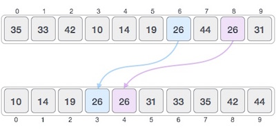

# 概述
排序是指以特定格式排列数据。排序算法指定按特定顺序排列数据的方式。最常见的订单是按数字或字典顺序排列的。

排序的重要性在于，如果数据以排序的方式存储，则数据搜索可以被优化到非常高的水平。排序还用于以更易读的格式表示数据。以下是在现实场景中排序的一些示例 -

电话簿 - 电话簿存储按姓名分类的人的电话号码，以便可以轻松搜索姓名。

字典 - 字典按字母顺序存储单词，以便搜索任何单词变得容易。

# 就地排序和非就地排序
排序算法可能需要一些额外的空间用于比较和临时存储少量数据元素。这些算法不需要任何额外的空间，并且据说排序就地发生，或者例如在阵列本身内发生。这称为就地排序。冒泡排序是就地排序的一个例子。

但是，在某些排序算法中，程序需要的空间大于或等于要排序的元素。使用相等或更多空间的排序称为非就地排序。Merge-sort是非就地排序的一个例子。

# 稳定和不稳定的排序
如果排序算法在对内容进行排序之后不会改变它们出现的类似内容的顺序，则称为稳定排序。

如果排序算法在排序内容之后改变它们出现的类似内容的顺序，则称为不稳定排序。

当我们希望保持原始元素的序列时，算法的稳定性很重要，例如在元组中。

# 自适应非自适应排序算法
如果排序算法利用了要排序的列表中已经“排序”的元素，则称该排序算法是自适应的。也就是说，在排序源列表中是否已经对某些元素进行了排序时，自适应算法会将此考虑在内并尝试不对它们进行重新排序。

非自适应算法是不考虑已经排序的元素的算法。他们试图强制重新排序每个元素以确认其排序。

# 一些术语
## 递增顺序排列
如果连续元素大于前一个元素，则称一系列值按递增顺序排列。例如，1,3,4,6,8,9按递增顺序排列，因为每个下一个元素都大于前一个元素。

## 降序排列
如果连续元素小于当前元素，则称一系列值按降序排列。例如，9,8,6,4,3,1按递减顺序排列，因为每个下一个元素都小于前一个元素。

## 非递增顺序
如果连续元素小于或等于序列中的先前元素，则称一系列值以非递增顺序。当序列包含重复值时，会发生此顺序。例如，9,8,6,3,3,1处于非递增顺序，因为每个下一个元素小于或等于（在3的情况下）但不大于任何先前元素。

## 非递减顺序
如果连续元素大于或等于序列中的前一元素，则称一系列值以非递减顺序。当序列包含重复值时，会发生此顺序。例如，1,3,3,6,8,9是非递减顺序，因为每个下一个元素大于或等于（在3的情况下）但不小于前一个。

