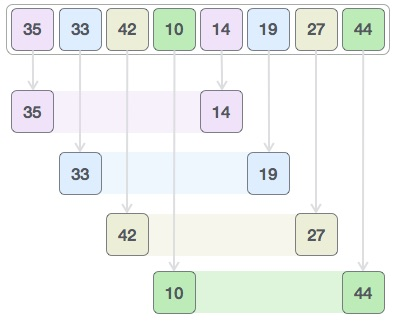
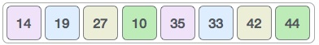
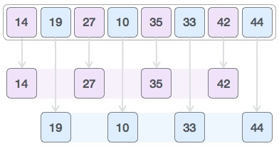
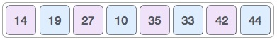

# 概述
希尔排序是一种高效的排序算法，基于插入排序算法。该算法避免了大的移位，如插入排序的情况，如果较小的值是最右边的并且必须移动到最左边。

该算法对广泛传播的元素使用插入排序，首先对它们进行排序，然后对间距较小的元素进行排序。该间距称为间隔。此间隔基于Knuth的公式计算为 -

```
h = h * 3 + 1
where −
   h is interval with initial value 1
```

该算法对于中等大小的数据集非常有效，因为该算法的平均和最坏情况复杂度取决于最熟知的间隙序列是Ο（n），其中n是项目的数量。最糟糕的情况是空间复杂度为O（n）。

# 希尔排序如何工作
让我们考虑以下示例来了解希尔排序的工作原理。我们采用我们在前面的示例中使用的相同数组。对于我们的示例和易于理解，我们采用间隔4.创建位于4个位置的所有值的虚拟子列表。这些值为{35,14}，{33,19}，{42,27}和{10,44}



我们比较每个子列表中的值，并在原始数组中交换它们（如果需要）。完成此步骤后，新数组应如下所示 -



然后，我们采用1的间隔，这个间隙产生两个子列表 - {14,27,35,42}，{19,10,33,44}



我们比较并交换原始数组中的值（如果需要）。完成此步骤后，数组应如下所示 -



最后，我们使用值间隔1对数组的其余部分进行排序.Shell sort使用插入排序对数组进行排序。

以下是逐步描述 -


我们看到它只需要四次交换来对数组的其余部分进行排序。

# 算法
以下是希尔排序的算法

```
Step 1 − Initialize the value of h
Step 2 − Divide the list into smaller sub-list of equal interval h
Step 3 − Sort these sub-lists using insertion sort
Step 3 − Repeat until complete list is sorted
```

# 伪代码
```
procedure shellSort()
   A : array of items 
	
   /* calculate interval*/
   while interval < A.length /3 do:
      interval = interval * 3 + 1	    
   end while
   
   while interval > 0 do:

      for outer = interval; outer < A.length; outer ++ do:

      /* select value to be inserted */
      valueToInsert = A[outer]
      inner = outer;

         /*shift element towards right*/
         while inner > interval -1 && A[inner - interval] >= valueToInsert do:
            A[inner] = A[inner - interval]
            inner = inner - interval
         end while

      /* insert the number at hole position */
      A[inner] = valueToInsert

      end for

   /* calculate interval*/
   interval = (interval -1) /3;	  

   end while
   
end procedure

```

# 用C语言实现代码如下
```
#include <stdio.h>
#include <stdbool.h>

#define MAX 7

int intArray[MAX] = {4,6,3,2,1,9,7};

void printline(int count) {
   int i;
	
   for(i = 0;i < count-1;i++) {
      printf("=");
   }
	
   printf("=\n");
}

void display() {
   int i;
   printf("[");
	
   // navigate through all items 
   for(i = 0;i < MAX;i++) {
      printf("%d ",intArray[i]);
   }
	
   printf("]\n");
}

void shellSort() {
   int inner, outer;
   int valueToInsert;
   int interval = 1;   
   int elements = MAX;
   int i = 0;
   
   while(interval <= elements/3) {
      interval = interval*3 +1;
   }

   while(interval > 0) {
      printf("iteration %d#:",i); 
      display();
      
      for(outer = interval; outer < elements; outer++) {
         valueToInsert = intArray[outer];
         inner = outer;
			
         while(inner > interval -1 && intArray[inner - interval] 
            >= valueToInsert) {
            intArray[inner] = intArray[inner - interval];
            inner -=interval;
            printf(" item moved :%d\n",intArray[inner]);
         }
         
         intArray[inner] = valueToInsert;
         printf(" item inserted :%d, at position :%d\n",valueToInsert,inner);
      }
		
      interval = (interval -1) /3;
      i++;
   }          
}

int main() {
   printf("Input Array: ");
   display();
   printline(50);
   shellSort();
   printf("Output Array: ");
   display();
   printline(50);
   return 1;
}

```

输出

```
Input Array: [4 6 3 2 1 9 7 ]
==================================================
iteration 0#:[4 6 3 2 1 9 7 ]
 item moved :4
 item inserted :1, at position :0
 item inserted :9, at position :5
 item inserted :7, at position :6
iteration 1#:[1 6 3 2 4 9 7 ]
 item inserted :6, at position :1
 item moved :6
 item inserted :3, at position :1
 item moved :6
 item moved :3
 item inserted :2, at position :1
 item moved :6
 item inserted :4, at position :3
 item inserted :9, at position :5
 item moved :9
 item inserted :7, at position :5
Output Array: [1 2 3 4 6 7 9 ]
==================================================

```