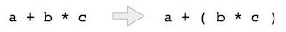

# 概述
编写算术表达式的方法称为符号。算术表达式可以用三种不同但等效的符号书写，即不改变表达式的本质或输出。这些符号是 -

中缀表示法
前缀（正向）表示法
后缀（反向）表示法
这些符号被命名为它们如何在表达式中使用运算符。我们将在本章中学到相同的内容。

# 中缀表示法
我们用中缀表示法编写表达式，例如a - b + c，其中运算符用在操作数之间。我们人类很容易用中缀符号进行读，写和说话，但同样适用于计算设备。在时间和空间消耗方面，处理中缀符号的算法可能是困难且昂贵的。

# 前缀表示法
在这种表示法中，运算符以操作数的前缀为前缀，即操作符在操作数之前写入。例如，+ ab。这相当于其中缀符号a + b。前缀表示法也称为波兰表示法。

# 后缀表示法
这种符号样式称为反转波兰表示法。在这种表示法样式中，运算符后缀为操作数，即操作符在操作数之后写入。例如，ab +。这相当于其中缀符号a + b。

# 三种区别
简单介绍这三种表示方法的区别
序号 |	中缀表示法 | 前缀表示法 | 后缀表示法
-----|------------|---------|----------
1 |	a + b	|+ a b	|a b +
2|	(a + b) ∗ c	|∗ + a b c|	a b + c ∗
3|	a ∗ (b + c)|	∗ a + b c|	a b c + ∗
4|	a / b + c / d	|+ / a b / c d	|a b / c d / +
5|	(a + b) ∗ (c + d)	| ∗ + a b + c d	|a b + c d + ∗
6|	((a + b) ∗ c) - d	|- ∗ + a b c d|	a b + c ∗ d -

# 解析表达式
正如我们已经讨论过的，设计一个解析中缀符号的算法或程序并不是一种非常有效的方法。相反，这些中缀符号首先转换为后缀或前缀符号，然后进行计算。

要解析任何算术表达式，我们还需要处理运算符优先级和关联性。

## 优先权
当操作数位于两个不同的运算符之间时，哪个运算符将首先取操作数，由运算符优先于其他运算符决定。例如 -



由于乘法运算优先于加法，因此将首先计算b * c。稍后提供运算符优先级表。


## 关联性
关联性描述了具有相同优先级的运算符出现在表达式中的规则。例如，在表达式a + b - c中，+和 - 两者具有相同的优先级，那么表达式的哪个部分将首先被评估，由这些运算符的关联性决定。这里，+和 - 都是左关联的，因此表达式将被评估为（a + b） - c。

优先级和关联性决定了表达式的评估顺序。以下是运算符优先级和关联表（从最高到最低） -

序号 |	操作者 | 优先权	| 关联性
-----|--------|-------|------
1 |	幂 ^	| 最高	| 右
2 |	乘法（*）和除法（/）	| 第二高	|左
3	|加法（+）和减法（ - ）	|最低|	左

上表显示了运算符的默认行为。在表达式评估的任何时间点，可以使用括号来更改顺序。例如 -

在a + b * c中，首先评估表达式部分b * c，乘法优先于加法。我们在这里使用括号为A + B先计算，如（A + B）* C。

## 后缀表达式运算
```
第1步 - 从左到右扫描表达式
第2步 - 如果是操作数，则将其推送到堆栈
步骤3  - 如果它是来自堆栈的操作员拉操作数并执行操作
步骤4  - 将步骤3的输出存储回堆栈
步骤5  - 扫描表达式，直到消耗掉所有操作数
第6步 - 弹出堆栈并执行操作
```

# 代码如下
```
#include<stdio.h> 
#include<string.h> 

//char stack
char stack[25]; 
int top = -1; 

void push(char item) {
   stack[++top] = item; 
} 

char pop() {
   return stack[top--]; 
} 

//returns precedence of operators
int precedence(char symbol) {

   switch(symbol) {
      case '+': 
      case '-':
         return 2; 
         break; 
      case '*': 
      case '/':
         return 3; 
         break; 
      case '^': 
         return 4; 
         break; 
      case '(': 
      case ')': 
      case '#':
         return 1; 
         break; 
   } 
} 

//check whether the symbol is operator?
int isOperator(char symbol) {

   switch(symbol) {
      case '+': 
      case '-': 
      case '*': 
      case '/': 
      case '^': 
      case '(': 
      case ')':
         return 1; 
      break; 
         default:
         return 0; 
   } 
} 

//converts infix expression to postfix
void convert(char infix[],char postfix[]) {
   int i,symbol,j = 0; 
   stack[++top] = '#'; 
	
   for(i = 0;i<strlen(infix);i++) {
      symbol = infix[i]; 
		
      if(isOperator(symbol) == 0) {
         postfix[j] = symbol; 
         j++; 
      } else {
         if(symbol == '(') {
            push(symbol); 
         } else {
            if(symbol == ')') {
				
               while(stack[top] != '(') {
                  postfix[j] = pop(); 
                  j++; 
               } 
					
               pop();   //pop out (. 
            } else {
               if(precedence(symbol)>precedence(stack[top])) {
                  push(symbol); 
               } else {
					
                  while(precedence(symbol)<=precedence(stack[top])) {
                     postfix[j] = pop(); 
                     j++; 
                  } 
						
                  push(symbol); 
               }
            }
         }
      }
   }
	
   while(stack[top] != '#') {
      postfix[j] = pop(); 
      j++; 
   } 
	
   postfix[j]='\0';  //null terminate string. 
} 

//int stack
int stack_int[25]; 
int top_int = -1; 

void push_int(int item) {
   stack_int[++top_int] = item; 
} 

char pop_int() {
   return stack_int[top_int--]; 
} 

//evaluates postfix expression
int evaluate(char *postfix){

   char ch;
   int i = 0,operand1,operand2;

   while( (ch = postfix[i++]) != '\0') {
	
      if(isdigit(ch)) {
	     push_int(ch-'0');  // Push the operand 
      } else {
         //Operator,pop two  operands 
         operand2 = pop_int();
         operand1 = pop_int();
			
         switch(ch) {
            case '+':
               push_int(operand1+operand2);
               break;
            case '-':
               push_int(operand1-operand2);
               break;
            case '*':
               push_int(operand1*operand2);
               break;
            case '/':
               push_int(operand1/operand2);
               break;
         }
      }
   }
	
   return stack_int[top_int];
}

void main() { 
   char infix[25] = "1*(2+3)",postfix[25]; 
   convert(infix,postfix); 
	
   printf("Infix expression is: %s\n" , infix);
   printf("Postfix expression is: %s\n" , postfix);
   printf("Evaluated expression is: %d\n" , evaluate(postfix));
} 

```

输出效果
```
Infix expression is: 1*(2+3)
Postfix expression is: 123+*
Result is: 5
```