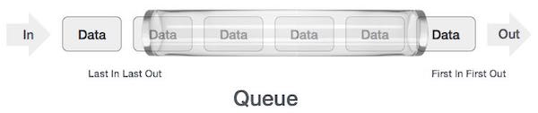
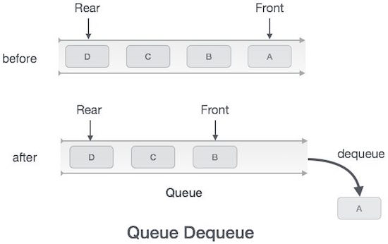

# 概述
队列是一种抽象的数据结构，有点类似于Stacks。与堆栈不同，队列的两端都是开放的。一端始终用于插入数据（入队），另一端用于删除数据（出队）。队列遵循先进先出方法，即首先访问先存储的数据项。

图标如下


一个真实的队列示例可以是单车道单向道路，车辆首先进入，首先退出。更多真实世界的例子可以看作是售票窗口和公共汽车站的队列。

# 队列表示
正如我们现在所知，在队列中，我们出于不同的原因访问两端。下面给出的下图试图将队列表示解释为数据结构 -



与在堆栈中一样，也可以使用数组，链接列表，指针和结构来实现队列。为简单起见，我们将使用一维数组实现队列。


# 基本操作
队列操作可能涉及初始化或定义队列，利用它，然后从内存中完全擦除它。在这里，我们将尝试理解与队列相关的基本操作 -

enqueue（） - 将一个项添加（存储）到队列中。

dequeue（） - 从队列中删除（访问）一个项目。

为了使上述队列操作有效，需要更多的功能。这些是 -

peek（） - 获取队列前面的元素而不删除它。

isfull（） - 检查队列是否已满。

isempty（） - 检查队列是否为空。

在队列中，我们总是将前端指针指向的数据出列（或访问），并在队列中排队（或存储）数据时我们采用后指针的帮助。

让我们首先了解一个队列的支持功能 -

## peek()
算法如下
```
begin procedure peek
   return queue[front]
end procedure
```
用C语言实现如下
```
int peek() {
   return queue[front];
}
```

## isfull()
由于我们使用单维数组来实现队列，我们​​只检查后指针是否达到MAXSIZE以确定队列已满。如果我们将队列保存在循环链表中，算法将有所不同。isfull（）函数的算法 -

算法如下
```
begin procedure isfull

   if rear equals to MAXSIZE
      return true
   else
      return false
   endif
   
end procedure

```

在C编程语言中实现isfull（）函数 -

```
bool isfull() {
   if(rear == MAXSIZE - 1)
      return true;
   else
      return false;
}
```

## isempty()
isempty（）函数的算法 -

```
begin procedure isempty

   if front is less than MIN  OR front is greater than rear
      return true
   else
      return false
   endif
   
end procedure
```

如果front的值小于MIN或0，则表示队列尚未初始化，因此为空。

这是C编程代码 -

```
bool isempty() {
   if(front < 0 || front > rear) 
      return true;
   else
      return false;
}
```

# 入队操作
队列维护两个数据指针，前端和后端。因此，其操作比堆栈的操作相对难以实现。

应采取以下步骤将数据排入（插入）到队列中 -

第1步 - 检查队列是否已满。

步骤2 - 如果队列已满，则产生溢出错误并退出。

步骤3 - 如果队列未满，则增加后指针以指向下一个空白空间。

步骤4 - 将数据元素添加到后方指向的队列位置。

第5步 - 返回成功。


有时，我们还会检查队列是否已初始化，以处理任何无法预料的情况。

入队算法
```
procedure enqueue(data)      
   
   if queue is full
      return overflow
   endif
   
   rear ← rear + 1
   queue[rear] ← data
   return true
   
end procedure
```

在C编程语言中实现enqueue（） -

```
int enqueue(int data)      
   if(isfull())
      return 0;
   
   rear = rear + 1;
   queue[rear] = data;
   
   return 1;
end procedure
```

# 出队操作
从队列中访问数据是两个任务的过程 - 访问前端指向的数据并在访问后删除数据。采取以下步骤来执行出列操作 -

第1步 - 检查队列是否为空。

步骤2 - 如果队列为空，则产生下溢错误并退出。

步骤3 - 如果队列不为空，请访问前端指向的数据。

步骤4 - 增加前指针以指向下一个可用数据元素。

第5步 - 返回成功。



出列操作的算法

```
procedure dequeue
   
   if queue is empty
      return underflow
   end if

   data = queue[front]
   front ← front + 1
   return true

end procedure
```

在C编程语言中实现dequeue（） -

```
int dequeue() {
   if(isempty())
      return 0;

   int data = queue[front];
   front = front + 1;

   return data;
}
```

# 全部代码
```
#include <stdio.h>
#include <string.h>
#include <stdlib.h>
#include <stdbool.h>

#define MAX 6

int intArray[MAX];
int front = 0;
int rear = -1;
int itemCount = 0;

int peek() {
   return intArray[front];
}

bool isEmpty() {
   return itemCount == 0;
}

bool isFull() {
   return itemCount == MAX;
}

int size() {
   return itemCount;
}  

void insert(int data) {

   if(!isFull()) {
	
      if(rear == MAX-1) {
         rear = -1;            
      }       

      intArray[++rear] = data;
      itemCount++;
   }
}

int removeData() {
   int data = intArray[front++];
	
   if(front == MAX) {
      front = 0;
   }
	
   itemCount--;
   return data;  
}

int main() {
   /* insert 5 items */
   insert(3);
   insert(5);
   insert(9);
   insert(1);
   insert(12);

   // front : 0
   // rear  : 4
   // ------------------
   // index : 0 1 2 3 4 
   // ------------------
   // queue : 3 5 9 1 12
   insert(15);

   // front : 0
   // rear  : 5
   // ---------------------
   // index : 0 1 2 3 4  5 
   // ---------------------
   // queue : 3 5 9 1 12 15
	
   if(isFull()) {
      printf("Queue is full!\n");   
   }

   // remove one item 
   int num = removeData();
	
   printf("Element removed: %d\n",num);
   // front : 1
   // rear  : 5
   // -------------------
   // index : 1 2 3 4  5
   // -------------------
   // queue : 5 9 1 12 15

   // insert more items
   insert(16);

   // front : 1
   // rear  : -1
   // ----------------------
   // index : 0  1 2 3 4  5
   // ----------------------
   // queue : 16 5 9 1 12 15

   // As queue is full, elements will not be inserted. 
   insert(17);
   insert(18);

   // ----------------------
   // index : 0  1 2 3 4  5
   // ----------------------
   // queue : 16 5 9 1 12 15
   printf("Element at front: %d\n",peek());

   printf("----------------------\n");
   printf("index : 5 4 3 2  1  0\n");
   printf("----------------------\n");
   printf("Queue:  ");
	
   while(!isEmpty()) {
      int n = removeData();           
      printf("%d ",n);
   }   
}

```

输出
```
Queue is full!
Element removed: 3
Element at front: 5
----------------------
index : 5 4 3 2 1 0
----------------------
Queue: 5 9 1 12 15 16
```


# 循环队列
下方是使用java作为栗子

## 接口
```
package demo.mingm.struct.queue;

/**
 * 接口 队列
* @author ming
* @date 2018/11/17
*/
public interface Queue<T> {
	// 定义数组长度
	public static final int DEFAULT_SIZE = 10;
	// 返回队列长度
	int size();
	// 判断队列是否为空
	boolean isEmpty();
	// 判断队列是否已满
	boolean isFull();
	// 入队， 成功true 错误false
	boolean add(T data);
	// offer 入队，和add方法不同的是，如果队满，或传入的为空，将会抛出错误，不会自动扩充
	boolean offer(T data);
	// 返回队头元素，不执行删除操作，为空 返回null
	T peek();
	// 返回队头元素，如果为空，将会抛出异常
	T element();
	// 出队，执行删除操作，若为空，返回null
	T poll();
	// 出队，执行删除操作，若为空，抛出异常
	T remove();
	// 清空队列
	void cleameQueue();
	
}
```

## 实现接口的类
```
package demo.mingm.struct.queue;
import java.util.Arrays;
import java.util.Vector;
public class SeqQueue<T> implements Queue<T> {
	private T[] elementData;	// 储存数据的数组
	private int size;	// 储存大小
	private int front, rear;	// 指针指向数组的元素，一个前，一个后
	private int real;
	
	public SeqQueue() {
		elementData= (T[]) new Object[DEFAULT_SIZE];
		// 指针的初始化
		this.front = 0;
		this.rear = 0;
		this.size = 0;
	}
	
	public SeqQueue(int length) {
		elementData = (T[]) new Object[length];
		this.front = 0;
		this.rear = 0;
		this.size = 0;
	}
	
	public int getSize() {
		return this.size;
	}
	
	public int getFront() {
		return this.front;
	}
	
	public int getRear() {
		return this.rear;
	}
	
	public void setSize(int size) {
		this.size = size;
	}
	
	public void setFront(int front) {
		this.front = front;
	}
	
	public void setRear(int rear) {
		this.rear = rear;
	}
	
	// 获取队列长度
	@Override
	public int size() {
		return this.getSize();
	}

	// 判断队列是否为空
	@Override
	public boolean isEmpty() {
		return this.getRear() == this.getFront();
	}
	
	// 判断队列是否已满
	@Override
	public boolean isFull() {
		return this.getFront() == (this.getRear() + 1) % this.elementData.length;
	}
	
	// 入队操作，如果不满，自动扩充数组
	@Override
	public boolean add(T data) {
		if(this.isFull()) {
			Arrays.copyOf(elementData, elementData.length*2);
		}
		// 是否插入空
		if(data == null)
			return false;
		// 添加data
		elementData[this.getRear()] = data;
		// 移动指针
		this.rear++;	// 创造单向队列
		this.size++;
		return true;
	}

	@Override
	public boolean offer(T data) {
		if(this.isFull() || data == null) {
			throw new NullPointerException("error 1");
		}
		// 添加data
		this.elementData[this.getRear()] = data;
		// 移动指针
		this.real = (this.real + 1)%elementData.length;	// 创造循环队列
		this.size++;
		return true;
	}

	// 返回队头元素，不删除
	@Override
	public T peek() {
		if(this.isEmpty())
			return null;
		return this.elementData[this.getFront()];
	}

	// 返回队头元素
	@Override
	public T element() {
		if(this.isEmpty())
			throw  new NullPointerException("error 2");
		return this.elementData[this.getFront()];
	}

	// 出队
	@Override
	public T poll() {
		if (this.isEmpty())
			return null;
		T tmp = this.peek();
		// 循环队列
		this.front = (this.getFront() + 1 ) % this.elementData.length;
		return tmp;
	}

	// 出队
	@Override
	public T remove() {
		if (this.isEmpty())
			throw  new NullPointerException("error 3");
		T tmp = this.peek();
		// 循环队列
		this.front = (this.getFront() + 1 ) % this.elementData.length;
		return tmp;
	}

	// 清空
	@Override
	public void cleameQueue() {
		this.real = 0;
		this.front = 0;
	}
}
```
