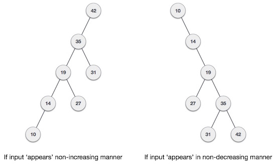
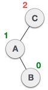
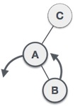
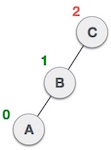
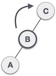
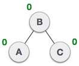
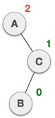
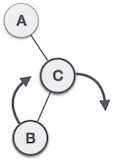
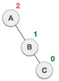

# 概述
如果二叉搜索树的输入以排序（升序或降序）方式出现怎么办？它会看起来像这样 -



据观察，BST的最坏情况性能最接近线性搜索算法，即Ο（n）。在实时数据中，我们无法预测数据模式及其频率。因此，需要平衡现有的BST。

以他们的发明者Adelson，Velski和Landis命名，AVL树是高度平衡二叉搜索树。AVL树检查左侧和右侧子树的高度，并确保差异不大于1.这种差异称为平衡因子。

在这里，我们看到第一棵树是平衡的，接下来的两棵树是不平衡的 -


在第二个树中，C的左子树具有高度2，右子树具有高度0，因此差异为2.在第三个树中，A的右子树具有高度2而左侧缺失，因此它为0 ，差异是2。AVL树允许差异（平衡因子）仅为1。

```
BalanceFactor = height(left-sutree) − height(right-sutree)

```

如果左子树和右子树的高度差异大于1，则使用一些旋转技术来平衡树。

# AVL旋转
为了平衡自身，AVL树可以执行以下四种旋转 -

左转
右旋
左右旋转
右左旋转

前两个旋转是单旋转，接下来的两个旋转是双旋转。要拥有一棵不平衡的树，我们至少需要一棵高度为2的树。通过这棵简单的树，让我们逐一理解它们。

# 左旋转
如果树变得不平衡，当一个节点插入到右子树的右子树中时，我们执行一个左旋转 -


在我们的示例中，节点A变得不平衡，因为节点插入到A右子树的右子树中。我们通过使A为B的左子树来执行左旋转。

在我们的示例中，节点A变得不平衡，因为节点插入到A右子树的右子树中。我们通过使A为B的左子树来执行左旋转。

# 右旋转
如果节点插入左子树的左子树中，则AVL树可能变得不平衡。然后树需要正确的旋转。


如图所示，通过执行右旋转，不平衡节点成为其左孩子的右孩子。

# 左右双旋转
双旋转是已经解释的旋转版本的略微复杂版本。为了更好地理解它们，我们应该注意旋转时执行的每个动作。我们先来看看如何进行左右旋转。左右旋转是左旋转然后右旋转的组合。

> 左右双旋转 = 左旋转 + 右旋转

图 | 描述
---|---
 |已将节点插入左子树的右子树中。这使得C成为不平衡节点。这些场景导致AVL树执行左右旋转。
 | 我们首先在C的左子树上执行左旋转。这使得A成为B的左子树。
 | 节点C仍然是不平衡的，但是现在，这是因为左子树的左子树。
 | 我们现在将右旋转树，使B成为此子树的新根节点。C现在成为其左子树的右子树。
 | 树现在平衡了。

# 左右双旋转
第二种类型的双旋转是右 - 左旋转。它是右旋转然后左旋转的组合。

图 | 描述
---|----
 | 已将节点插入右子树的左子树中。这使得A是一个平衡因子为2的不平衡节点。
 | 首先，我们沿C节点执行正确的旋转，使C成为其自己的左子树B的右子树。现在，B成为A的正确子树。
 | 节点A仍然是不平衡的，因为其右子树的右子树需要左旋转。
 | 通过使B成为子树的新根节点来执行左旋转。A成为其右子树B的左子树。
 | 树现在平衡了。

