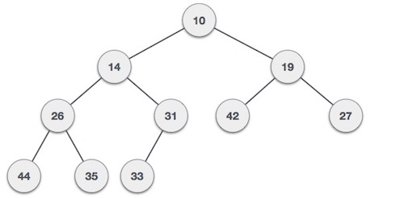
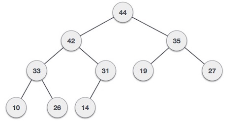

# 概述
堆是平衡二叉树数据结构的一种特殊情况，其中根节点密钥与其子节点进行比较并相应地进行排列。如果α有子节点β那么 -

键（α）≥键（β）

由于parent的值大于child的值，因此该属性会生成Max Heap。基于此标准，堆可以有两种类型 -

```
For Input → 35 33 42 10 14 19 27 44 26 31

```

Min-Heap - 根节点的值小于或等于其子节点的值。



Max-Heap - 根节点的值大于或等于其子节点的值。



两棵树都是使用相同的输入和到达顺序构建的。

# 最大堆构造算法
我们将使用相同的示例来演示如何创建Max Heap。创建Min Heap的过程类似，但我们使用min值而不是max值。

我们将通过一次插入一个元素来导出最大堆的算法。在任何时候，堆必须保持其属性。在插入时，我们还假设我们在已经堆化的树中插入节点。

```
Step 1 − Create a new node at the end of heap.
Step 2 − Assign new value to the node.
Step 3 − Compare the value of this child node with its parent.
Step 4 − If value of parent is less than child, then swap them.
Step 5 − Repeat step 3 & 4 until Heap property holds.
```

注 - 在Min Heap构造算法中，我们期望父节点的值小于子节点的值。

让我们通过动画插图了解Max Heap的构造。我们考虑前面使用的相同输入样本。


# 最大堆删除算法
让我们推导出一种从最大堆中删除的算法。Max（或Min）堆中的删除始终在根处发生，以删除最大（或最小）值。

```
Step 1 − Remove root node.
Step 2 − Move the last element of last level to root.
Step 3 − Compare the value of this child node with its parent.
Step 4 − If value of parent is less than child, then swap them.
Step 5 − Repeat step 3 & 4 until Heap property holds.

```

