# 概述
生成树是图G的子集，其具有覆盖有最小可能边数的所有顶点。因此，生成树没有循环，也无法断开连接。

通过这个定义，我们可以得出结论，每个连通和无向图G都至少有一个生成树。断开连接的图形没有任何生成树，因为它不能跨越所有顶点。

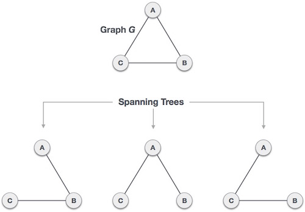

我们从一个完整的图表中找到了三棵生成树。完整的无向图可以具有最大n ^ (n-2) 个生成树，其中n是节点数。在上面提到的示例中，n是3，因此3 ^ (3-2) = 3个生成树是可能的。

# 生成树的一般属性
我们现在知道一个图可以有多个生成树。以下是连接到图G的生成树的一些属性 -

连接图G可以具有多个生成树。

图G的所有可能的生成树具有相同数量的边和顶点。

生成树没有任何循环（循环）。

从生成树中删除一条边将使图形断开连接，即生成树连接最少。

向生成树添加一条边将创建一个电路或循环，即生成树最大程度上是非循环的。

# 生成树的数学性质
生成树有n-1个边，其中n是节点（顶点）的数量。

从完整的图表中，通过删除最大e - n + 1边，我们可以构造生成树。

完整的图形可以具有最大n n-2个生成树。

因此，我们可以得出结论，生成树是连接图G的子集，而断开连接的图没有生成树。

# 生成树的应用
生成树主要用于查找连接图中所有节点的最小路径。生成树的常见应用是 -

民用网络规划

计算机网络路由协议

聚类分析

让我们通过一个小例子来理解这一点。考虑一下，城市网络是一个巨大的图形，现在计划以这样的方式部署电话线，即在最小线路中我们可以连接到所有城市节点。这是生成树进入图片的地方。

# 最小生成树（MST）
在加权图中，最小生成树是生成树，其权重最小于同一图的所有其他生成树。在实际情况中，该权重可以被测量为距离，拥塞，交通负载或任何表示边缘的任意值。

# 最小生成树算法
## 克鲁斯克尔算法
Kruskal用于查找最小成本生成树的算法使用贪婪方法。此算法将图形视为森林，将每个节点视为单个树。树仅连接到另一个树，并且仅当它在所有可用选项中具有最低成本且不违反MST属性时。

要了解Kruskal的算法，让我们考虑以下示例 -

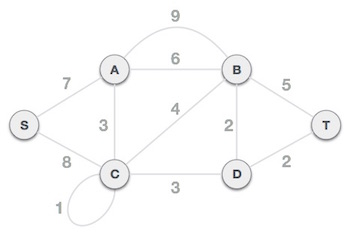

### 步骤1 - 删除所有循环和平行边缘
从给定图形中删除所有循环和平行边。

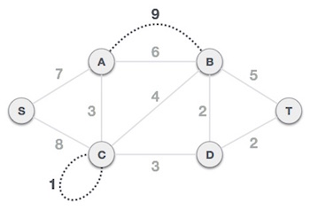

如果是平行边缘，请保留成本最低的一个并删除所有其他边缘。

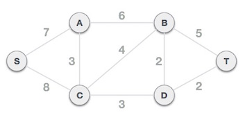

### 步骤2 - 按重量递增顺序排列所有边缘
下一步是创建一组边和重量，并按重量（成本）的升序排列它们。

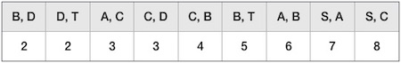

### 步骤3 - 添加权重最小的边缘
现在我们开始从具有最小权重的图形开始向图形添加边缘。在整个过程中，我们将继续检查跨越属性是否完好无损。如果通过添加一条边，生成树属性不成立，那么我们将考虑不在图中包含边。

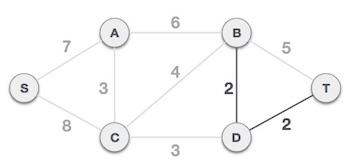

最低成本是2，涉及的边是B，D和D，T。我们添加它们。添加它们不会违反生成树属性，因此我们继续进行下一个边缘选择。

下一个成本是3，相关边缘是A，C和C，D。我们再添加一次 -

表中的下一个成本是4，我们观察到添加它将在图中创建一个路径。 -

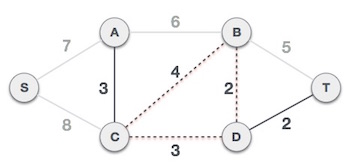

我们忽略它。在此过程中，我们将忽略/避免创建电路的所有边缘。

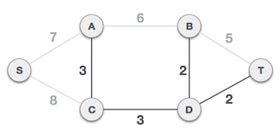

我们观察到成本为5和6的边缘也会产生路径。我们忽略它们并继续前进。

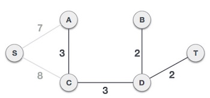

现在我们只剩下一个要添加的节点。在可用的最小成本边缘7和8之间，我们将添加成本为7的边缘。

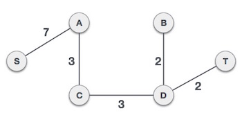

通过添加边S，A，我们已经包含了图的所有节点，现在我们有了最小的生成树。

## 普里姆算法
Prim用于查找最小成本生成树的算法（如Kruskal算法）使用贪婪方法。Prim的算法与最短路径优先算法共享相似性。

与Kruskal算法相比，Prim的算法将节点视为单个树，并继续从给定图形向生成树添加新节点。

为了与Kruskal的算法形成对比并更好地理解Prim的算法，我们将使用相同的例子 -

### 第1步 - 删除所有循环和平行边

从给定图形中删除所有循环和平行边。如果是平行边缘，请保留成本最低的一个并删除所有其他边缘。

### 步骤2 - 选择任意节点作为根节点
在这种情况下，我们选择S节点作为Prim生成树的根节点。此节点是任意选择的，因此任何节点都可以是根节点。有人可能想知道为什么任何视频都可以成为根节点。所以答案是，在生成树中，包含图形的所有节点，并且因为它是连接的，所以必须至少有一条边，它将它连接到树的其余部分。

### 第3步 - 检查输出边缘并选择成本较低的边缘
在选择根节点S之后，我们看到S，A和S，C分别是权重为7和8的两条边。我们选择边缘S，A，因为它比另一边小。

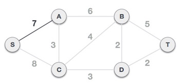

现在，树S-7-A被视为一个节点，我们检查从它出来的所有边缘。我们选择成本最低的那个并将其包含在树中。

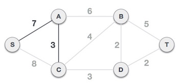

在该步骤之后，形成S-7-A-3-C树。现在我们将再次将其视为一个节点，并将再次检查所有边缘。但是，我们只会选择成本最低的优势。在这种情况下，C-3-D是新的边缘，小于其他边缘的成本8,6,4等。

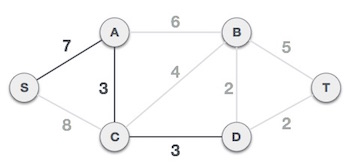

在将节点D添加到生成树之后，我们现在有两个具有相同成本的边缘，即D-2-T和D-2-B。因此，我们可以添加任何一个。但下一步将再次产生边缘2作为最低成本。因此，我们正在显示包含两个边的生成树。

我们可能会发现使用两种不同算法的同一图的输出生成树是相同的。

