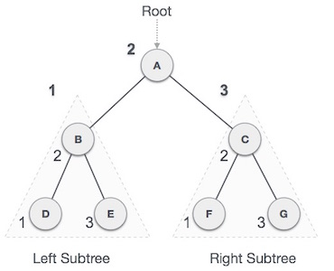
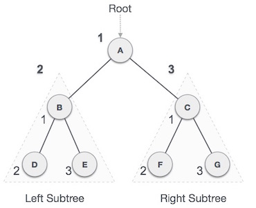
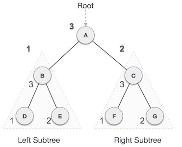

# 概述
遍历是一个访问树的所有节点的过程，也可以打印它们的值。因为所有节点都是通过边（链接）连接的，所以我们总是从根（头）节点开始。也就是说，我们不能随机访问树中的节点。我们使用三种方式遍历树 -

前序
中序
后序

# 中序遍历
在此遍历方法中，首先访问左子树，然后访问根，然后访问右子树。我们应该永远记住，每个节点都可以代表一个子树。

如果按顺序遍历二叉树，则输出将按升序生成排序的键值。



我们从开始一个，并按照中序遍历，我们移动到其左子树乙。B也按顺序遍历。该过程一直持续到访问所有节点。这棵树的inorder遍历的输出将是 -

```
D→B→E→A→F→C→G
```

## 算法
```
Until all nodes are traversed −
Step 1 − Recursively traverse left subtree.
Step 2 − Visit root node.
Step 3 − Recursively traverse right subtree.
```

# 前序
在此遍历方法中，首先访问根节点，然后访问左子树，最后访问右子树。



我们从开始一个，并按照前序遍历，我们首先访问一个本身，然后移动到它的左子树乙。B也是预先遍历的。该过程一直持续到访问所有节点。此树的预先遍历输出将是 -

```
A→B→D→E→C→F→G
```
## 算法
```
Until all nodes are traversed −
Step 1 − Visit root node.
Step 2 − Recursively traverse left subtree.
Step 3 − Recursively traverse right subtree.
```
# 后序
在此遍历方法中，最后访问根节点，因此命名。首先，我们遍历左子树，然后是右子树，最后遍历根节点。



我们从开始一个，并按照后序遍历，我们首先参观的左子树乙。B也在后期遍历。该过程一直持续到访问所有节点。此树的后序遍历输出将为 -

```
D→E→B→F→G→C→A
```
## 算法
```
Until all nodes are traversed −
Step 1 − Recursively traverse left subtree.
Step 2 − Recursively traverse right subtree.
Step 3 − Visit root node.

```

# C实现
树的结构如下


```
#include <stdio.h>
#include <stdlib.h>

struct node {
   int data; 
	
   struct node *leftChild;
   struct node *rightChild;
};

struct node *root = NULL;

void insert(int data) {
   struct node *tempNode = (struct node*) malloc(sizeof(struct node));
   struct node *current;
   struct node *parent;

   tempNode->data = data;
   tempNode->leftChild = NULL;
   tempNode->rightChild = NULL;

   //if tree is empty
   if(root == NULL) {
      root = tempNode;
   } else {
      current = root;
      parent = NULL;

      while(1) { 
         parent = current;
         
         //go to left of the tree
         if(data < parent->data) {
            current = current->leftChild;                
            
            //insert to the left
            if(current == NULL) {
               parent->leftChild = tempNode;
               return;
            }
         }  //go to right of the tree
         else {
            current = current->rightChild;

            //insert to the right
            if(current == NULL) {
               parent->rightChild = tempNode;
               return;
            }
         }
      }            
   }
}

struct node* search(int data) {
   struct node *current = root;
   printf("Visiting elements: ");

   while(current->data != data) {
      if(current != NULL)
         printf("%d ",current->data); 

      //go to left tree
      if(current->data > data) {
         current = current->leftChild;
      }
      //else go to right tree
      else {                
         current = current->rightChild;
      }

      //not found
      if(current == NULL) {
         return NULL;
      }
   }
   
   return current;
}

void pre_order_traversal(struct node* root) {
   if(root != NULL) {
      printf("%d ",root->data);
      pre_order_traversal(root->leftChild);
      pre_order_traversal(root->rightChild);
   }
}

void inorder_traversal(struct node* root) {
   if(root != NULL) {
      inorder_traversal(root->leftChild);
      printf("%d ",root->data);          
      inorder_traversal(root->rightChild);
   }
}

void post_order_traversal(struct node* root) {
   if(root != NULL) {
      post_order_traversal(root->leftChild);
      post_order_traversal(root->rightChild);
      printf("%d ", root->data);
   }
}

int main() {
   int i;
   int array[7] = { 27, 14, 35, 10, 19, 31, 42 };

   for(i = 0; i < 7; i++)
      insert(array[i]);

   i = 31;
   struct node * temp = search(i);

   if(temp != NULL) {
      printf("[%d] Element found.", temp->data);
      printf("\n");
   }else {
      printf("[ x ] Element not found (%d).\n", i);
   }

   i = 15;
   temp = search(i);

   if(temp != NULL) {
      printf("[%d] Element found.", temp->data);
      printf("\n");
   }else {
      printf("[ x ] Element not found (%d).\n", i);
   }            

   printf("\nPreorder traversal: ");
   pre_order_traversal(root);

   printf("\nInorder traversal: ");
   inorder_traversal(root);

   printf("\nPost order traversal: ");
   post_order_traversal(root);       

   return 0;
}

```