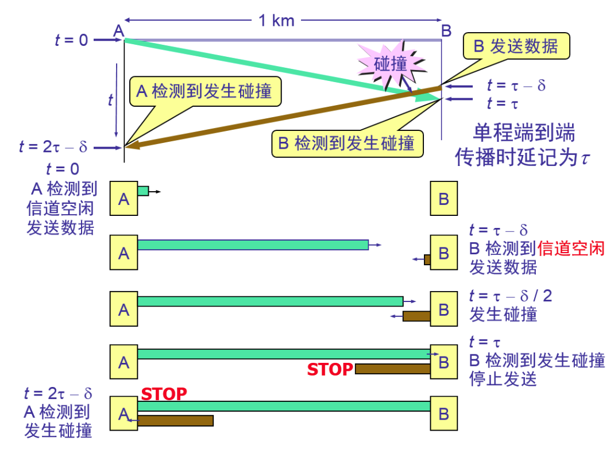

# 名称解释
## 数据链路
在电信术语中，是异地用于收发数据的工具和媒介。它也可以是一个由通信终端和连接电路组成的系统，具体的通信由专门设计的协议来控制。

# 协议数据单元
帧

# 主要任务
1. 封装成帧
2. 控制链路状态
3. 建立连接
4. 传输帧
5. 差错检测
6. 提交网络层
7. 释放连接

# 本层设备
网桥、二层交换机

# 点对点信道，广播信道
## 点对点信道
使用一对一的点对点的通信方式
## 广播信道
一对多的信道

# 数据链路层的解决问题
## 封装成帧
### 步骤
在点对点信道的数据链路中，主要步骤如下
1. 节点A的数据链路层把网络层交下来的IP数据报添加首部和尾部封装成帧
2. 节点A把封装好的帧发送给节点B的数据链路层
3. 若节点B的数据链路层收到的帧无差错，则从收到的帧中提取出IP数据报交给上面的网络层，否则丢弃这个帧
### MTU
此为帧的数据部分的长度上限--最大单元MTU

## 透明传输
### 解决问题
错误的寻找到帧的边界
### 如何解决
添加转义字符

## 差错检测
使用循环冗余检验 CRC法

# 网卡
网卡的主要作用
1. 数据的串/并转换
2. 数据的缓存
3. 与计算机存储器存储数据
4. 实现以太网协议

# 载波监听
由于计算机连接在一条总线上，同一时间只允许一台计算机发送，否则会互相干扰，所以以太网采用载波监听，碰撞检测，多点接入
## 多点接入
许多计算机以多点的方式连接在一根总线上
## 载波监听
检测在同一时间，是否有其他计算机发送数据，如果有则发送数据，否则，不发送数据
## 碰撞检测
边发送，边监听。
适配器边发送数据，边检测信道上的信号电压变化情况。
当发生碰撞以后将会重传。
### 争用期 / 碰撞窗口
用于解决时延，超过争用期，就可以知道是否发生了碰撞。

# CSMA/CD
此为半双工通信

# 网桥 集线器
##　不同
使用集线器扩展局域网，所有的连接在同一个作用域里
使用网桥，可以避免所有的连接在同一个作用域，避免更大的碰撞域
集线器有缓存，网桥没有缓存
集线器在进行转发的时候，不会进行帧的检测，网桥要进行帧的检测。
## 透明网桥
### 透明
指局域网上的站点，并不知道要发送的帧的经过几个网桥。
## 工作原理
网桥每收到一个帧，就记录下其源地址，进入网桥的接口，作为转发表中的一个项目。
在转发帧的时候，根据收到的帧的目的地址进行转发。
此处之外还会登记进入网桥的时间，用于避免失效。
## 关于以太网交换机
以太网交换机实质上是一个多接口的网桥。
交换机工作在数据链路层

