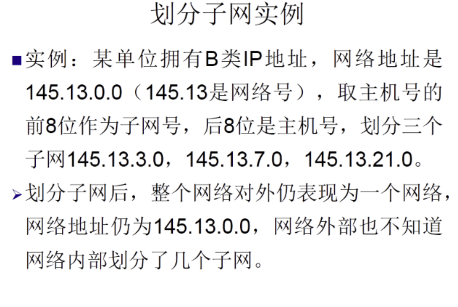
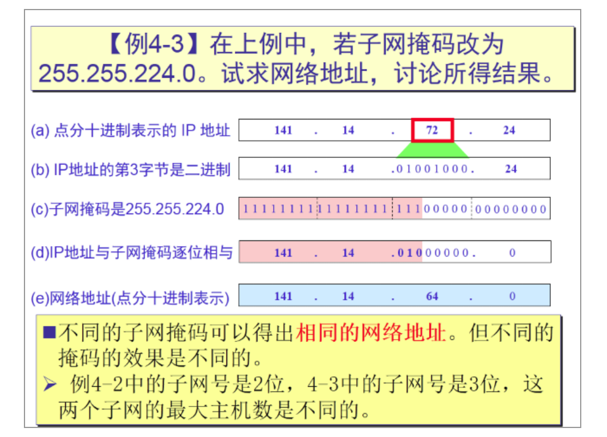
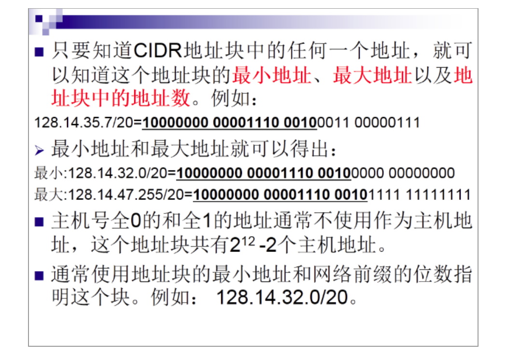

# 名词解释
## IP地址
分配给网络上使用的网际协议的装置的数字标签。
## NAT
网络地址转换。　用于私有ip和公有ip互相转换.
## 本地IP地址
属于非注册地址，专门为组织机构内部使用

1. A类 10.0.0.0 - 10.255.255.255
2. B类 172.16.0.0 - 172.31.255.255
3. C类 192.168.0.0 - 192.168.255.255

## 全球IP地址
由因特网信息中心负责，这些IP地址分配给注册并向因特网信息中心提出申请的组织机构，可以直接访问因特网。

# 协议数据单元
ip数据报 或 分组 / 包

# 本层设备
路由器

# 网络层功能
1. 网络互联 单个网络互联起来
2. 组包 发送方把传输层的报文封装成包
3. 传送包
4. 寻址和路由选择；通过路由选择算法为包寻找合适路由
5. 拆包： 接收方把收到的包还原成报文交给传输层。

# 数据报服务方式
有两种方式，数据报服务方式，虚电路方式。
## 区别
对比方面 | 虚电路服务 | 数据报服务
--------|-----------|---------
思路 | 可靠通信应该由网络保证 | 可靠通信应该由用户主机保证
连接建立 | 必须有 | 不需要
终点地址 | 仅仅在连接建立阶段使用，每个分组使用短的虚电路号 | 每个分组都有终点的完整地址
分组的转发 | 属于同一条虚电路的分组，都按照同一路由进行转发 | 每个分组独立选择路由转发
当结点出现故障 | 所有通过出故障的结点的虚电路都不能工作 | 出故障的结点可能会丢失分组，一些路由可能会发生变化
分组的顺序 | 总是按发送的顺序到达终点 | 到达终点的时间不一定按发送顺序
端到端的差错处理和流量控制 | 可以由网络负责，也可以由用户主机负责 | 由用户负责 

# IP
## IP地址定义
分配给网络上使用的网际协议的装置的数字标签。
## 表示方式
由两段组成，第一段为网络号，第二段为主机号。
点分十进制。
## 分类
分类，为A类 B类 C类 D类 E类 
### A类
网络号 8 位 主机号 24位
### B类
网络号 16位 主机号 16位
### C类
网络号 24位 主机号 8位
### D类
1110 多播地址
### E类
111 保留为今后使用

# IP和MAC区别
1. IP是基于网络拓扑设计出来的。MAC是网卡烧录好的。一般不能改动。
2. 长度不同，ip地址为32位，mac地址为48位
3. 分配依据不同，ip地址分配基于网络拓扑，mac地址基于制造商。
4. 寻址协议层不同 ip属于网络层，mac属于数据链路层

# ARP协议工作
## 源与目的在同一局域网
1. 先查看其arp高速缓存中有无主机B的ip地址。
    若有，查出对应的硬件地址，然后地址写入MAC帧首部，通过局域网MAC帧发往硬件地址。
    否则 广播ARP请求，若是接收的，进行响应。保存进高速缓存中，
2. 发送数据包
## 源与目的不在一局域网
1. 先查看其arp高速缓存有无主机IP的地址，若无发送广播，依旧无，发送给下一条路由器。
2. 路由器的MAC地址写入头部，然后发送给下一条路由器

# 网络层分组转发算法
从数据报的首部提取目的主机的IP地址D， 得出目的网络地址为N
若网络N就是源主机所在的网络，数据报直接交付给主机D，否则间接交付。执行(3)
若路由表中有目的地址为D的特定主机路由，则把数据报传送给路由表中所指明的下一跳路由器。否则执行(4)
若路由表中有到达网络N的路由，则把数据报传送给路由表指明的下一条路由，否则执行(5)
若路由表中有一个默认路由，则把数据报传送给路由表中所指明的默认路由，否则执行(6)
报告转发分组出错。

# 划分子网
IP地址 = {<网络号>, <子网号>, <主机号>}
内部二级IP变为三级IP
## 实例

# 子网掩码
IP地址与子网掩码进行与操作。分离网络地址和子网地址。
（ip地址） and （子网掩码） = 网络地址 + 子网地址

计算实例

# CIDR编制方式
使用斜线记法。

# ICMP协议
网边控制报文协议，即ICMP协议
报文有5种方式
1. 终点不可达
2. 源端抑制
3. 时间超过
4. 参数问题
5. 改变路由(重定向)

# VPN
为虚拟专用网，在互联网中，开辟出一条安全的链路，这条链路相距很远的内部专用网连接在一起。

