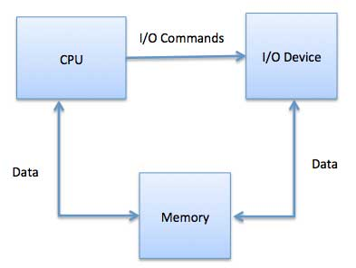
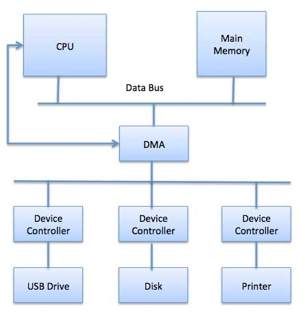

# 概述
操作系统的重要工作之一是管理各种I / O设备，包括鼠标，键盘，触摸板，磁盘驱动器，显示适配器，USB设备，位映射屏幕，LED，模数转换器，On /关闭开关，网络连接，音频I / O，打印机等。

需要I / O系统来接收应用程序I / O请求并将其发送到物理设备，然后从设备返回任何响应并将其发送到应用程序。I / O设备可分为两类 -

块设备 - 块设备是驱动程序通过发送整个数据块进行通信的设备。例如，硬盘，USB摄像头，Disk-On-Key等。

字符设备 - 字符设备是驱动程序通过发送和接收单个字符（字节，八位字节）进行通信的设备。例如，串口，并口，声卡等

# 设备控制器
设备驱动程序是可以插入OS以处理特定设备的软件模块。操作系统从设备驱动程序获取帮助以处理所有I / O设备。

设备控制器的工作方式类似于设备和设备驱动程序之间的接口。I / O单元（键盘，鼠标，打印机等）通常由机械组件和电子组件组成，其中电子组件称为设备控制器。

每个设备始终都有一个设备控制器和一个设备驱动程序，用于与操作系统进行通信。设备控制器可能能够处理多个设备。作为接口，其主要任务是将串行比特流转换为字节块，并根据需要执行纠错。

连接到计算机的任何设备都通过插头和插座连接，并且插座连接到设备控制器。以下是连接CPU，内存，控制器和I / O设备的模型，其中CPU和设备控制器都使用公共总线进行通信。

# 同步与异步I / O.
同步I / O - 在此方案中，CPU执行在I / O继续进行时等待

异步I / O - I / O与CPU执行同时进行

# 与I / O设备的通信
CPU必须能够与I / O设备之间传递信息。有三种方法可用于与CPU和设备通信。

特殊指令I / O.
内存映射I / O.
直接内存访问（DMA）

# 特殊指令I / O.
它使用专门用于控制I / O设备的CPU指令。这些指令通常允许将数据发送到I / O设备或从I / O设备读取。

# 内存映射I / O.
使用内存映射I / O时，内存和I / O设备共享相同的地址空间。该器件直接连接到某些主存储器位置，因此I / O器件可以在不通过CPU的情况下将数据块传输到存储器或从存储器传输数据块。

在使用内存映射IO时，OS会在内存中分配缓冲区，并通知I / O设备使用该缓冲区将数据发送到CPU。I / O设备与CPU异步操作，完成后中断CPU。

这种方法的优点是每个可以访问存储器的指令都可以用来操作I / O设备。内存映射IO用于大多数高速I / O设备，如磁盘，通信接口。

# 直接内存访问（DMA）
传输每个字节后，键盘等慢速设备会向主CPU产生中断。如果诸如磁盘的快速设备为每个字节生成中断，则操作系统将花费大部分时间来处理这些中断。因此，典型的计算机使用直接内存访问（DMA）硬件来减少这种开销。

直接内存访问（DMA）意味着CPU授予I / O模块权限，可以在不涉及的情况下读取或写入内存。DMA模块本身控制主存储器和I / O设备之间的数据交换。CPU仅在传输的开始和结束时涉及，并且仅在传输整个块后才中断。

直接内存访问需要一个称为DMA控制器（DMAC）的特殊硬件，它管理数据传输并仲裁对系统总线的访问。控制器使用源和目标指针（在何处读取/写入数据），计数器来跟踪传输的字节数和设置，包括I / O和存储器类型，中断和CPU周期状态。

操作系统使用DMA硬件如下 -

步|	描述
---|-----
1	|指示设备驱动程序将磁盘数据传输到缓冲区地址X.
2|	然后，设备驱动程序指示磁盘控制器将数据传输到缓冲区。
3|	磁盘控制器启动DMA传输。
4|	磁盘控制器将每个字节发送到DMA控制器。
5|	DMA控制器将字节传输到缓冲区，增加存储器地址，减少计数器C直到C变为零。
6|	当C变为零时，DMA中断CPU以发送传输完成信号。

# 轮询与中断I / O.
计算机必须能够检测任何类型输入的到来。有两种方法可以实现，称为轮询和中断。这两种技术都允许处理器处理可能在任何时间发生且与当前正在运行的进程无关的事件。

## 轮询I / O.
轮询是I / O设备与处理器通信的最简单方法。定期检查设备状态以查看是否是下一次I / O操作的时间的过程称为轮询。I / O设备只是将信息放入状态寄存器，处理器必须来获取信息。

大多数情况下，设备不需要注意，一旦完成，它将不得不等到轮询程序接下来询问它。这是一种效率低下的方法，大部分处理器时间都浪费在不必要的民意调查上。

将这种方法与老师不断询问课堂上的每个学生，如果他们需要帮助的话。显然，更有效的方法是让学生在需要帮助时通知教师。

## 中断I / O.
处理I / O的另一种方案是中断驱动方法。中断是从需要注意的设备向微处理器发出的信号。

当CPU收到中断时，设备控制器在需要CPU注意时在总线上放置一个中断信号，它保存当前状态并使用中断向量调用相应的中断处理程序（OS例程的地址来处理各种事件）。处理完中断设备后，CPU继续执行其原始任务，就像从未中断过一样。