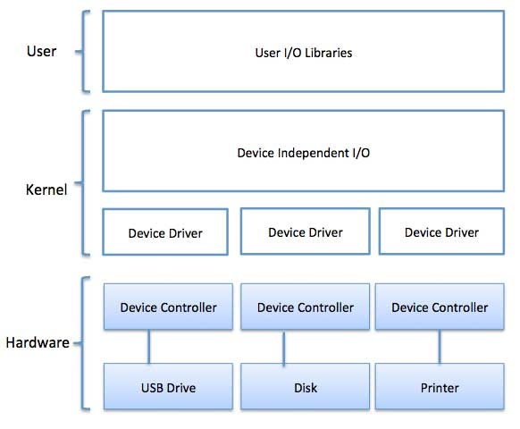

I / O软件通常在以下层中组织 -

用户级库 - 这为用户程序提供了简单的界面来执行输入和输出。例如，stdio是由C和C ++编程语言提供的库。

内核级模块 - 这提供了设备驱动程序，以与设备驱动程序使用的设备控制器和设备无关的I / O模块进行交互。

硬件 - 该层包括实际的硬件和硬件控制器，它们与设备驱动程序交互并使硬件保持活动状态。

I / O软件设计中的一个关键概念是它应该是独立于设备的，应该可以编写可以访问任何I / O设备的程序，而无需事先指定设备。例如，将文件作为输入读取的程序应该能够读取软盘，硬盘或CD-ROM上的文件，而无需为每个不同的设备修改程序。

# 设备驱动程序
设备驱动程序是可以插入OS以处理特定设备的软件模块。操作系统从设备驱动程序获取帮助以处理所有I / O设备。设备驱动程序封装依赖于设备的代码，并以代码包含特定于设备的寄存器读/写的方式实现标准接口。设备驱动程序通常由设备制造商编写，并随设备一起提供在CD-ROM上。

设备驱动程序执行以下作业 -

接受来自上面的设备独立软件的请求。
与设备控制器交互以获取并提供I / O并执行所需的错误处理
确保请求成功执行
设备驱动程序如何处理请求如下：假设请求来读取块N.如果驱动程序在请求到达时处于空闲状态，则它立即开始执行请求。否则，如果驱动程序已经忙于其他请求，则会将新请求放入待处理请求的队列中。

# 中断处理程序
中断处理程序，也称为中断服务例程或ISR，是一个软件，或者更具体地说是操作系统中的回调函数，或者更具体地说是设备驱动程序中的回调函数，其执行由接收中断触发。

当中断发生时，中断程序会执行任何操作，以便处理中断，更新数据结构并唤醒正在等待中断发生的进程。

中断机制接受一个地址──从一个小集合中选择特定中断处理例程/函数的数字。在大多数体系结构中，该地址是存储在称为中断向量表的表中的偏移量。该向量包含专用中断处理程序的内存地址。

# 与设备无关的I / O软件
与设备无关的软件的基本功能是执行所有设备通用的I / O功能，并为用户级软件提供统一的接口。虽然很难编写完全独立于设备的软件，但我们可以编写一些在所有设备中都很常见的模块。以下是与设备无关的I / O软件的功能列表 -

设备驱动程序的统一接口
设备命名 - 映射到主设备号和次设备号的助记符名称
设备保护
提供与设备无关的块大小
缓冲，因为从设备发出的数据无法存储在最终目的地。
块设备上的存储分配
分配和释放专用设备
错误报告

# 用户空间I / O软件
这些库提供了更丰富和简化的界面来访问内核的功能或最终与设备驱动程序交互。大多数用户级I / O软件都包含库程序，但有一些例外，例如假脱机系统，这是一种在多道程序设计系统中处理专用I / O设备的方法。

I / O库（例如，stdio）位于用户空间中，以提供与OS驻留设备无关的I / O SW的接口。例如，putchar（），getchar（），printf（）和scanf（）是C编程中可用的用户级I / O库stdio的示例。

# 内核I / O子系统
内核I / O子系统负责提供许多与I / O相关的服务。以下是一些提供的服务。

调度 - 内核调度一组I / O请求以确定执行它们的良好顺序。当应用程序发出阻塞I / O系统调用时，请求将放在该设备的队列中。内核I / O调度程序重新排列队列的顺序，以提高整体系统效率和应用程序所经历的平均响应时间。

缓冲 - 内核I / O子系统维护一个称为缓冲区的内存区域，用于在两个设备之间或具有应用程序操作的设备之间传输数据时存储数据。完成缓冲以应对数据流的生产者和消费者之间的速度不匹配或者在具有不同数据传输大小的设备之间进行调整。

缓存 - 内核维护缓存内存，缓存内存是保存数据副本的快速内存区域。访问缓存副本比访问原始副本更有效。

假脱机和设备保留 - 假脱机是一种缓冲区，它保存不能接受交错数据流的设备（如打印机）的输出。假脱机系统一次将排队的假脱机文件复制到打印机。在某些操作系统中，假脱机由系统守护程序进程管理。在其他操作系统中，它由内核线程处理。

错误处理 - 使用受保护内存的操作系统可以防止多种硬件和应用程序错误。
