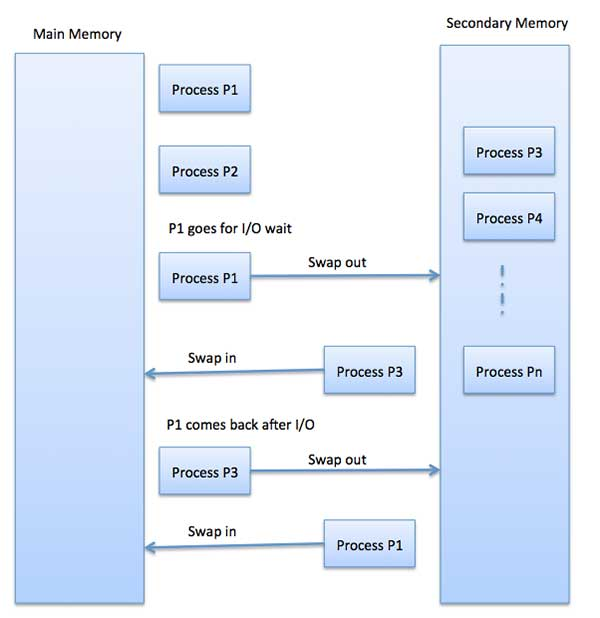
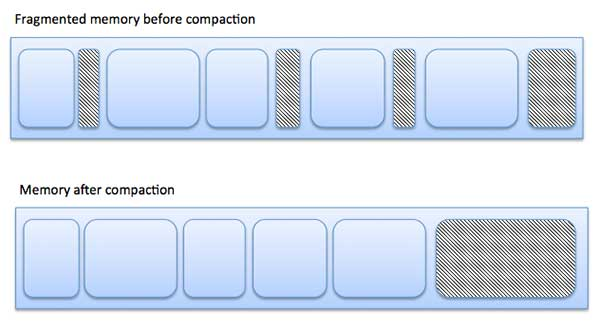
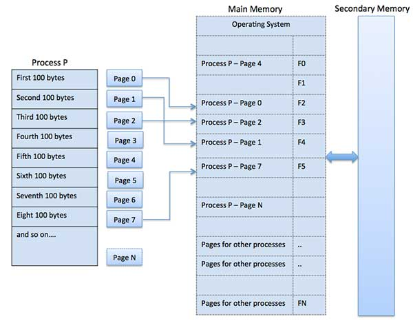
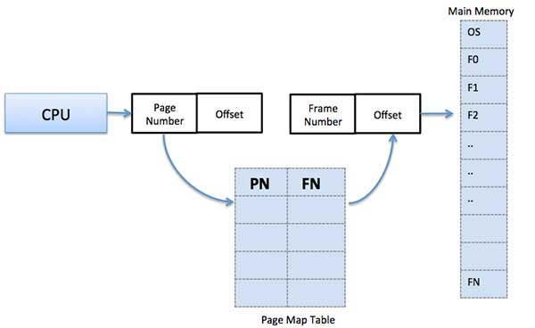
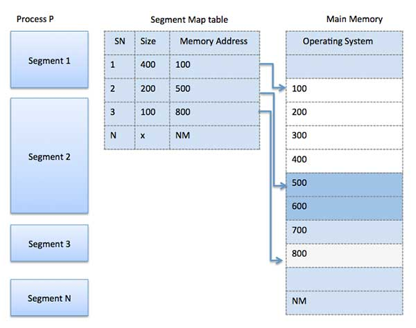

# 概述
内存管理是操作系统的功能，它处理或管理主内存，并在执行期间在主内存和磁盘之间来回移动进程。内存管理会跟踪每个内存位置，无论它是分配给某个进程还是免费的。它会检查要为进程分配多少内存。它决定哪个进程将在什么时间获得内存。它会跟踪某些内存被释放或未分配的情况，并相应地更新状态。

本教程将教您与内存管理相关的基本概念。

# 进程地址空间
进程地址空间是进程在其代码中引用的逻辑地址集。例如，当使用32位寻址时，地址的范围可以从0到0x7fffffff; 也就是说，2 ^ 31个可能的数字，总理论大小为2千兆字节。

操作系统负责在将内存分配给程序时将逻辑地址映射到物理地址。在分配内存之前和之后，程序中使用了三种类型的地址 -

SN|	内存地址和描述
---|-----------
1	| **符号地址**  源代码中使用的地址。变量名，常量和指令标签是符号地址空间的基本元素。
2	| **相对地址** 在编译时，编译器将符号地址转换为相对地址。
3	| **物理地址** 加载程序在程序加载到主存储器时生成这些地址。

虚拟和物理地址在编译时和加载时地址绑定方案中是相同的。虚拟和物理地址在执行时地址绑定方案上有所不同。

由程序生成的所有逻辑地址的集合被称为逻辑地址空间。与这些逻辑地址相对应的所有物理地址的集合被称为物理地址空间。

从虚拟地址到物理地址的运行时映射由作为硬件设备的存储器管理单元（MMU）完成。MMU使用以下机制将虚拟地址转换为物理地址。

基址寄存器中的值被添加到用户进程生成的每个地址，在发送到内存时将其视为偏移量。例如，如果基址寄存器值是10000，则用户尝试使用地址位置100将被动态地重新分配给位置10100。

用户程序处理虚拟地址; 它永远不会看到真正的物理地址。

# 静态与动态加载
静态或动态加载之间的选择应在计算机程序开发时进行。如果必须静态加载程序，那么在编译时，将编译和链接完整的程序，而不会留下任何外部程序或模块依赖性。链接器将目标程序与其他必需的对象模块组合成绝对程序，该程序还包括逻辑地址。

如果您正在编写动态加载的程序，那么编译器将编译程序，并且对于要动态包含的所有模块，将仅提供引用，其余工作将在执行时完成。

在加载时，通过静态加载，绝对程序（和数据）被加载到存储器中以便开始执行。

如果使用动态加载，则库的动态例程以可重定位的形式存储在磁盘上，并且只有在程序需要时才会加载到内存中。

# 静态与动态链接
如上所述，当使用静态链接时，链接器将程序所需的所有其他模块组合成单个可执行程序以避免任何运行时依赖性。

使用动态链接时，不需要将实际模块或库与程序链接，而是在编译和链接时提供对动态模块的引用。Windows中的动态链接库（DLL）和Unix中的共享对象是动态库的很好的例子。

# 交换
交换是一种机制，在这种机制中，进程可以暂时从主存储器（或移动）交换到辅助存储器（磁盘），并使该存储器可供其他进程使用。稍后，系统将进程从辅助存储器交换回主存储器。

虽然性能通常受交换过程的影响，但它有助于并行运行多个和大的进程，这就是Swapping 也被称为内存压缩技术的原因。



交换过程所花费的总时间包括将整个进程移动到辅助磁盘然后将进程复制回内存所花费的时间，以及重新获取主内存所需的时间。

我们假设用户进程的大小为2048KB，并且在标准硬盘上进行交换时，数据传输速率约为每秒1 MB。将1000K进程实际传输到内存或从内存传输

```
2048KB / 1024KB per second
= 2 seconds
= 2000 milliseconds
```

现在考虑进出时间，它将需要完整的4000毫秒加上其他开销，其中该过程竞争重新获得主存储器。

# 内存分配
主内存通常有两个分区 -

内存不足 - 操作系统驻留在此内存中。

高内存 - 用户进程保存在高内存中。

操作系统使用以下内存分配机制。

SN	| 内存分配和描述
-----|----------
1	| **单分区分配** 在这种类型的分配中，重定位寄存器方案用于保护用户进程彼此之间以及改变操作系统代码和数据。重定位寄存器包含最小物理地址的值，而限制寄存器包含逻辑地址范围。每个逻辑地址必须小于限制寄存器。
2	| **多分区分配** 在这种类型的分配中，主存储器被分成许多固定大小的分区，其中每个分区应该只包含一个进程。当分区空闲时，从输入队列中选择一个进程并将其加载到空闲分区中。当进程终止时，该分区可用于另一个进程。

# 碎片
当进程从内存中加载和删除时，可用内存空间被分成几块。有时候，考虑到它们的小尺寸和内存块仍未使用，有时会将进程分配给内存块。此问题称为碎片。

碎片有两种类型 -

SN |	碎片和描述
----|------------
1	| **外部碎片化** 总内存空间足以满足请求或驻留进程，但它不是连续的，因此无法使用。
2	| **内部碎片化** 分配给进程的内存块更大。内存的某些部分未使用，因为其他进程无法使用。

下图显示了碎片如何导致内存浪费，并且压缩技术可用于从碎片化内存中创建更多可用内存 -



通过压缩或混合存储器内容可以减少外部碎片，从而将所有空闲存储器放在一个大块中。为了使压实成为可能，重新定位应该是动态的。

通过有效地分配最小的分区但对于该过程足够大，可以减少内部碎片。

# 分页
计算机可以占用比系统上物理安装的数量更多的内存。这个额外的内存实际上称为虚拟内存，它是设置为模拟计算机RAM的硬盘的一部分。寻呼技术在实现虚拟内存中起着重要作用。

分页是一种内存管理技术，其中进程地址空间被分成称为页面的相同大小的块（大小为2的幂，512字节和8192字节之间）。过程的大小以页数来衡量。

类似地，主存储器被分成称为帧的小的固定大小的（物理）存储器块，并且帧的大小保持与页面的大小相同，以便最佳地利用主存储器并避免外部碎片。



地址翻译
页面地址称为逻辑地址，由页码和偏移量表示。
```
Logical Address = Page number + page offset
```
帧地址称为物理地址，由帧号和偏移量表示。
```
Physical Address = Frame number + page offset
```
称为页面映射表的数据结构用于跟踪进程的页面与物理存储器中的帧之间的关系。



当系统将帧分配给任何页面时，它会将此逻辑地址转换为物理地址，并在页表中创建条目，以便在程序执行期间使用。

当要执行进程时，其相应的页面将加载到任何可用的内存帧中。假设你有一个8Kb的程序，但你的内存在给定的时间点只能容纳5Kb，那么分页概念就会出现。当计算机耗尽RAM时，操作系统（OS）会将空闲或不需要的内存页面移动到辅助内存，以释放RAM用于其他进程，并在程序需要时将其恢复。

该过程在整个程序执行期间继续，其中OS继续从主存储器中移除空闲页面并将它们写入辅助存储器并在程序需要时将它们带回。

# 寻呼的优点和缺点
以下列出了分页的优缺点 -

分页减少了外部碎片，但仍然受到内部碎片的影响。

分页很容易实现，并被认为是一种有效的内存管理技术。

由于页面和框架的大小相同，交换变得非常容易。

页表需要额外的内存空间，因此对于RAM较小的系统可能不太好。

# 分割
分段是一种内存管理技术，其中每个作业被分成几个不同大小的段，每个段包含一个包含执行相关功能的块的模块。每个段实际上是程序的不同逻辑地址空间。

当要执行进程时，尽管每个段被加载到可用存储器的连续块中，但是其相应的分段被加载到非连续存储器中。

分段存储器管理与寻呼非常相似，但这里的段具有可变长度，而在寻呼页面中具有固定大小。

程序段包含程序的主要功能，实用程序功能，数据结构等。操作系统维护每个进程的段映射表以及可用内存块的列表以及段号，它们的大小以及主存储器中的相应存储器位置。对于每个段，该表存储段的起始地址和段的长度。对存储器位置的引用包括标识段和偏移的值。



