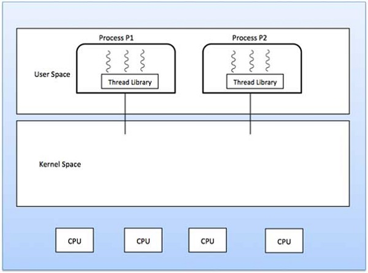
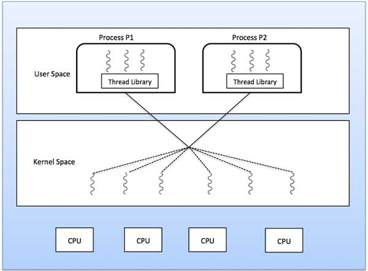
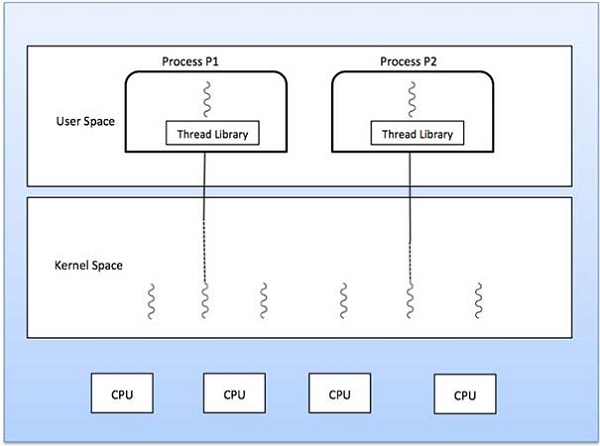

# 什么是线程？
线程是通过进程代码执行的流程，具有自己的程序计数器，用于跟踪下一个要执行的指令，保存其当前工作变量的系统寄存器以及包含执行历史的堆栈。

线程与其对等线程共享少量信息，如代码段，数据段和打开文件。当一个线程改变代码段内存项时，所有其他线程都会看到它。

线程也称为轻量级进程。线程提供了一种通过并行性来提高应用程序性能的方法。线程表示通过减少开销线程等同于经典过程来提高操作系统性能的软件方法。

每个线程只属于一个进程，进程外不存在任何线程。每个线程代表一个单独的控制流。线程已成功用于实现网络服务器和Web服务器。它们还为在共享内存多处理器上并行执行应用程序提供了合适的基础。下图显示了单线程和多线程进程的工作情况。

# 进程和线程之间的区别
SN|	处理	|线
---|-------|----
1	|流程重量大或资源密集。|	线程重量轻，占用的资源少于进程。
2|	流程切换需要与操作系统交互。|	线程切换不需要与操作系统交互。
3|	在多个处理环境中，每个进程执行相同的代码，但具有自己的内存和文件资源。|	所有线程都可以共享同一组打开的文件，子进程。
4	|如果一个进程被阻止，那么在第一个进程被解除阻塞之前，其他任何进程都无法执行。|	当一个线程被阻塞并等待时，同一任务中的第二个线程可以运行。
5|	不使用线程的多个进程使用更多资源。|	多线程进程使用较少的资源。
6	|在多个流程中，每个流程独立于其他流程运行。|	一个线程可以读取，写入或更改另一个线程的数据。

# 线程的优点
线程最小化上下文切换时间。
线程的使用提供了进程内的并发性。
高效的沟通。
创建和上下文切换线程更经济。
线程允许更多规模和效率地利用多处理器体系结构。
# 线程类型
线程以下列两种方式实现 -

用户级线程 - 用户管理的线程。

内核级线程 - 操作系统托管线程作用于内核，操作系统核心。
# 用户级线程
在这种情况下，线程管理内核不知道线程的存在。线程库包含用于创建和销毁线程的代码，用于在线程之间传递消息和数据，用于调度线程执行以及用于保存和恢复线程上下文的代码。应用程序以单个线程开始。

## 好处
线程切换不需要内核模式权限。
用户级线程可以在任何操作系统上运行。
调度可以是用户级线程中的特定于应用程序。
用户级线程可以快速创建和管理。
## 缺点
在典型的操作系统中，大多数系统调用都是阻塞的。
多线程应用程序无法利用多处理。

# 内核级线程
在这种情况下，线程管理由内核完成。应用程序区域中没有线程管理代码。内核线程由操作系统直接支持。任何应用程序都可以编程为多线程。应用程序中的所有线程都在单个进程中受支持。

内核维护整个流程的上下文信息以及流程中的个人线程。内核调度是基于线程完成的。内核在内核空间中执行线程创建，调度和管理。内核线程的创建和管理速度通常比用户线程慢。

## 好处
内核可以在多个进程上同时调度来自同一进程的多个线程。
如果进程中的一个线程被阻塞，则内核可以调度同一进程的另一个线程。
内核例程本身可以是多线程的。
## 缺点
内核线程的创建和管理速度通常比用户线程慢。
在同一进程中将控制从一个线程转移到另一个线程需要模式切换到内核。

# 多线程模型
某些操作系统提供组合的用户级线程和内核级线程工具。Solaris是这种组合方法的一个很好的例子。在组合系统中，同一应用程序中的多个线程可以在多个处理器上并行运行，阻塞系统调用不需要阻止整个过程。多线程模型有三种类型

多对多的关系。
多对一的关系。
一对一的关系。

# 多对多模型
多对多模型将任意数量的用户线程复用到相同或更少数量的内核线程上。

下图显示了多对多线程模型，其中6个用户级线程与6个内核级线程进行多路复用。在此模型中，开发人员可以根据需要创建任意数量的用户线程，并且相应的内核线程可以在多处理器计算机上并行运行。此模型提供了并发的最佳准确性，当线程执行阻塞系统调用时，内核可以调度另一个线程来执行。

# 多对一模型
多对一模型将许多用户级线程映射到一个内核级线程。线程管理由用户空间在线程库中完成。当线程进行阻塞系统调用时，整个进程将被阻止。一次只有一个线程可以访问内核，因此多个线程无法在多处理器上并行运行。

如果用户级线程库是在操作系统中以系统不支持它们的方式实现的，则内核线程使用多对一关系模式。

# 一对一模型
用户级线程与内核级线程之间存在一对一的关系。与多对一模型相比，此模型提供更多并发性。当线程进行阻塞系统调用时，它还允许另一个线程运行。它支持多个线程在微处理器上并行执行。

该模型的缺点是创建用户线程需要相应的内核线程。OS / 2，Windows NT和Windows 2000使用一对一的关系模型。

用户级和内核级线程之间的区别
SN|	用户级线程|	内核级线程
1|	用户级线程的创建和管理速度更快。|	内核级线程的创建和管理速度较慢。
2|	实现是由用户级别的线程库实现的。|	操作系统支持创建内核线程。
3|	用户级线程是通用的，可以在任何操作系统上运行。|	内核级线程特定于操作系统。
4|	多线程应用程序无法利用多处理。|	内核例程本身可以是多线程的。

