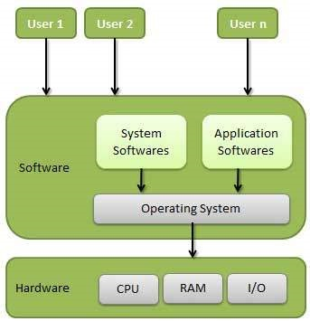

# 概述
操作系统（OS）是计算机用户和计算机硬件之间的接口。操作系统是执行所有基本任务的软件，如文件管理，内存管理，进程管理，处理输入和输出，以及控制磁盘驱动器和打印机等外围设备。

一些流行的操作系统包括Linux，Windows，OS X，VMS，OS / 400，AIX，z / OS等。

# 定义
操作系统是充当用户和计算机硬件之间的接口并控制各种程序的执行的程序。

以下是操作系统的一些重要功能。

内存管理
处理器管理
设备管理
文件管理
安全
控制系统性能
工作会计
检测辅助工具时出错
其他软件和用户之间的协调

# 内存管理
内存管理是指主内存或主内存的管理。主存储器是大量的字或字节，其中每个字或字节都有自己的地址。

主存储器提供快速存储，可由CPU直接访问。对于要执行的程序，它必须在主存储器中。操作系统执行以下内存管理活动 -

保留主要记忆的轨迹，即，哪些部分正在使用中，哪些部分未被使用。

在多道程序设计中，操作系统决定哪个进程将获得内存的时间和内容。

当进程请求内存时，分配内存。

当进程不再需要或已终止时，取消分配内存。

# 处理器管理
在多道程序设计环境中，操作系统决定哪个进程在何时以及在多长时间内获得处理器。此功能称为进程调度。操作系统为处理器管理执行以下活动 -

跟踪处理器和进程状态。负责此任务的程序称为流量控制器。

将处理器（CPU）分配给进程。

在不再需要进程时取消分配处理器。

# 设备管理
操作系统通过各自的驱动程序管理设备通信。它为设备管理执行以下活动 -

保留所有设备的轨道。负责此任务的程序称为I / O控制器。

决定哪个进程获取设备的时间和时间。

以有效的方式分配设备。

取消分配设备。

# 文件管理
文件系统通常被组织到目录中以便于导航和使用。这些目录可能包含文件和其他方向。

操作系统执行以下文件管理活动 -

跟踪信息，位置，用途，状态等。集体设施通常称为文件系统。

决定谁获得资源。

分配资源。

取消分配资源。

# 其他重要活动
以下是操作系统执行的一些重要活动 -

安全性 - 通过密码和类似的其他技术，它可以防止未经授权的程序和数据访问。

控制系统性能 - 记录服务请求和系统响应之间的延迟。

部门管理 - 跟踪各种工作和用户使用的时间和资源。

检测辅助工具时出错 - 生成转储，跟踪，错误消息以及其他调试和错误检测辅助工具。

其他软件和用户之间的协调 - 将编译器，解释器，汇编器和其他软件协调和分配给计算机系统的各个用户。

