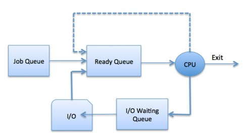
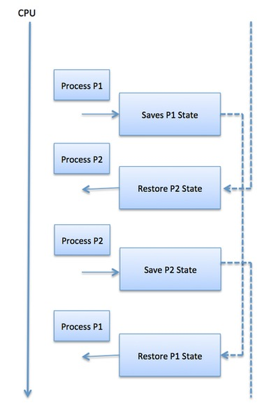

# 定义
进程调度是进程管理器的活动，它处理从CPU中删除正在运行的进程以及根据特定策略选择另一个进程。

进程调度是多道程序操作系统的重要组成部分。这样的操作系统允许一次将多个进程加载到可执行存储器中，并且加载的进程使用时间复用来共享CPU。

# 进程调度队列
操作系统维护进程调度队列中的所有PCB。OS为每个进程状态维护一个单独的队列，并且同一执行状态中的所有进程的PCB被放置在同一队列中。当进程状态发生变化时，其PCB将与其当前队列取消链接并移至其新状态队列。

操作系统维护以下重要的进程调度队列 -

作业队列 - 此队列保留系统中的所有进程。

就绪队列 - 此队列保留一组驻留在主存储器中的所有进程，准备就绪并等待执行。始终将新进程放入此队列中。

设备队列 - 由于I / O设备不可用而被阻止的进程构成此队列。

操作系统可以使用不同的策略来管理每个队列（FIFO，循环，优先级等）。OS调度程序确定如何在就绪和运行队列之间移动进程，该进程在系统上每个处理器核心只能有一个条目; 在上图中，它已与CPU合并。

# 双态过程模型
双态过程模型是指运行和非运行状态，如下所述 -

SN |状态和描述
---|--------
1|**运行**   创建新进程时，它将以运行状态进入系统。
2	| **未运行** 未运行的进程将保留在队列中，等待轮到他们执行。队列中的每个条目都是指向特定进程的指针。队列是使用链表实现的。调度员的使用如下。当进程中断时，该进程将在等待队列中传输。如果该过程已完成或中止，则该过程将被丢弃。在任何一种情况下，调度程序然后从队列中选择要执行的进程。

# 调度程序
调度程序是特殊的系统软件，以各种方式处理进程调度。他们的主要任务是选择要提交到系统中的作业并确定要运行的进程。调度程序有三种类型 -

长期调度程序
短期调度程序
中期调度程序
# 长期调度程序
它也被称为作业调度程序。长期调度程序确定允许哪些程序进入系统进行处理。它从队列中选择进程并将它们加载到内存中以便执行。处理加载到内存中以进行CPU调度。

作业调度程序的主要目标是提供均衡的作业组合，例如I / O绑定和处理器绑定。它还控制了多道程序的程度。如果多道程序的程度是稳定的，那么创建过程的平均速率必须等于离开系统的过程的平均离开率。

在某些系统上，长期调度程序可能不可用或最小。分时操作系统没有长期调度程序。当进程将状态从new更改为ready时，则使用长期调度程序。

# 短期调度程序
它也被称为CPU调度程序。其主要目标是根据所选标准提高系统性能。它是就绪状态到进程运行状态的变化。CPU调度程序在准备执行的进程中选择一个进程，并将CPU分配给其中一个进程。

短期调度程序（也称为调度程序）决定下一步执行哪个进程。短期调度程序比长期调度程序更快。

# 中期调度程序
中期调度是交换的一部分。它从内存中删除进程。它降低了多道程序的程度。中期调度程序负责处理交换的输出过程。

如果正在发出I / O请求，正在运行的进程可能会暂停。暂停的流程无法完成任何进展。在这种情况下，要从内存中删除进程并为其他进程腾出空间，挂起的进程将移动到辅助存储。此过程称为交换，并且该流程被称为交换或推出。交换可能是改善工艺组合的必要条件。

# 调度程序之间的比较
SN|	长期调度程序|	短期调度程序|	中期调度程序
---|----------|-------------|------------
1	|这是一份工作调度员	|它是一个CPU调度程序	|它是一个进程交换调度程序。
2	|速度小于短期调度程序	|其他两个速度最快|	速度介于短期和长期调度程序之间。
3	|它控制了多道程序的程度	|它提供了对多道程序化程度的较小控制	|它降低了多道程序的程度。
4	|它在时间共享系统中几乎不存在或极少	|它在时间共享系统中也是最小的	|它是时间共享系统的一部分。
5	|它从池中选择进程并将它们加载到内存中以便执行	它选择那些准备执行的进程|	它可以将进程重新引

# 上下文切换
上下文切换是在Process Control块中存储和恢复CPU的状态或上下文的机制，以便稍后可以从同一点恢复流程执行。使用此技术，上下文切换器允许多个进程共享单个CPU。上下文切换是多任务操作系统功能的重要组成部分。

当调度程序将CPU从执行一个进程切换到执行另一个进程时，来自当前运行进程的状态被存储到进程控制块中。在此之后，下一个运行的进程的状态从其自己的PCB加载并用于设置PC，寄存器等。此时，第二个进程可以开始执行。

由于必须保存和恢复寄存器和存储器状态，因此上下文切换是计算密集型的。为了避免上下文切换时间的量，一些硬件系统采用两组或更多组处理器寄存器。切换过程时，将存储以下信息供以后使用。

程序计数器
调度信息
基准和限制寄存器值
目前使用的注册
改变了状态
I / O状态信息
会计信息
