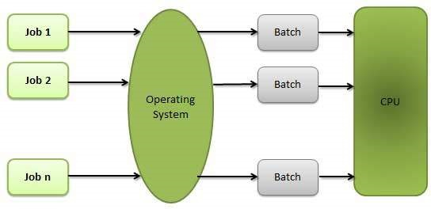
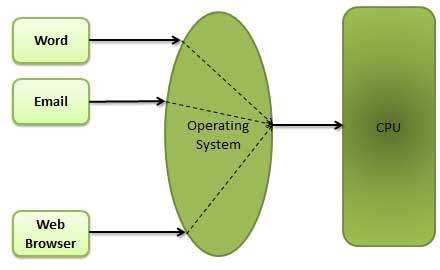
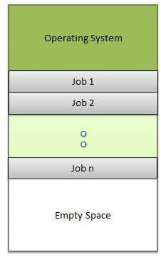
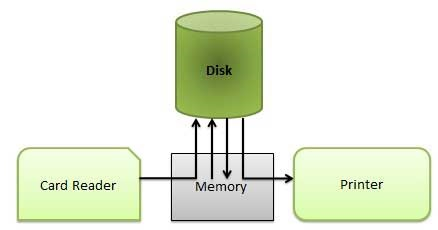

# 批量处理
批处理是一种技术，其中操作系统在处理开始之前一起收集程序和数据。操作系统执行与批处理相关的以下活动 -

OS定义了一个作业，该作业具有预定义的命令，程序和数据序列作为单个单元。

操作系统在内存中保留一个作业，并在没有任何手动信息的情况下执行它们。

工作按提交顺序处理，即先到先得的时尚。

当作业完成其执行时，其内存将被释放，作业的输出将被复制到输出假脱机中，以便以后打印或处理。

# 好处
批处理将操作员的大部分工作带到计算机上。

上一个工作完成后，新工作开始时，性能会提高，无需任何人工干预。

# 缺点
难以调试程序。
工作可以进入无限循环。
由于缺乏保护方案，一个批处理作业可能会影响待处理的作业。

# 多任务处理
多任务处理是指CPU通过在它们之间切换来同时执行多个作业。交换机频繁发生，用户可以在运行时与每个程序进行交互。操作系统执行以下与多任务相关的活动 -

用户直接向操作系统或程序发出指令，并立即收到响应。

操作系统以一次处理多个操作/执行多个程序的方式处理多任务处理。

多任务操作系统也称为时间共享系统。

开发这些操作系统是为了以合理的成本提供计算机系统的交互式使用。

分时操作系统使用CPU调度和多道程序设计的概念为每个用户提供一小部分分时CPU。

每个用户在内存中至少有一个单独的程序。

加载到内存中并正在执行的程序通常称为进程。

当进程执行时，它通常只在很短的时间内执行，然后才能完成或需要执行I / O.

由于交互式I / O通常以较慢的速度运行，因此可能需要很长时间才能完成。在此期间，CPU可以被另一个进程使用。

操作系统允许用户同时共享计算机。由于分时系统中的每个动作或命令往往很短，因此每个用户只需要很少的CPU时间。

当系统将CPU从一个用户/程序快速切换到下一个用户/程序时，每个用户都会得到他/她拥有自己的CPU的印象，而实际上一个CPU正在许多用户之间共享。

# 多道程序
当两个或多个程序同时驻留在存储器中时，共享处理器称为多道程序设计。多道程序设计假设一个共享处理器。多道程序通过组织作业来增加CPU利用率，以便CPU始终有一个执行。

下图显示了进程并发程序系统的内存布局。

操作系统执行以下与多道程序设计相关的活动。

操作系统一次在内存中保留多个作业。

这组作业是作业池中保留的作业的子集。

操作系统选择并开始执行存储器中的一个作业。

多道程序设计操作系统使用内存管理程序监视所有活动程序和系统资源的状态，以确保CPU永远不会空闲，除非没有要处理的作业。

## 好处
高效率的CPU利用率。
用户感觉很多程序几乎同时分配CPU。

## 缺点
需要CPU调度。
为了在内存中容纳许多作业，需要进行内存管理。
# 交互
交互性是指用户与计算机系统交互的能力。操作系统执行以下与交互性相关的活动 -

为用户提供与系统交互的界面。
管理输入设备以从用户获取输入。例如，键盘。
管理输出设备以向用户显示输出。例如，监视器。
由于用户提交并等待结果，因此OS的响应时间需要很短。

# 实时系统
实时系统通常是专用的嵌入式系统。操作系统执行与实时系统活动相关的以下活动。

在这样的系统中，操作系统通常从传感器数据读取并作出反应。
操作系统必须保证在固定的时间段内对事件做出响应，以确保正确的性能。
# 分布式环境
分布式环境是指计算机系统中的多个独立CPU或处理器。操作系统执行与分布式环境相关的以下活动 -

OS在多个物理处理器之间分配计算逻辑。

处理器不共享内存或时钟。相反，每个处理器都有自己的本地内存。

OS管理处理器之间的通信。他们通过各种通信线路相互通信。

# 假脱机
假脱机是同时在线外围操作的首字母缩写。假脱机是指将各种I / O作业的数据放入缓冲区。此缓冲区是内存或硬盘中的特殊区域，可供I / O设备访问。

操作系统执行与分布式环境相关的以下活动 -

处理I / O设备数据假脱机，因为设备具有不同的数据访问速率。

维护假脱机缓冲区，该缓冲区提供一个等待站，数据可以在较慢的设备赶上时休息。

由于计算机可以并行方式执行I / O，因此由于假脱机过程而保持并行计算。可以让计算机从磁带读取数据，将数据写入磁盘并在执行计算任务时写入磁带打印机。

## 好处
假脱机操作使用磁盘作为非常大的缓冲区。
假脱机能够将一个作业的I / O操作与另一个作​​业的处理器操作重叠。
