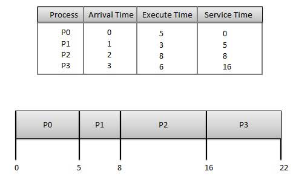
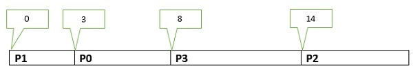
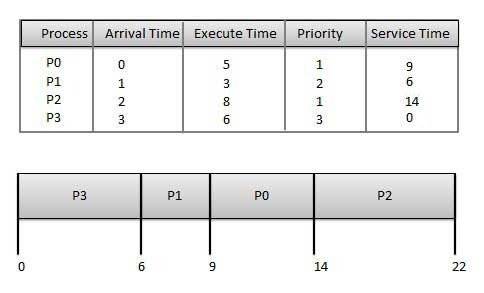
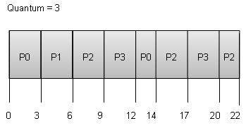

进程调度程序根据特定的调度算法调度要分配给CPU的不同进程。我们将在本章讨论六种流行的流程调度算法 -

先到先得（FCFS）调度
最短作业 - 下一个（SJN）调度
优先级调度
最短的剩余时间
循环（RR）调度
多级队列调度
这些算法要么是先发制人的，要么是先发制人的。非抢占式算法的设计使得一旦进程进入运行状态，它就不会被抢占，直到它完成其分配的时间，而抢占式调度基于优先级，其中调度程序可以在高优先级的任何时候抢占低优先级运行进程进程进入就绪状态。

# 先到先得（FCFS）
工作按先到先得的原则执行。
它是一种非先发制人，先发制人的调度算法。
易于理解和实施。
它的实现基于FIFO队列。
由于平均等待时间很长，性能很差。

每个过程的等待时间如下 -

处理|	等待时间：服务时间 - 到达时间
--|-------------------------
P0|	0 - 0 = 0
P1|	5 - 1 = 4
P2|	8 - 2 = 6
P3|	16 - 3 = 13

平均等待时间：（0 + 4 + 6 + 13）/ 4 = 5.75

# 最短的工作接下来（SJN）

这也称为最短作业，或SJF

这是一种非先发制人的先发制人调度算法。

减少等待时间的最佳方法。

易于在批处理系统中实现，其中预先知道所需的CPU时间。

无法在不知道所需CPU时间的交互式系统中实现。

处理者应事先知道过程需要多长时间。

处理	|到达时间	|执行时间	|服务时间
-------|----------|---------|-------
P0|	0|	5|	3
P1|	1|	3|	0
P2|	2|	8|	14
P3|	3|	6|	8

# 甘特图

每个过程的等待时间如下 -

处理|	等待时间：服务时间 - 到达时间
----|------------
P0	|3 - 0 = 3
P1	|0
P2	|14 - 2 = 12
P3	|8 - 3 = 5

平均等待时间：（3 + 12 + 5）/ 4 = 5

# 基于优先级的调度
优先级调度是一种非抢占式算法，是批处理系统中最常用的调度算法之一。

每个进程都分配了一个优先级。优先级最高的进程首先执行，依此类推。

具有相同优先级的进程以先到先得的方式执行。

可以根据内存要求，时间要求或任何其他资源要求来确定优先级。

每个过程的等待时间如下 -

处理	|等待时间：服务时间 - 到达时间
--------|---------
P0	|9 - 0 = 9
P1	|6 - 1 = 5
P2	|14 - 2 = 12
P3	|0 - 0 = 0

平均等待时间：（9 + 5 + 12 + 0）/ 4 = 6.5

# 最短的剩余时间
最短剩余时间（SRT）是SJN算法的抢占式版本。

处理器被分配给最接近完成的作业，但它可以被更新的就绪作业抢占，并且完成时间更短。

无法在不知道所需CPU时间的交互式系统中实现。

它通常用于需要优先考虑短工作的批处理环境中。

# 循环调度
Round Robin是抢占式进程调度算法。

每个进程都提供了一个执行的修复时间，它被称为量子。

一旦进程执行了给定的时间段，它就被抢占，并且其他进程在给定的时间段内执行。

上下文切换用于保存抢占进程的状态。

每个过程的等待时间如下 -

处理|	等待时间：服务时间 - 到达时间
---|--------------------------
P0|	（0 - 0）+（12 - 3）= 9
P1|	（3 - 1）= 2
P2|	（6 - 2）+（14 - 9）+（20 - 17）= 12
P3|	（9 - 3）+（17 - 12）= 11

平均等待时间：（9 + 2 + 12 + 11）/ 4 = 8.5

# 多级队列调度
多级队列不是独立的调度算法。他们利用其他现有算法对具有共同特征的作业进行分组和调度。

为具有共同特征的进程维护多个队列。
每个队列都可以有自己的调度算法。
优先级分配给每个队列。
例如，可以在一个队列中调度CPU绑定的作业，在另一个队列中调度所有I / O绑定的作业。然后，Process Scheduler交替从每个队列中选择作业，并根据分配给队列的算法将它们分配给CPU。

