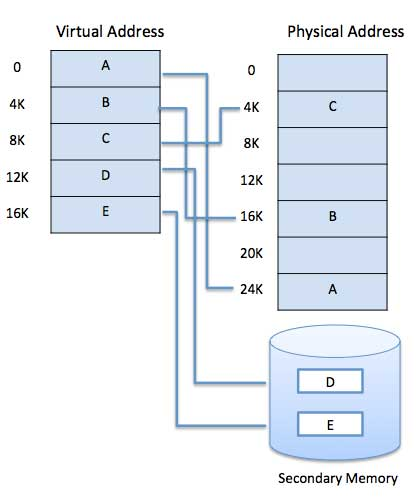
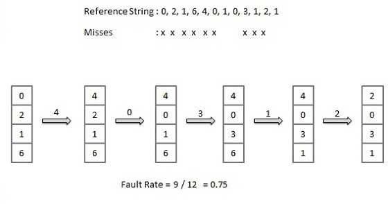
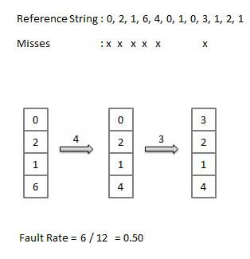
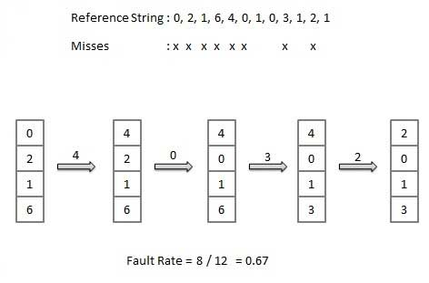

计算机可以占用比系统上物理安装的数量更多的内存。这个额外的内存实际上称为虚拟内存，它是硬盘的一部分，用于模拟计算机的RAM。

该方案的主要显着优点是程序可以比物理内存大。虚拟内存有两个目的。首先，它允许我们通过使用磁盘来扩展物理内存的使用。其次，它允许我们具有内存保护，因为每个虚拟地址都被转换为物理地址。

以下是不需要将整个程序完全加载到主存储器中的情况。

用户编写的错误处理例程仅在数据或计算中发生错误时使用。

程序的某些选项和功能可能很少使用。

许多表被分配了固定数量的地址空间，即使实际上只使用了少量的表。

执行仅部分在内存中的程序的能力将抵消许多好处。

将每个用户程序加载或交换到内存中需要更少的I / O.

程序将不再受可用物理内存量的限制。

每个用户程序可以占用较少的物理内存，可以同时运行更多程序，并相应地提高CPU利用率和吞吐量。

用于通用目的的现代微处理器，存储器管理单元或MMU内置于硬件中。MMU的工作是将虚拟地址转换为物理地址。下面给出一个基本的例子 -

虚拟内存通常由请求分页实现。它也可以在分段系统中实现。需求分段也可用于提供虚拟内存。

# 需求分页
请求寻呼系统非常类似于具有交换的寻呼系统，其中进程驻留在辅助存储器中，并且页面仅在需要时而不是提前加载。当发生上下文切换时，操作系统不会将任何旧程序的页面复制到磁盘或任何新程序的页面到主存储器中。相反，它只是在加载第一页并开始执行后才开始执行新程序程序的页面被引用。

在执行程序时，如果程序引用主内存中不可用的页面，因为它在很久以前就已被换出，则处理器会将此无效内存引用视为页面错误，并将控制从程序转移到操作系统要求页面回到内存中。

# 好处
以下是Demand Paging的优势 -

大虚拟内存。
更有效地使用内存。
多道程序的程度没有限制。
# 缺点
用于处理页面中断的表的数量和处理器开销的量大于简单的页面管理技术的情况。

# 页面替换算法
页面替换算法是一种技术，操作系统决定在需要分配内存页时将哪些内存页面换出，写入磁盘。每当发生页面错误并且空闲页面不能用于分配目的而导致页面不可用或空闲页面数低于所需页面时，就会发生分页。

当选择替换并被分页的页面再次被引用时，它必须从磁盘读入，这需要I / O完成。此过程决定了页面替换算法的质量：等待页面调入的时间越少，算法越好。

页面替换算法查看有关访问硬件提供的页面的有限信息，并尝试选择应替换哪些页面以最小化页面未命中总数，同时将其与主存储的成本和算法的处理器时间进行平衡本身。有许多不同的页面替换算法。我们通过在特定的内存引用字符串上运行算法并计算页面错误的数量来评估算法，

# 参考字符串
内存引用字符串称为引用字符串。通过人工生成或通过跟踪给定系统并记录每个存储器引用的地址来生成引用字符串。后一种选择产生大量数据，我们注意到两件事。

对于给定的页面大小，我们只需要考虑页码，而不是整个地址。

如果我们有对页面p的引用，那么对页面p的任何紧接的引用都不会导致页面错误。第一次参考后，页面p将在内存中; 紧接着的参考文献不会出错。

例如，考虑以下地址序列 - 123,215,600,1234,76,96

如果页面大小为100，则引用字符串为1,2,6,12,0,0

# 先进先出（FIFO）算法
主存储器中最旧的页面是将被选择替换的页面。

易于实现，保留列表，从尾部替换页面并在头部添加新页面。

# 最优页面算法
最优页面替换算法具有所有算法中最低的页面错误率。存在最佳页面替换算法，并且已被称为OPT或MIN。

替换不会在最长时间内使用的页面。使用页面的使用时间。

# 最近最少使用（LRU）算法
在主存储器中未使用最长时间的页面是将被选择替换的页面。

易于实施，保留列表，通过回顾时间来替换页面。

# 页面缓冲算法
要快速启动进程，请保留一个可用帧的池。
在页面错误时，选择要替换的页面。
在空闲池的框架中写入新页面，标记页面表并重新启动该过程。
现在将脏页写入磁盘并将保留替换页面的帧放在空闲池中。

# 最常用（LFU）算法
计数最小的页面将被选择替换。

该算法受到在进程的初始阶段期间大量使用页面的情况，但是从不再使用该情况。

# 最常用（MFU）算法
该算法基于以下参数：具有最小计数的页面可能刚刚被引入并且尚未被使用。

